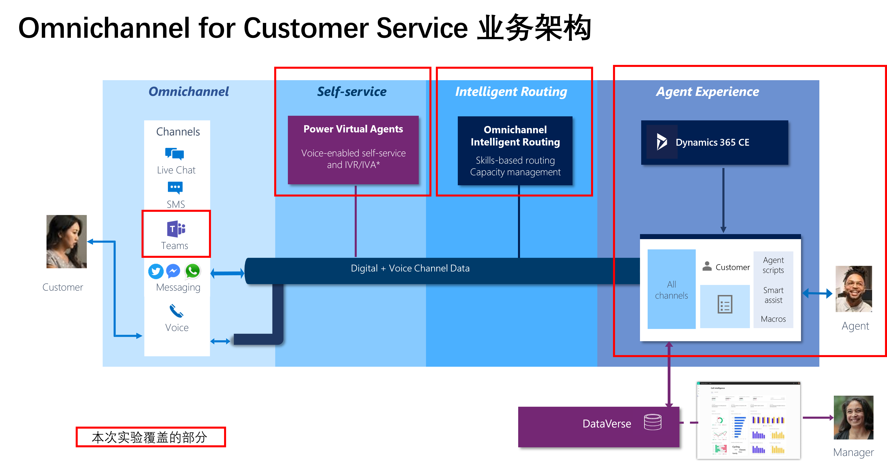

# 借助Teams+PVA+OCS+Bot Framework Composer 搭建企业级IT Helpdesk

## 业务背景

在数字化转型的大背景下，越来越多的企业引入先进的数字化工具赋能业务快速发展，但同时也为整个IT运维团队的带来了前所未有的压力。如何高效的服务好每一位员工，让员工在第一时间获得IT服务响应以及短时间内实现故障的修复是所有企业IT运维团队所专注完成的使命。本实验手册将围绕着IT运维服务的核心痛点，讲述如何借助Omnichannel for Customer Service + Power Virtual Agent + Bot Framework Composer + Teams 实现企业内部的高效自助服务和业务协同。有关以上几个组件的相关介绍可以参考以下官方文档。

参考文档：
[Introduction to Omnichannel for Customer Service](https://docs.microsoft.com/en-us/dynamics365/customer-service/introduction-omnichannel)
[Power Virtual Agents overview](https://docs.microsoft.com/en-us/power-virtual-agents/fundamentals-what-is-power-virtual-agents)
[Extend your bot with Bot Framework Composer](https://docs.microsoft.com/en-us/power-virtual-agents/advanced-bot-framework-composer)
[Configure a Microsoft Teams channel](https://docs.microsoft.com/en-us/dynamics365/customer-service/configure-microsoft-teams)

## 前提准备

环境申请

- 申请D365 Customer Service Enterprise试用
- 申请Digital Messaging Add-on(需要在具备1的条件下方可申请)
- 申请Office E3/E5 试用
- 申请Power Virtual Agent 试用
- 下载并安装Bot Framework Composer

**✨以上申请内容，请参考实验手册中的指示**

## 开始部署

**🥰本次实验的详细操作手册为放置在[LabManual目录](https://github.com/charlielv926/Biz-App-TechSolution/tree/main/Build%20IT%20HelpDesk%20with%20BizApp%20Platform/LabManual)中PDF文件,可以下载至本地进行查阅。**

本次演示的主要流程场景如下：

## 部署完成

部署完成后，整体业务演示场景如下方的视频所示：

- [基于网页端的PVA聊天测试](https://blobstoragecharlie.blob.core.chinacloudapi.cn/image/Test-ITHelpdesk-Bot.mp4)
- [基于Teams+PVA+人工的聊天测试](https://blobstoragecharlie.blob.core.chinacloudapi.cn/image/Test-ITHelpDeskOCS.mp4)
  
## 联系人信息

任何问题，请联系：Charlielv0926@163.com