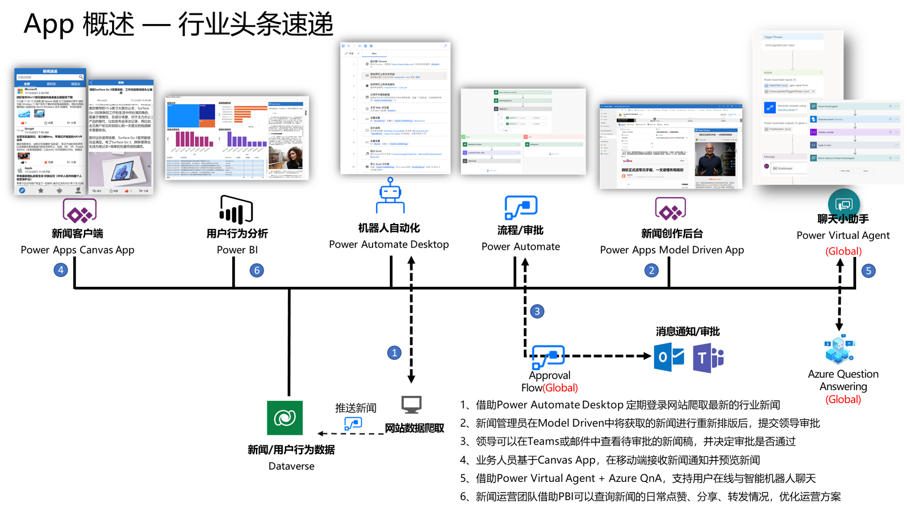

# 借助Power Platform 平台搭建企业新闻社区（实验）

## 业务背景

Contoso是一家总部位于美国的新能源车企，截止今年已经在中国地区建立了完善的营销和服务体系，广受中国消费者的青睐。由于整个中国市场新进入者不断产生， 并推出有竞争力的产品，这其中包括一些互联网行业的巨头带着资本和数字化技术进入新能源汽车赛道，对传统汽车行业形成巨大冲击，Contoso公司内部也在积极进行市场分析和销售战略调整。
为了更好的帮助销售了解新能源汽车赛道的最新动态，Contoso中国区营销团队计划为销售团队打造一个行业新闻社区，帮助业务员实时了解行业资讯动态，了解行业前沿产品和技术。
你作为Contoso数字化创新部门的IT Manager，正在Review当前营销部门的需求，并为他们提供积极的建议，主要的业务诉求包括：

 >1.市场部原先基于[百度新闻网站](https://news.baidu.com)检索新能源汽车关键词，并手工摘录其中的文章。未来希望可以有专业的自动化工具可以代替人工，按照设定的关键词自动化检索到特定的数据管理平台供后续筛选和加工。

2.采集后的新闻资讯，希望有在线编辑的能力，编辑完成后可以实时预览未来发布到员工手机端的样式。
  
> 3.经过编辑和筛选后的每一篇文章，都希望可以一键推送给市场部的领导进行审核，审核通过后自动进行文章信息的推送。
>
> 4.每位销售人员希望能在PAD或Mobile端上查看内部新闻社区的所有推送的文章。

5.每位员工可以基于所查阅的新闻进行相关的点赞，分享，收藏等一系列操作。

6.市场团队希望可以有机器人可以在线接受员工对于新闻内容的反馈以及自动化新闻查询等便利功能。

7.运营部门期望能够基于销售人员对于新闻的相关点赞，收藏，分享等维度指标，去优化后续的新闻内容采集，推送时间等

8.特殊要求：Contoso在全球所有区域都使用微软M365 Global版本，中国地区考虑到合规以及访问性能的原因，采购了Power Platform 21V版本的产品。但是对于一些邮件提醒，审批通知等操作还是希望可以在Global的Outlook中实现。

你作为本次创新项目的负责人，正在召集团队进行需求的review。为了能更快的将需求快速落地和验证，你打算从团队中挑选2-3人组建临时的创新小组，每个人基于需求挑选各自擅长的模块分工协同，快速交付成果。

>**✨本次实验部分涵盖需求中灰色标注部分**

## 实验涵盖内容申明

本手册旨在通过快速搭建简易的PoC,实现对以上架构的初步验证。故手册内容更加聚焦在整个业务流程的串联和拉通，不注重对于UI设计的大篇幅赘述和Step by Step操作。本手册主要涵盖内容有：

- Dataverse数据模型构建
- PAD(Power Automate Desktop)对于网站数据的抓取和传输
- MDA后端界面的构建&Embedded Canvas App的使用
- Canvas App展示文章素材给到员工侧
- Power Automate Cloud Flow如果满足跨Tenant的审批及消息通知

## 实验涵盖内容申明

需要准备如下License（**Global&21V**）：

- Power Apps per user/per app
- Power Automate per user
- Power Automate with attended RPA
- Office365 E5

## 开始部署

**🥰本次实验的详细操作手册为放置在[LabManual目录](https://github.com/charlielv926/Biz-App-TechSolution/tree/main/Build%20News%20Community%20with%20Power%20Platform/LabManual)中PDF文件,可以下载至本地进行查阅。**

本次演示的主要流程业务架构如下：

## 部署完成

部署完成后，整体业务场景如下方的视频所示：

- [新闻数据抓取及发布](https://blobstoragecharlie.blob.core.chinacloudapi.cn/image/news.mp4)

## 联系人信息

任何问题，请联系：Charlielv0926@163.com