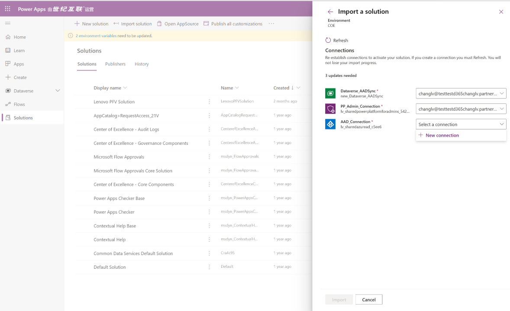
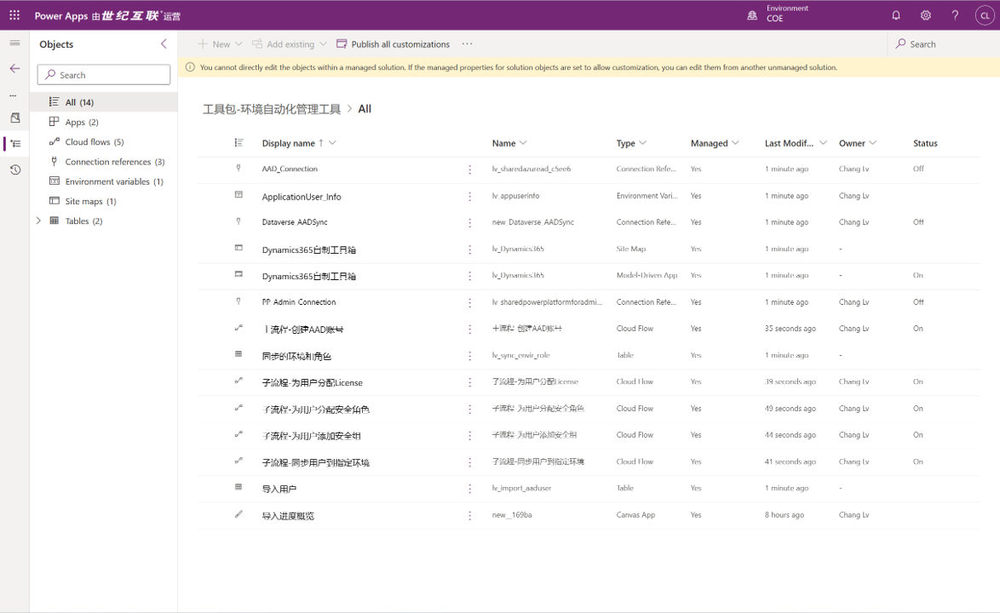
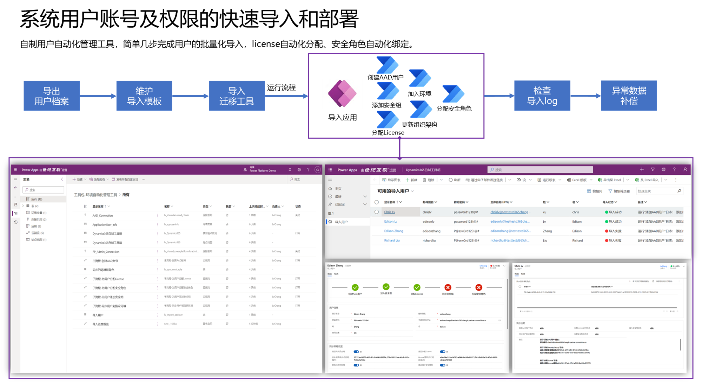
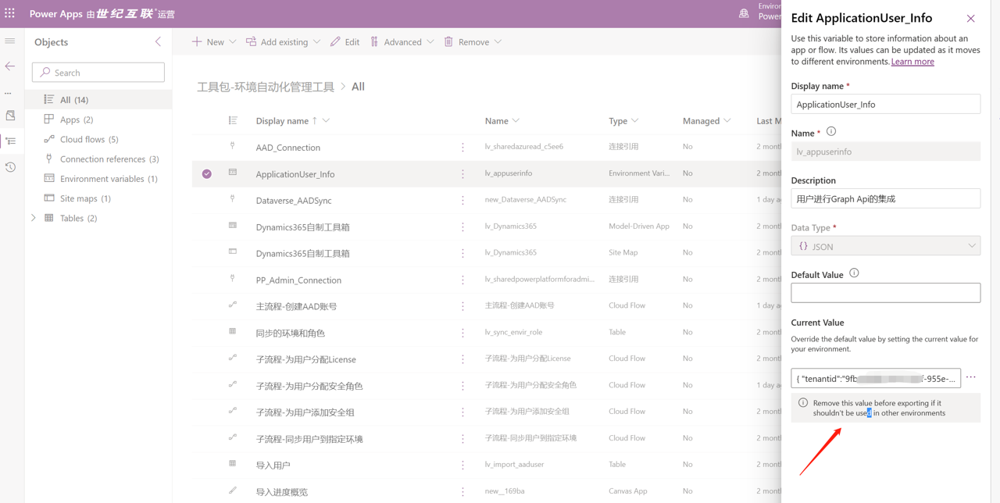
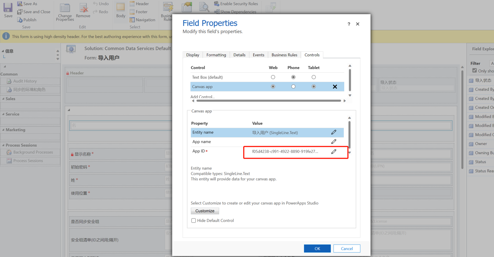
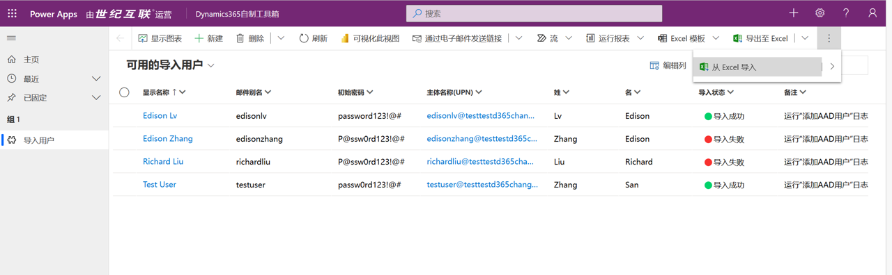
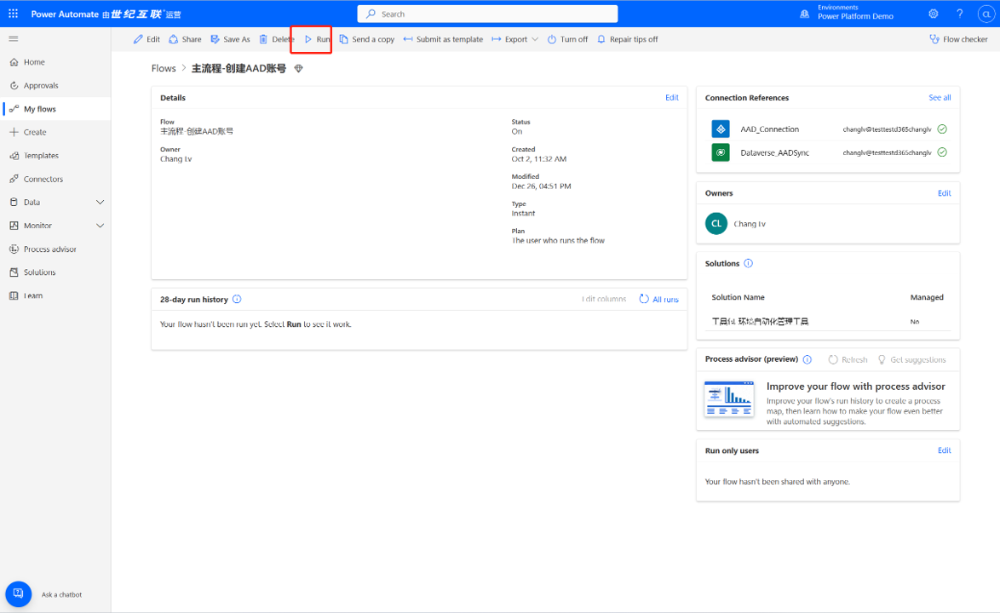
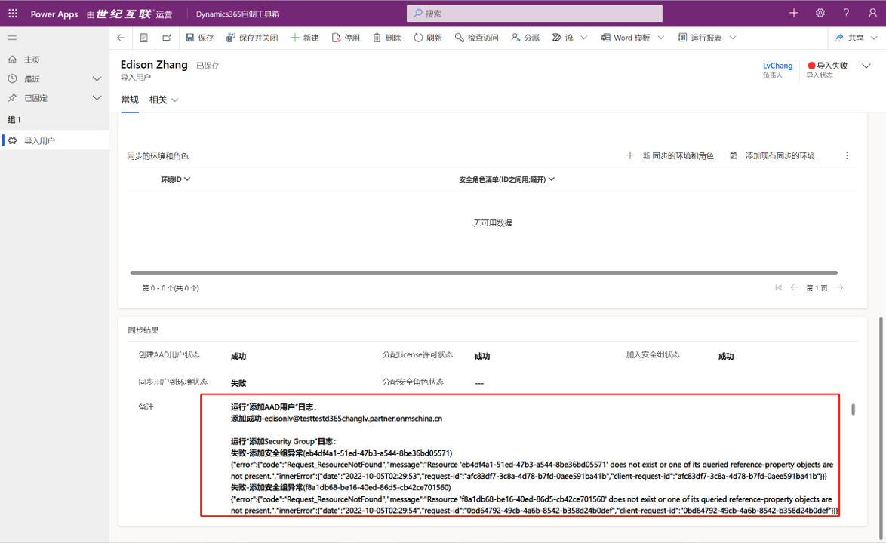

# D365 CE/PP User Onboarding Automation Tool

## 业务背景

在面向大型企业部署D365 CRM系统或企业在规模化推广Power Platform平台进行全民低代码创新时，你们是否遇到过类似问题：

1.众多的License sku该如何管理？
2.众多的用户该如何分类进行对应的访问权限的管理？
3.在D365环境中，如何自动化的管理用户的组织架构？
4.手动的用户增删license,分AAD Group,导入环境，分配角色等工作如何可以完全自动化？

在有些业务场景中，我们会通过Graph API, Power Shell等方式去实现流程中的部分节点自动化。本篇文章主要会介绍如何基于Power Apps+Power Automate+Graph API实现用户的自动化导入流程。

## 前提准备

1.准备可以创作PowerApps & PowerAutomate的环境（需要Dataverse）
2.在AAD Portal注册Application user用于进行相关的Graph API调用

补充说明：

- AAD User注册请查看文档[Register an application with the Microsoft identity platform](https://learn.microsoft.com/en-us/graph/auth-register-app-v2)
  
- Graph API相关的权限详见对应API的说明文档[Get access without a user](https://learn.microsoft.com/en-us/graph/auth-v2-service)

## 部署解决方案

**1.下载托管Solution并进行导入**

在[Asset目录](./Asset)中，下载托管解决方案并导入到你准备的环境中。导入过程新建所需的connection,并完成导入操作



导入成功后，可以看到在解决方案中有如下的资产



**2.代码资产的介绍**

为了实现完整的用户Onboarding的流程，我们创建了众多的组件进行对应数据录入，流程流转的支持。详细的架构如下：



核心组件的用途如下：
| 名称   | 类型 | 用途描述|
  |:--- | :---- |:---|
  | Dynamics365自制工具箱 | Model Driven App | 用于进行用户初始化数据导入以及监控导入结果的后端App|
  | 导入用户 | Table | 用于存放需要流程运行的用户清单|
  | 同步的环境和角色 | Table | 用于存放将用户同步的目标环境以及对应环境的安全角色ID(一个用户会同步到多个环境以及拥有多个安全角色)|
  | 主流程-创建AAD账号 | Cloud Flow | 主流程，用于判断当前用户的同步规则，创建新用户以及按照规则将子任务分流到子流程|
  | 子流程-为用户分配License | Cloud Flow | 子流程，专门用于接收主流程的参数，并未特定的用户授予特定的license|
  | 子流程-为用户分配安全组 | Cloud Flow | 子流程，专门用于接收主流程的参数，并将指定的AAD用户加入到特定的安全组中|
  | 子流程-同步用户到指定环境 | Cloud Flow | 子流程，专门用于接收主流程的参数，并将指定的AAD用户加入到特定的Power Platform环境中|
  | 子流程-为用户分配安全角色 | Cloud Flow | 子流程，专门用于接收主流程的参数，并为指定的AAD用户添加指定的D365/PP的安全角色|
  | ApplicationUser_info | Environment Variable | 用于存放Application user的ID和Secret的环境变量|
  | 导入进度概览 | Canvas App | 嵌入在模型驱动应用中，用于展示当前用户导入进度的UI控件|

**3.解决方案的调整**

3.1新建一个非托管解决方案，并将环境变量“ApplicationUser_info”加入到新的解决方案中。将您环境创建的application user相关ID和Secret按照如下格式保存在变量中：

```
{
  "tenantid":"你的租户ID",
  "appid":"你的APPID",
  "appsecret":"你的密钥",
  "audience":"https://microsoftgraph.chinacloudapi.cn"
}
```

注意此处如果是导入到Global的环境，Audience替换为:"https://graph.microsoft.com"



3.2将Embedded Canvas App在模型驱动应用中，替换当前环境App的id



**4.开始使用应用**

可以批量将D365/PP用户导入到系统中，维护用户的基本信息以及需要同步的机制


运行主流程，系统会抓取所有待导入的用户清单，并逐个将用户进行同步操作


查看最终导入清单中的日志明细，进行相关的异常数据的补偿。


**5.后续的个性化优化**

你可以基于当前solution进行改造，将更多的后续流程补充在现有资产中。比如基于用户调岗，离职的License，权限的自动化移除等。

## 联系人信息

任何问题，请联系：Charlielv0926@163.com
