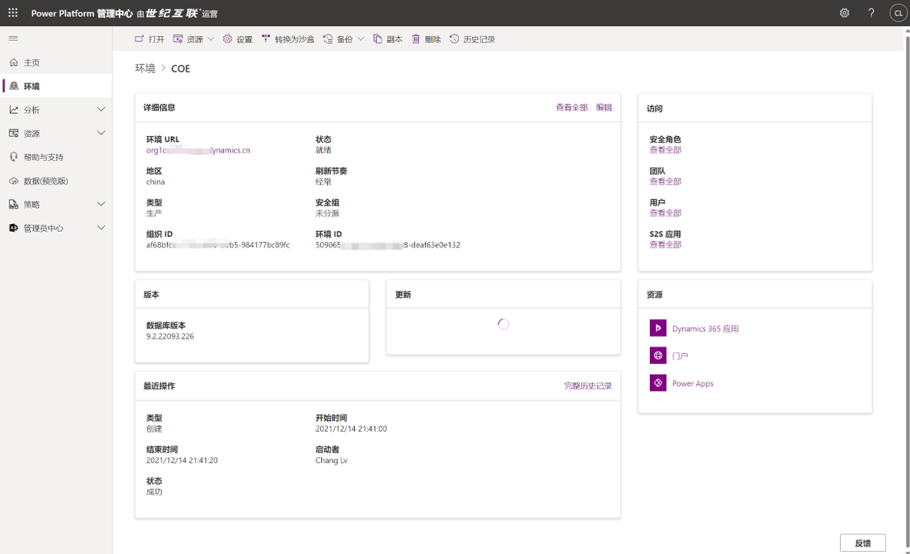
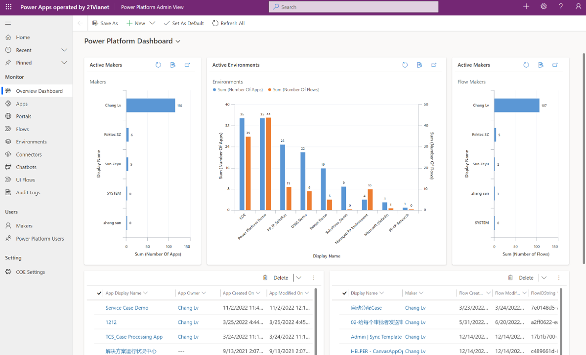
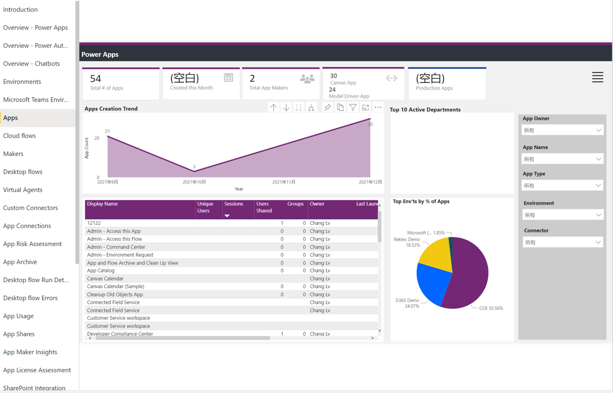

# 在21V的Power Platform中部署CoE Starter Kit

## 实验介绍

- 组织中的卓越中心 (CoE) 推动创新和改进，并将具有相似业务目标的志同道合的人聚集在一起，分享知识和成功，同时为组织提供标准、一致性和治理。Microsoft Power Platform CoE Starter Kit 是一组组件和工具，旨在帮助您开始制定采用和支持 Microsoft Power Platform 的策略。该套件提供了一些自动化和工具，以帮助团队构建支持 CoE 所需的监控和自动化。该工具包的基础是 Microsoft Dataverse 数据模型和工作流，用于在租户的环境中收集资源信息。该工具包包括多个应用程序和 Power BI 分析，用于查看您收集的数据并与之交互。该工具包还为实施 CoE 工作提供了几个模板和建议的模式和实践。
- 本指南旨在帮助中国用户基于21v版本Power Platform平台快速部署CoE套件。

## 前提准备

- 环境及License要求
  - Power Platform具备1GB及以上的可用数据库容量，用于创建包含Dataverse的环境
  - 具备有效的License许可，包括Power Apps Per User, Power Automate Per User/Per Flow, Power BI Pro及以上, M365 E3(如不具备，后续需要将流程中关于O365 outlook的相关action剔除)
- 部署权限要求
  - 部署用户具备对应环境的System Administrator的权限
- 解决方案包的准备
  - 可下载文件目录[SolutionPackage](https://github.com/charlielv926/Biz-App-TechSolution/tree/main/PP%20COE%20Starter%20Kit%20Deployment%20in%2021V/SolutionPackage)中的.zip包，当前目录中的solution最近更新时间为2022年11月，可参考更新的[历史记录](https://github.com/charlielv926/Biz-App-TechSolution/tree/main/PP%20COE%20Starter%20Kit%20Deployment%20in%2021V/SolutionPackage)。你也可以忽略本条，在下一条目中直接下载最新的解决方案包
  - 可直接通过链接下载[Solution包](https://aka.ms/CoEStarterKitDownload),详细用途说明可参考[解决方案说明](https://learn.microsoft.com/en-us/power-platform/guidance/coe/setup#download-the-solution)

## 开始部署

- 1、关于Global环境的详细部署步骤可参考[Setup CoE Starter Kit](https://learn.microsoft.com/en-us/power-platform/guidance/coe/setup)
- 2、关于21V环境的详细部署步骤可参考文件目录[HandsOnBook](https://github.com/charlielv926/Biz-App-TechSolution/tree/main/PP%20COE%20Starter%20Kit%20Deployment%20in%2021V/HandsOnBook),由于CoE Starter Kit的相关解决方案持续在迭代更新，因此你也可以按照1中的标准文档进行部署，但是需要考虑下一章节所描述的差异部分。

## 21V与Global环境部署的差异说明

- Endpoint的调整
  >请注意在21v部署服务时，需要将原先指向Global的endpoint进行替换，替换的Mapping表可参考[API endpoints of Office 365 operated by 21Vianet](https://learn.microsoft.com/en-us/previous-versions/office/office-365-api/api/o365-china-endpoints)

- Solution包的选择性部署
  >由于在21v环境目前尚不具备Teams，所以在CoE部署过程中，涉及Teams相关的整套Solution都不必且无法进行部署。可参照下表

  | 文件名   | 描述 | 适用21V | 安装建议 |
  |:--- | :---- | :---: |:---: |
  | ALMAcceleratorForMakers_x.x.yyyymmdd.x_managed.zip |  ALM Accelerator for Makers 解决方案文件。 设置 ALM Accelerator for Makers 组件时需要。 | Y | Y |
  | ALMAcceleratorForMakers_x.x.yyyymmdd.x_managed.zip |  ALM Accelerator for Makers 解决方案文件。 设置 ALM Accelerator for Makers 组件时需要。| Y | Y |
  | CenterofExcellenceAuditComponents_x.xx_managed.zip |  治理组件解决方案文件。 设置治理组件时需要。 依赖首先安装的核心组件。| Y | Y |
  | CenterofExcellenceAuditLogs_x.xx_managed.zip|  审核日志组件解决方案文件。 设置审核日志组件时需要。 依赖首先安装的核心组件。| Y  | Y |
  | CenterofExcellenceCoreComponents_x.xx_managed.zip|  核心组件解决方案文件。 在生产环境中设置核心组件时需要。| Y  | Y |
  | CenterofExcellenceCoreComponentsTeams_x.xx_managed.zip|  核心组件解决方案文件。 在 Dataverse for Teams 环境中设置核心组件时需要。| N | N |
  | CenterofExcellenceInnovationBacklog_x.xx_managed.zip|创新积压组件解决方案文件。 设置创新积压组件时需要。 | Y  | Y |
  | CenterofExcellenceNurtureComponents_x.xx_managed.zip|  培养组件解决方案文件。 设置培养组件时需要。 依赖首先安装的核心组件。| N  | N |
  | MakerAssessmentStarterData.xlsx|  为制作者评估应用提供一组初学者问题和答案。 配置制作者评估应用时需要。| Y  | Y|
  | Production_CoEDashboard_MMM2022.pbit|  在生产环境中安装 CoE 解决方案时使用的 CoE 仪表板 Power BI 模板文件。 配置 Power BI 仪表板时需要 | Y | Y |
  | Pulse_CoEDashboard.pbit|  Pulse 调查 Power BI 模板文件。 配置 Pulse 调查组件时需要。  | N | N |
  | Teams_CoEDashboard_MMM2022.pbit|  在 Dataverse for Teams 环境中安装 CoE 解决方案时使用的 CoE 仪表板 Power BI 模板文件。 配置 Power BI 仪表板时需要  | N | N |
  | Production_CoEDashboard_MMM2022.pbit|  在生产环境中安装 CoE 解决方案时使用的 CoE 仪表板 Power BI 模板文件。 配置 Power BI 仪表板时需要  | Y | Y |
  | Theming_x.xx_managed.zip|  主题化组件解决方案文件。 设置主题化组件时需要。 | Y | Y |
  | ToolIcons.zip|  为创新积压提供一组起点图标。 配置创新积压时需要  | Y | Y |

- 关于Power BI报表数据源的修改
  >按照下图找到环境对应的URL，并在PBI Desktop中更改指向的环境URL
  
  

## 数据的查看

- 基于后台流程的周期性触发，一般经历6-12小时后，就可以看到当前租户中的CoE管理数据了。如下图：
  
  
  

## 大功告成，Cheers😃😃😃

  

## 联系人信息

任何问题，请联系：Charlielv0926@163.com