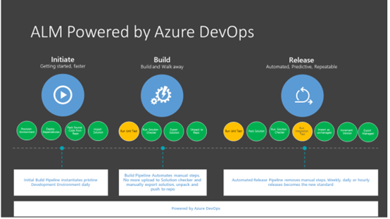
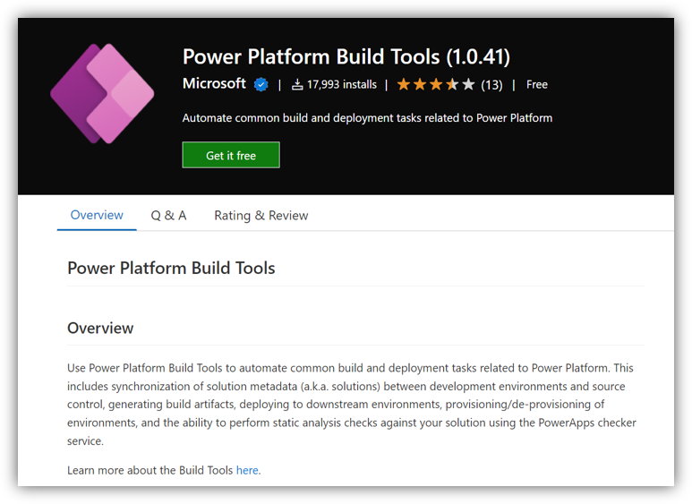

# DevOps自动化部署PP及D365 CE Solution

## 业务背景

在D365 CE和Power Platform的开发中，开发人员会依赖解决方案将应用程序和组件从一个环境传输到另一个环境，实现跨环境的部署。传统的项目实施过程中，往往看到伙伴通过手动交付解决方案并且没有适当的源代码控制系统。对于这种情况，Azure DevOps为BizApps的应用开发提供了新的解决方案。

- 考虑采用像Azure DevOps这样的源代码控制系统。Azure DevOps 为支持团队提供开发人员服务来规划工作、协作开发代码以及构建和部署应用程序。
  
- 从开发环境中导出包含迭代所需的应用程序和自定义项的解决方案，解压缩解决方案，并将组件存储在您的源代码控制系统中。使用 Azure Pipelines 管理组件，然后将它们部署到目标环境进行测试。最后，部署到生产环境供用户消费。

参考文档：[使用 Microsoft Power Platform 的应用程序生命周期管理 (ALM)](https://docs.microsoft.com/en-us/power-platform/alm/)

## 前提准备

环境申请

- [申请Power Platform试用](https://make.powerapps.com/signup?redirect=marketing)
- [申请Azure DevOps试用](https://docs.microsoft.com/en-us/azure/devops/user-guide/sign-up-invite-teammates?view=azure-devops)
- 在DevOps MarketPlace中安装所需插件
  

## 开始部署

本次实验将会按照下图的模式进行构建。模拟在实际开发场景中，针对D365/PP的Solution构建，从Dev环境生成，自动部署至UAT进行测试，以及测试通过后经过审批发布至生产的一系列操作步骤。具体如下：

**🥰本次实验的详细操作手册为放置在[LabManual目录](https://github.com/charlielv926/Biz-App-TechSolution/tree/main/PP%26D365%20CE%20Solution%20Deployment%20with%20Azure%20DevOps/LabManual)中PDF文件,可以下载至本地进行查阅。**
