# 使用 OpenAI API 构建智能聊天机器人并将并部署到 Azure App Service 和Microsoft Teams App


&nbsp; 
 

## 方案简介
[ChatGPT](https://openai.com/blog/chatgpt/) 是一个使用 GPT-3（Generative Pre-trained Transformer 3）自然语言处理模型构建的机器人聊天系统。它可以接受用户输入并使用 GPT-3 模型生成回复。它使用了大量的文本数据来预先训练语言模型，以便在不同的任务中使用。GPT-3 模型具有很强的自然语言生成能力，可以生成人类可以理解的语言文本。

一种典型的使用场景是在聊天机器人中使用ChatGPT来生成对话。聊天机器人可以用于客服，咨询，提供信息甚至帮程序员写代码等。例如，**本项目中文档和代码基本是使用ChatGPT API生成的，但经过了人工校验。**

OpenAI API 可以通过 HTTP 调用访问，可以使用多种语言（包括 Python、Java、JavaScript 和 Ruby）调用。你可以通过向 API 发送文本提示并获取回复来使用 ChatGPT。你可以使用 OpenAI API 构建一个智能聊天机器人，也可以将它用于其他自然语言生成应用。本文演示使用Python语言实现OpenAI API调用并部署到Azure App Service和Microsoft Teams App展现用户交互界面。

&nbsp; 

## 准备工作

要部署OpenAI API，需要准备以下几项：

- Azure订阅
- VS Code（1.74.2或以上版本）版本并安装Azure Account,Azure Tools和Azure App Service插件
- [Python](https://www.python.org/downloads/) 3.10或更高版本(本demo使用Python 3.10.9)
- 要使用 OpenAI API，需要先注册[OpenAI 开发者账号](https://beta.openai.com/signup)并获取 [API 密钥](https://beta.openai.com/account/api-keys)。

&nbsp; 

## 程序设计逻辑

### 设计架构的工作原理如下：

1. 本项目前端使用index.html,style.css,script.js实现用户交互界面。后端使用两个python程序（server.py 和 gpt.py）实现与前端页面交互及OpenAI API调用。
   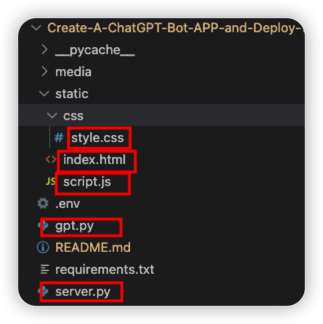

2. 用户在 Web 页面中输入文本并单击按钮。
   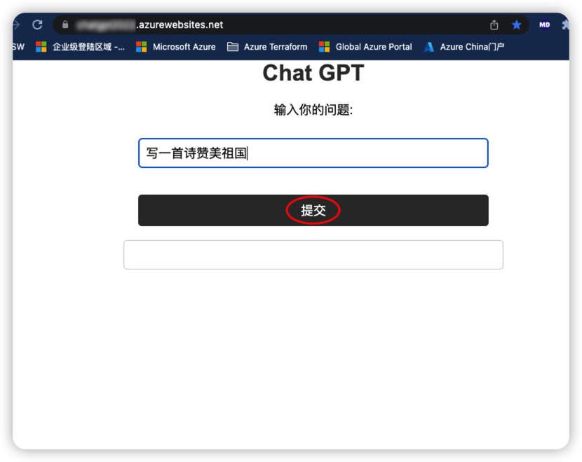

3. Web 页面使用 JavaScript 将文本发送到 Flask 应用程序的 /chat 路由。

4. Flask 应用程序接收文本并使用 OpenAI 生成回复文本。

5. Flask 应用程序将回复文本发送回 Web 页面。

6. Web 页面使用 JavaScript 将回复文本显示在页面上。
  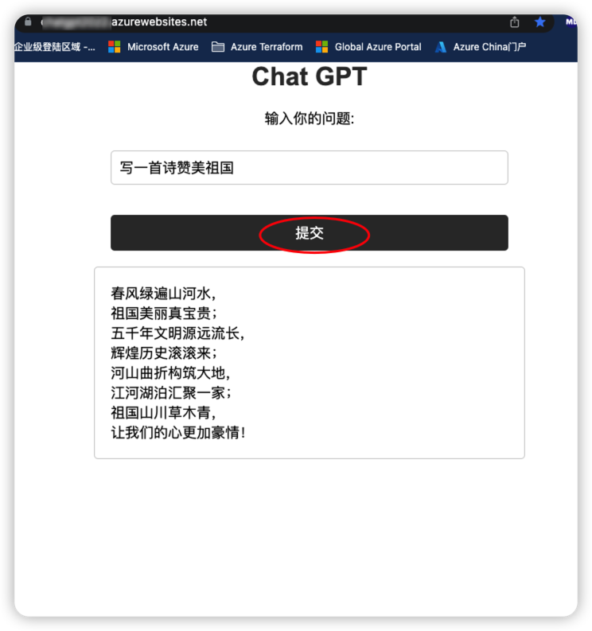

在这种架构中，index.html 文件是 Web 页面的模板。在该文件中，我们使用 HTML 和 CSS 来创建页面布局和外观。我们还使用 JavaScript 来处理用户交互并与 Flask 应用程序进行通信。

Flask 应用程序文件 (上面的代码) 负责处理用户输入的文本并生成回复。它还提供了两个路由：一个用于显示 Web 页面，另一个用于处理用户输入的文本并生成回复。

在静态文件目录中，我们可以存储 CSS 样式表和 JavaScript 文件。这些文件可以用来自定义 Web 页面的外观和交互。

总之，这种设计架构将 Web 页面、Flask 应用程序和 OPenAI API 结合起来，使用户能够通过 Web 页面与 ChatGPT 聊天机器人进行交互。

&nbsp; 
### Python代码解析
下面是使用两个 Python 程序（server.py 和 gpt.py）调用 OpenAI API 并生成 Flask 交互式 Web 页面的代码。

这种设计架构可以使代码更易于维护和扩展，


在下面的代码中，server.py 文件是 Flask 应用程序文件。它负责提供 Web 页面和与 ChatGPT 聊天机器人进行交互的路由。

server.py：

```Python server.py
from flask import Flask, request
import gpt

app = Flask(__name__)

@app.route('/process_gpt', methods=['POST'])
def process_gpt():
  return gpt.process_gpt(request)

@app.route('/')
def index():
  return app.send_static_file('index.html')

if __name__ == '__main__':
  app.run()
```

gpt.py 文件是 OpenAI 类的定义。它包含一个静态方法，用于生成 Chat 的回复文本。

gpt.py：

```Python gpt.py
import openai

def process_gpt(request):
  message = request.form['message']
  openai.api_key = "<YOUR_API_KEY>"
  response = openai.Completion.create(
    engine="text-davinci-003",
    prompt=message,
    max_tokens=1024,
    temperature=0.5,
  )

  # Format the response text
  response_text = response.choices[0].text.strip()  # Remove leading and trailing whitespace
  response_text = response_text.replace("\n", "<br>")  # Replace newlines with line breaks
  # Return the formatted response text
  return response_text
```

1. gpt.py中使用 **openai.api_key = "<YOUR_API_KEY>"** 来输入API Key，用你实际申请的API Key 替换程序中<YOUR_API_KEY>。

2. openai.Completion.create() 方法来调用 OpenAI API。这个方法接受多个参数，包括：

 - engine：要使用的 GPT-3 模型。
 - prompt：聊天对话的上下文。这里，我们通过用户的输入问题来实现通用的对话，没有对bot给出特殊提示。大家可以根据实际的应用在自己的项目中设置prompt。例如： prompt="User: Hi, how are you today?\nBot:"
 - max_tokens：生成的回复的最大字符数。
 - temperature：生成的回复的随机性。值越大，回复越随机。
 - 更多该方法的参数及解释可以[参考openai.Completion.create() 方法官方文档](https://beta.openai.com/docs/api-reference/completions/create)


3. 调用 OpenAI API 后，会返回一个包含生成的回复的响应。你可以使用 response.text 属性来获取回复的文本。你可以将这个回复文本作为机器人的回复，并将其显示给用户。

&nbsp; 
## 本地测试该Chat应用
现在，你已经知道了如何使用 OpenAI API 构建一个智能聊天机器人。接下来，你可能希望将你的 Python web 应用在自己的本地电脑做一下测试。参考如下步骤：

1. 在VS code中打开一个终端。
   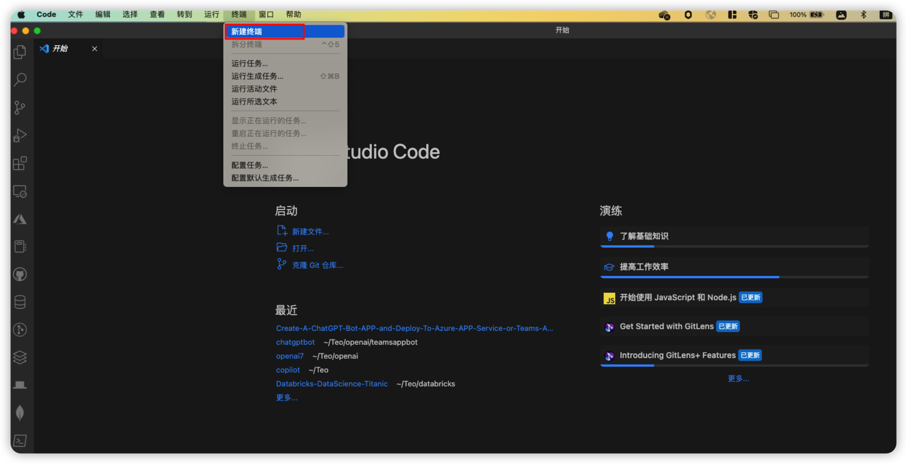

2. 在终端中输入以下命令以克隆GitHub项目,这将在你的本地系统上创建一个名为“Create-A-ChatGPT-Bot-APP-and-Deploy-To-Azure-APP-Service-or-Teams-APP”的文件夹，并将GitHub项目的所有文件克隆到该文件夹中。
```bash
git clone https://github.com/teo-ma/Create-A-ChatGPT-Bot-APP-and-Deploy-To-Azure-APP-Service-or-Teams-APP.git

```
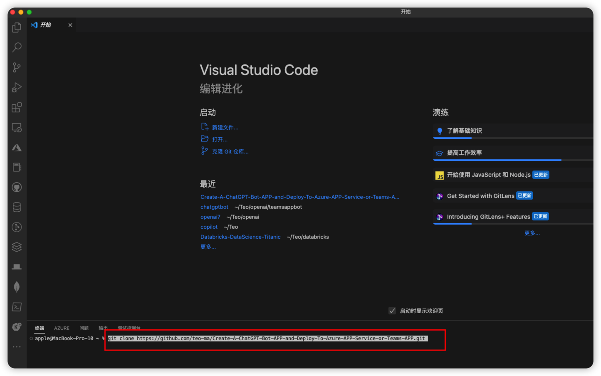

3. 在VS code中打开该文件夹,在gpt.py代码里替换你申请的API Key。
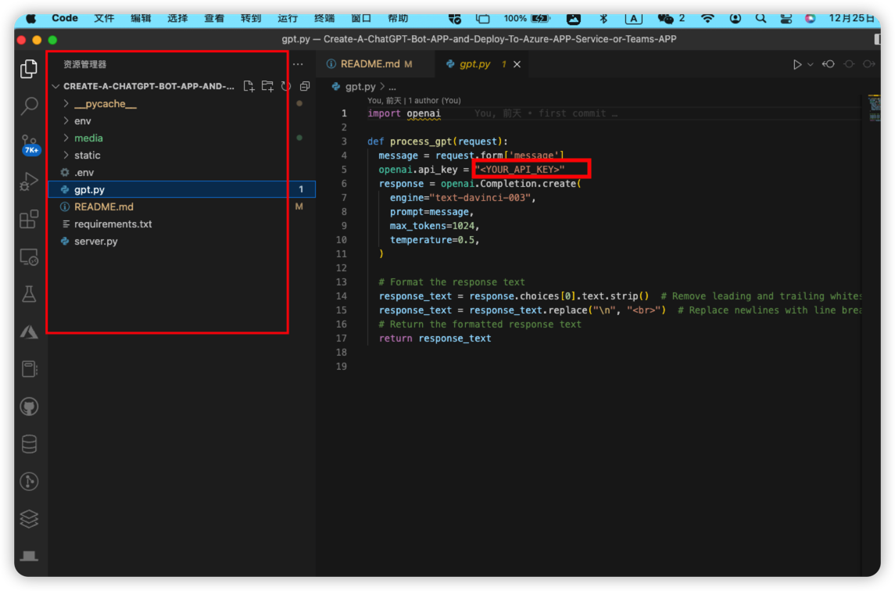

 
4. 在终端里项目根目录下运行以下命令以安装项目所需的所有依赖项，所需的应用中python依赖项会写在requirements.txt文件中，例如：flask和openai。
```bash

pip install -r requirements.txt

```
5. 您需要创建一个虚拟环境。虚拟环境是一种隔离 Python 包的方法，可以在不影响全局 Python 环境的情况下安装和测试包。您可以使用 virtualenv 库来创建虚拟环境。首先，需要使用 pip 命令安装 virtualenv
   
```bash

pip install virtualenv


```
6. 使用以下命令创建一个名为 env 的虚拟环境：
```bash

virtualenv env

```
7. 运行以下命令以激活虚拟环境。
```bash
source env/bin/activate
``
```
8. 运行该应用
```bash

flask run

```
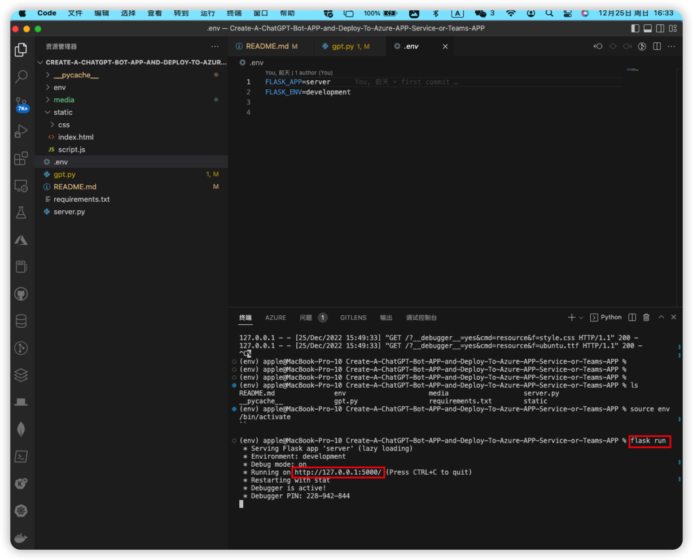

9. 在浏览器中打开 http://127.0.0.1:5000/
    
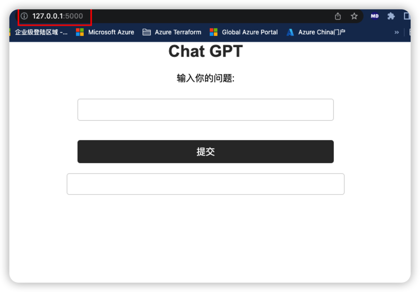

10.  可以输入一些感兴趣的问题测试一下ChatGPT的能力，这样该应用在本地测试就完成了

&nbsp; 

## 部署 Python Web 应用到 Azure App Service
现在，你已经在本地测试了OpenAI API 智能聊天机器人应用。接下来，你可能希望将该应用部署到 Azure App Service 上。

1. 在VS code中打开该项目。
2. 确认您的VS Code已经安装了Azure Account,Azure Tools和Azure App Service扩展。并在VS Code中[登录Azure账号](https://marketplace.visualstudio.com/items?itemName=ms-vscode.azure-account)。
3. 在VS code中打开设置（Ctrl + Shift + P），并输入“Azure App Service: Create New Web App”。
4. 在提示中选择“Azure App Service: Create New Web App”，然后按照提示操作。你需要选择一个订阅、资源组Web应用的名称。Runtime Stack选择Python 3.10。
5. 在VS code中打开设置（Ctrl + Shift + P），并输入“Azure App Service: Deploy to Web App”。
6. 在提示中选择“Azure App Service: Deploy to Web App”，然后按照提示操作。你需要选择之前创建的Web应用和你要部署的文件夹。
7. 这样，你的应用就会被部署到 Azure App Service 上，并可以通过 Internet 访问。
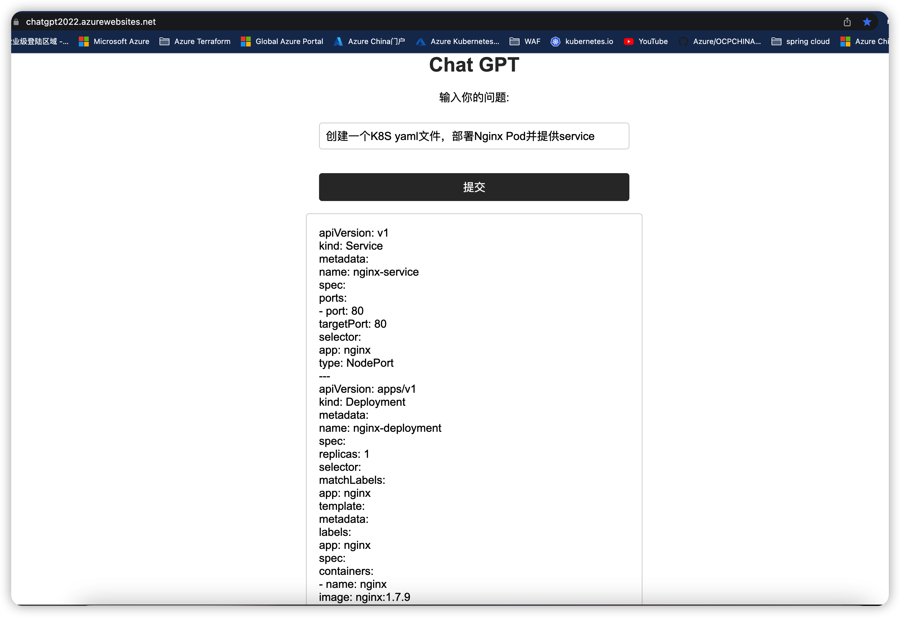

&nbsp; 
## 部署OpenAI Bot 到Microsoft Teams tab App
在Microsoft Teams 中以一个app形式部署OpenAIBot有多种方式，例如：
1. 通过Microsoft Teams App Studio创建OpenAI聊天机器人：Microsoft Teams App Studio可以帮助你创建自定义的OpenAI聊天机器人应用，以便在Microsoft Teams中使用。

2. 使用Microsoft Bot Framework创建OpenAI聊天机器人：Microsoft Bot Framework可以帮助你快速创建和部署OpenAI聊天机器人，并将其部署到Microsoft Teams中。

3. 使用Azure Bot Service创建OpenAI聊天机器人：Azure Bot Service可以帮助你快速创建和部署OpenAI聊天机器人，并将其部署到Microsoft Teams中。
4. 将创建的OpenAI的website，通过website URL的方式部署到Microsoft Teams tab App。

具体方案选择和实现方法，可以参考[Microsoft Teams开发者文档](https://learn.microsoft.com/en-us/microsoftteams/platform/)。

本文之前已经将OpenAI Bot部署到Azure App Service上，因此，我们将使用第4种方式将现有的ChatGPT Bot应用以URL方式部署到Microsoft Teams tab App。步骤如下，
1. 首先，你需要在Microsoft Teams中打开要部署该OpenAI交互页面的团队teams。
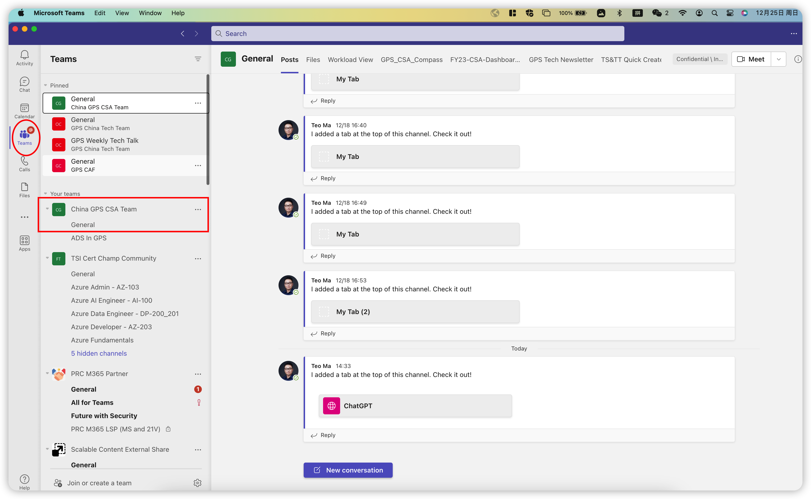
2. 然后，在团队的导航栏中，单击 **“+”**,即 **“Add a tab”**。
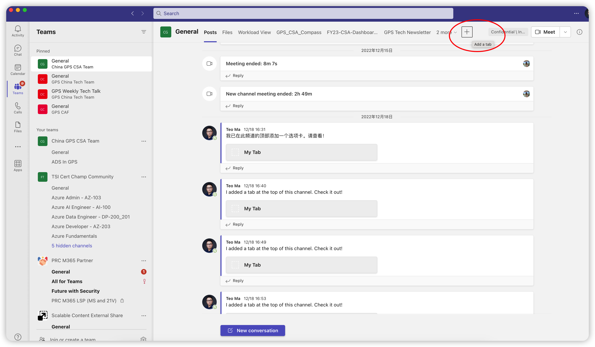
3. 在“Add a tab”窗口中，搜索“website”，并点击这个应用。
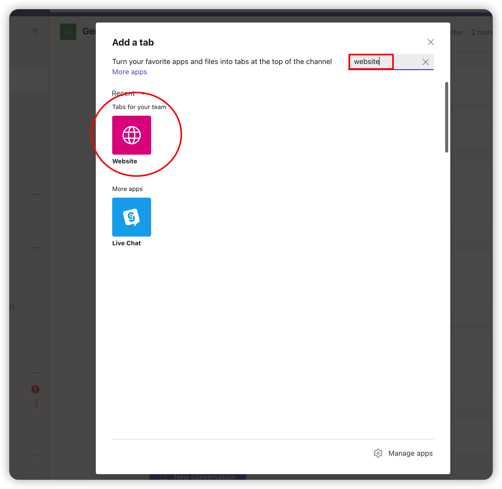
4. 在“名称”字段中输入应用的名称。在“URL”字段中输入应用的URL。这是你部署在Azure App Service上应用的URL。
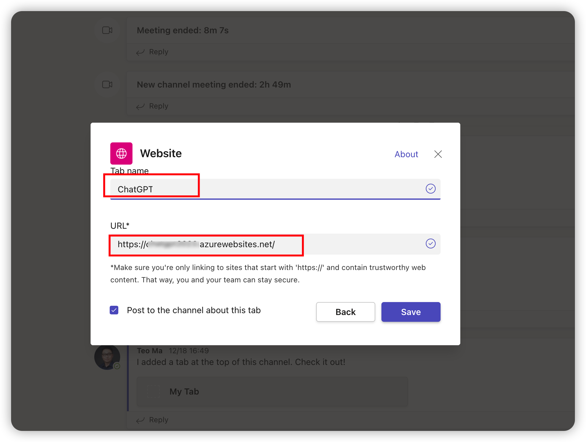
5. 单击“Save”按钮。这会将应用添加到Microsoft Teams您的团队的导航栏中。
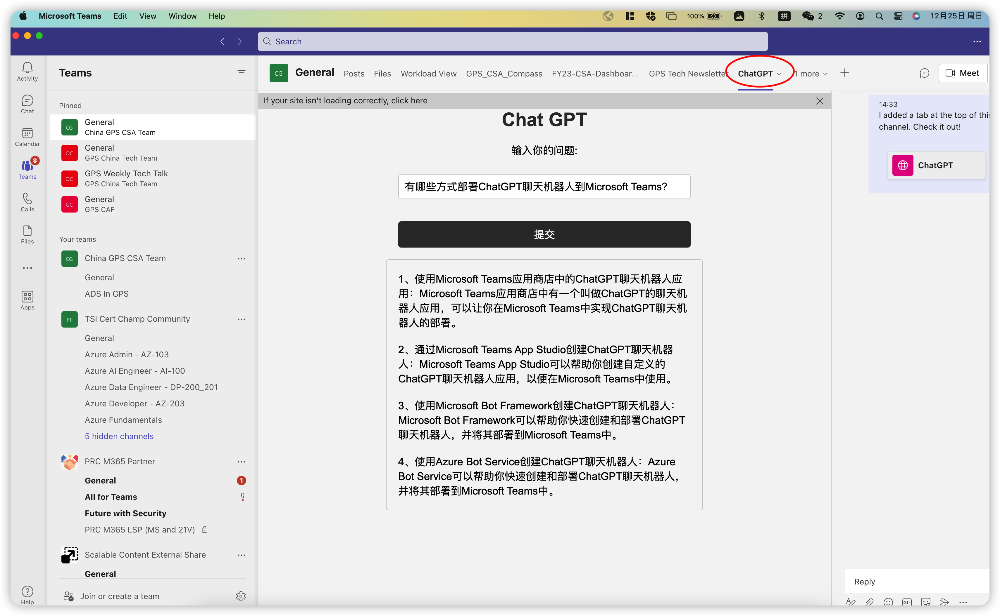

&nbsp; 
## 结论

本文介绍了如何将OpenAI API部署到Azure App Service及team apps上，它提供的功能比较强大，大家可以根据自己的业务需求场景创建更多的OpenAI应用。
