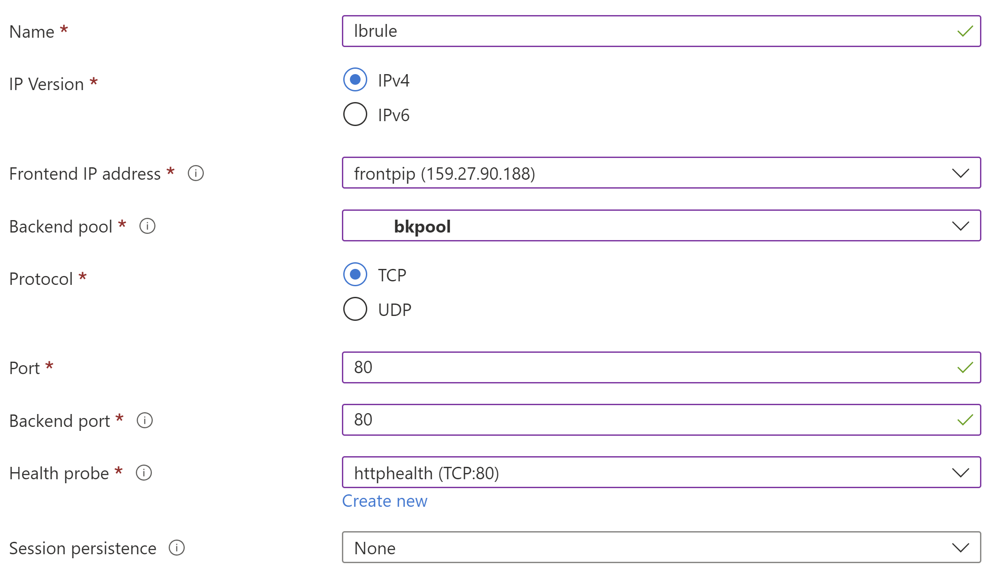
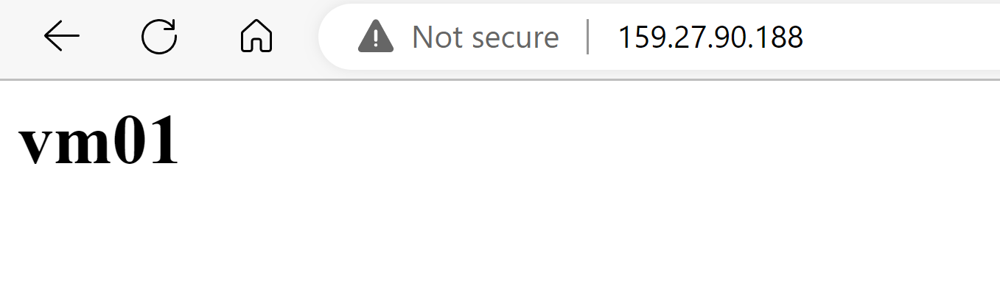

# Azure上的双机高可用集群搭建
由于合规性和政策上的一些原因, 在中国区Azure目前仍然无法通过应用市场来安装Global Azure丰富的第三方开源解决方案, 所以大部分的开源解决方案仍需要客户通过虚拟机自己搭建, 这时为了保证服务的高可用性, 多机横向扩展集群或双机主备集群通常是生产环境中必不可少的高可用方案. 在这个动手实验中我们将指导大家搭建常用的双机主备集群实现虚拟机业务的高可用部署. 为了方便大家实验我们使用常用的Centos操作系统, 在实际生产环境建议使用企业级操作系统如[SUSE Enterprise Linux](https://learn.microsoft.com/en-us/azure/virtual-machines/workloads/sap/high-availability-guide-suse-pacemaker).

在这个实验中我们将利用业内常用的Pacemaker和Corosync来搭建主从集群, 而Fencing方案目前有SBD Device (iSCSI target), SBD Device(Azure Shared Disk), Azure fence agent, 在这个实验中我们将选用最简单最新的Azure fence agent来帮助我们快速搭建集群.

```
注释:
在实验基础配置信息如下:
Azure资源组  haserver
创建两台虚拟机位于同一可用性集 vm01, vm02 均为 Ubuntu Server 20.04 LTS, DS2v4, 32G 高级SSD
vm01 10.0.0.4
vm02 10.0.0.5
浮动IP 10.0.0.100

在后续文档中:
[A] 表示在两个节点上都需要进行的操作
[1] 表示在vm01上进行的操作
[2] 表示在vm02上进行的操作
```
## 更新系统到最新
> [A]# sudo su

> [A]# apt-get update && reboot

## 更新/etc/hosts文件, 实际IP以实际环境为准
> [A]# vi /etc/hosts
```
10.0.0.4    vm01
10.0.0.5    vm02
10.0.0.100  haserver
```
## 安装需要的软件
安装集群所需软件包
> [A]# apt-get install --assume-yes pacemaker corosync pcs

安装Azure SDK包
> [A]# apt-get install --assume-yes python3-azure fence-agents

安装测试HTTP服务包
> [A]# apt-get install --assume-yes lighttpd

> [A]# systemctl stop lighttpd.service

> [A]# systemctl disable lighttpd.service

## 设置集群用户密码

> [A]# echo "hacluster:Pass@1234567" | chpasswd

## 启动集群管理服务
> [A]# systemctl start pcsd

> [A]# systemctl enable pcsd

> [A]# systemctl status pcsd

## 创建并启动集群
> [1]# pcs cluster auth -u "hacluster" -p "Pass@1234567"

> [1]# pcs host auth vm01 vm02 -u "hacluster" -p "Pass@1234567"
```
vm01: Authorized
vm02: Authorized
```

> [1]# pcs cluster setup hacluster vm01 vm02 --start --force
```
Cluster has been successfully set up.
Starting cluster on hosts: 'vm01', 'vm02'...
```

> [1]# pcs cluster enable --all
```
vm01: Cluster Enabled
vm02: Cluster Enabled
```

> [1]# pcs status
```
Cluster name: hacluster

WARNINGS:
No stonith devices and stonith-enabled is not false

Cluster Summary:
  * Stack: corosync
  * Current DC: vm01 (version 2.0.3-4b1f869f0f) - partition with quorum
  * Last updated: Sun Nov 13 09:04:39 2022
  * Last change:  Sun Nov 13 09:03:04 2022 by hacluster via crmd on vm01
  * 2 nodes configured
  * 0 resource instances configured

Node List:
  * Online: [ vm01 vm02 ]

Full List of Resources:
  * No resources

Daemon Status:
  corosync: active/enabled
  pacemaker: active/enabled
  pcsd: active/enabled
```

## 创建Service Principle for Azure fence agent
```
使用Azure CLI登录后创建
# az ad sp create-for-rbac -n pcssp --scopes /subscriptions/yourSubscriptionID --role contributor
记录应用ID, 和密码, 这里我们赋予了订阅Contributor的权限, 实际使用中也可以创建自定义Role仅包含如下权限
"Microsoft.Compute/*/read",
"Microsoft.Compute/virtualMachines/powerOff/action",
"Microsoft.Compute/virtualMachines/start/action"
```
## 创建Fencing服务
> [1]# pcs quorum expected-votes 2

> [1]# pcs property set stonith-timeout=900

> [1]# pcs stonith create fenceazure fence_azure_arm login="APPID" passwd="APPPass" resourceGroup="YourRG" tenantId="yourTenantID" subscriptionId="yourSubID" cloud=china power_timeout=240 pcmk_reboot_timeout=900 op monitor interval=60s

> [1]# pcs property set stonith-enabled=true

> [1]# pcs status
```
Cluster name: hacluster
Cluster Summary:
  * Stack: corosync
  * Current DC: vm01 (version 2.0.3-4b1f869f0f) - partition with quorum
  * Last updated: Wed Nov 16 02:55:36 2022
  * Last change:  Wed Nov 16 02:55:33 2022 by root via cibadmin on vm01
  * 2 nodes configured
  * 1 resource instance configured

Node List:
  * Online: [ vm01 vm02 ]

Full List of Resources:
  * fenceazure	(stonith:fence_azure_arm):	 Started vm01

Daemon Status:
  corosync: active/enabled
  pacemaker: active/enabled
  pcsd: active/enabled
```
## 创建测试资源
配置不同的页面显示以区分服务所在节点, 在真实生产环境中可以配置共享存储以保证服务一致性
> [A]# sudo rm /var/www/html/*.html

> [A]# echo "\<h1\>\$HOSTNAME\</h1\>" | sudo tee /var/www/html/index.html

> [1]# pcs resource create virtual_ip **ocf**:**heartbeat**:**IPaddr2** ip=10.6.0.100 cidr_netmask=32 op monitor interval=60s

> [1]# pcs resource create webserver systemd:lighttpd op monitor timeout=20s interval=60s

> [1]# pcs constraint colocation add webserver with virtual_ip INFINITY

> [1]# pcs constraint order virtual_ip then webserver

> [1]# pcs status
```
Cluster name: hacluster
Cluster Summary:
  * Stack: corosync
  * Current DC: vm01 (version 2.0.3-4b1f869f0f) - partition with quorum
  * Last updated: Wed Nov 16 11:07:02 2022
  * Last change:  Wed Nov 16 11:06:38 2022 by root via cibadmin on vm01
  * 2 nodes configured
  * 3 resource instances configured

Node List:
  * Online: [ vm01 vm02 ]

Full List of Resources:
  * fenceazure	(stonith:fence_azure_arm):	 Started vm01
  * virtual_ip	(ocf::heartbeat:IPaddr2):	 Started vm01
  * webserver	(systemd:lighttpd):	 Started vm01

Daemon Status:
  corosync: active/enabled
  pacemaker: active/enabled
  pcsd: active/enabled
```

## 重启集群服务

> [1]# pcs cluster stop --all

> [1]# pcs cluster start --all

> [1]# pcs status resources

## 在资源组中创建标准负载均衡, 类型为Public, 后端池为集群中的两台虚机, 侦听于80端口, 并打开虚拟机网络安全组中的80端口


## 测试访问服务


## 测试关闭正在运行WebServer服务的vm01, 集群自动failover

> [2]# pcs cluster stop vm01

或者
> [2]# pcs stonith fence vm01

查看集群状态, 是否所有资源都切换至另一正常节点
> [2]# pcs status
```
Cluster name: hacluster
Cluster Summary:
  * Stack: corosync
  * Current DC: vm02 (version 2.0.3-4b1f869f0f) - partition with quorum
  * Last updated: Wed Nov 16 11:09:38 2022
  * Last change:  Wed Nov 16 11:06:38 2022 by root via cibadmin on vm01
  * 2 nodes configured
  * 3 resource instances configured

Node List:
  * Online: [ vm02 ]
  * OFFLINE: [ vm01 ]

Full List of Resources:
  * fenceazure	(stonith:fence_azure_arm):	 Started vm02
  * virtual_ip	(ocf::heartbeat:IPaddr2):	 Started vm02
  * webserver	(systemd:lighttpd):	 Started vm02

Daemon Status:
  corosync: active/enabled
  pacemaker: active/enabled
  pcsd: active/enabled
```
