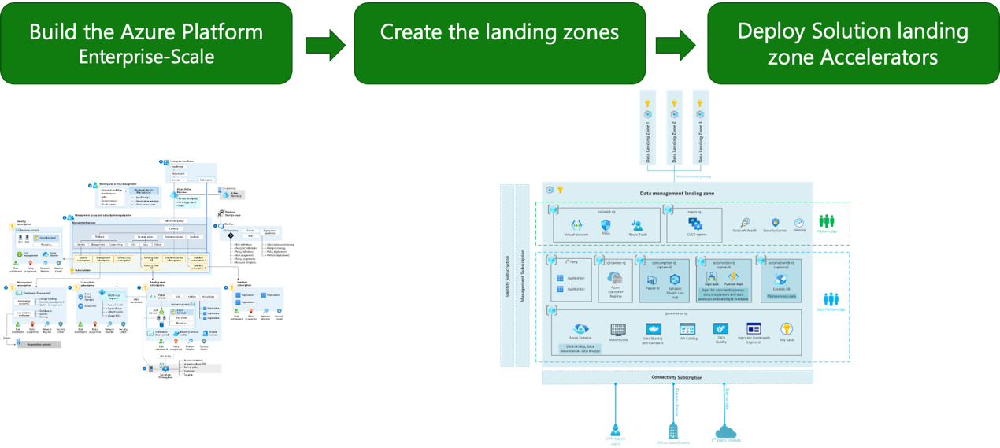

# LandingZonesDeploymentwithTerraform
使用Azure Terraform/Rover 部署Azure企业级Landing Zone


> [实验背景](#实验背景)
>
> [所需基础知识介绍](#所需基础知识介绍)
>

&nbsp;
&nbsp;

## 实验背景

本实验目的意在帮助云管理Partner及客户使用Azure
Terraform（包含工具集及代码）部署一个企业级Landing
Zone，以此掌握使用云原生IaC（基础架构即代码）的技能加速企业客户云采用历程。

在本动手实验中，您将了解如何使用Azure
Terraform为虚拟企业客**Contoso**公司构建基于云采用框架
(CAF)的登陆区。需要同时具备**Terraform 、Azure CAF、Docker、Git知识，以及具有简单的开发技能**。

本动手实验将指导您如何部署平台Landing Zone，包括：

-   Azure 远程状态管理（启动板）

-   用于管理组、策略定义、策略分配和 RBAC 的 Azure Landing
    Zone（以前称为企业级）

-   身份服务（Azure Active Directory 服务，扩展您的本地 Active Directory
    域服务\...\...）

-   监控服务

-   连接服务（虚拟WAN、私有DNS区域、出口防火墙\...）

本动手实验中的步骤将指导您完成以下过程：



&nbsp;
&nbsp;

## 所需基础知识介绍

1.  **Azure CAF Landing Zone（登陆区）**

    Microsoft Azure CAF（云采用框架）为您提供采用Azure的指导和最佳实践。而AzureLandingZone是多订阅Azure环境的输出，该环境负责缩放、安全治理、网络和标识。AzureLanding
    Zone可在Azure中实现应用程序迁移、现代化和创新。此方法考虑支持客户应用程序组合所需的所有平台资源，并且不会区分基础结构即服务或平台即服务。


&nbsp;

2.  **Azure Terraform**

      Azure提供用于生成Azure登陆区的微软第一方服务，也可以使用第三方工具完成这项工作。HashiCorp的**Terraform**是客户和合作伙伴经常用来部署Landing Zone的一种工具。
      Azure Landing Zone (ALZ) Terraform 模块是用于从 Azure Landing Zone概念体系结构部署平台资源的正式 Terraform 模块。该模块旨在简化管理组层次结构、策略和管理订阅中的资源的部署。将资源部署到应用程序Landing Zone超出了模块的范围，从而决定部署方法和工具给负责应用程序的团队。


      CAF Terraform Landing Zone方法是一组工具，提供抽象的、有意见的 Terraform实现，以在 Azure 中提供部署自动化。 它允许客户使用 Terraform将资源部署到应用程序Landing Zone，并提供部署订阅的机制。此方法还可以部署 Azure Landing Zone概念体系结构，方法是实现 AzureLanding Zone Terraform 模块。


      下图演示了两种方法的覆盖范围：


> CAF Terraform 登陆区产品团队的使命是：

-   为 Azure 上的 Terraform 配备站点可靠性工程团队。

-   使 IaC 民主化：基础设施即配置。

-   将状态管理和企业范围内的组合产品化。

-   使用 Azure 企业级Landing Zone标准化部署。

-   使用本地 Terraform 和 DevOps 实施Azure企业级登陆区设计方法。

-   就如何在Microsoft Azure上为IaC（基础设施即代码）启用 DevOps
    提出规范性指南。

-   使用一组通用实践和共享最佳实践来培养 Azure
    Terraform社区成员和开发者。

&nbsp;

3.  **CAF Rover**

在您的笔记本电脑上使用原生的Azure Terraform
可以完成你想要的Azure资源管理。但为了简化使用Terraform创建Landing Zone，**CAF Rover提供了对Azure Terraform近一步封装，**并且具有两个维度：

-   **Rover运行环境是一个容器**

    -   允许在 PC、Mac、Linux
        上获得一致的开发人员体验，包括正确的工具、git 挂钩和 DevOps
        工具。

    -   与Visual Studio Code、GitHub Codespaces的本机集成。

    -   包含应用Landing Zone所需的版本化工具集。

    -   通过分离运行环境和配置环境，帮助您快速切换组件版本。

    -   确保管道的普遍性和抽象性在任何地方运行Rover，无论使用哪种管道技术。

-   **Rover是一个 Terraform 包装器**

    -   帮助您在 Azure 存储帐户上透明地存储和检索 Terraform 状态文件。

    -   促进向 CI/CD 的过渡。

    -   在本地和管道内部实现无缝体验（状态连接、执行跟踪等）。

**CAF Rover有如下好处**：

-   极大地简化了 Azure 存储帐户的安全状态管理。

-   帮助测试不同版本的二进制文件（新版本的 Terraform、Azure
    CLI、jq、tflint 等）

-   无处不在的开发环境：每个人都使用相同版本的 DevOps
    工具链，始终保持最新，在笔记本电脑、管道、GitHub 代码空间等上运行。

-   促进向任何 CI/CD 的身份转换：即所有 CI/CD 都具有容器功能。

-   允许从一个 DevOps 环境轻松过渡到另一个（GitHub Actions、Azure
    DevOps、Jenkins、CircleCI 等）

-   它是开源的，并利用了 Terraform 经常需要的开源项目。在哪里可以找到
    CAF
    Rover[？](https://aztfmod.github.io/documentation/docs/rover/rover-intro#where-to-find-caf-rover)

Rover一个开源项目，您可以直接从Docker
Hub找到稳定或预览版本，或者创建您自己的版本，以匹配您组织自己的 DevOps
工具包。您可以在此处找到Rover项目。

您可以单独使用此处的所有工具，但这意味着您必须手动完成Rover所做的一切:)

Rover 已经包含在 CAF Terraform
的开发环境中（.devcontainer各个项目中的文件夹）。

&nbsp;

4.  **Rover Ignite**

      为客户云环境创建一致的配置文件堆栈很容易出错。Rover ignite是一个迭代工具，为您创建部署完特定整客户环境所需的文件集。Rover ignite命令将采用模板化配置文件，并根据您的客户环境设置为您生成不同的元素，包括readme文件。Rover ignite 将 YAML 文件作为模板摄取，这些模板将生成 tfvars文件、readme文件和即将生成的管道。


      总结下来，RoverIgnite生成基于客户环境所需的Rover变量及含有运行Rover命令的readme文件等客户化配置信息。Readme文档里含有执行命令及描述。基于这些执行命令，可以通过复制/粘贴快速执行Rover命令进行部署。

        典型的Rover Ignite命令如下所示（但是，一般来说，在 CAF中，我们将为您提供有关如何最好地使用它的具体说明）：

    ```bash

        rover ignite \
        --playbook /tf/caf/landingzones/templates/platform/ansible.yaml \
        -e base_templates_folder=/tf/caf/landingzones/templates/platform \
        -e resource_template_folder=/tf/caf/landingzones/templates/resources \
        -e config_folder=/tf/caf/definitions/single_reuse/platform \
        -e landingzones_folder=/tf/caf/landingzones

    ```


    所需参数参考：

   -   **-playbook** 是Ansible playbook根配置的路径。 

   -   **-e base_templates_folder** 是Terraform Landing Zone的 Ansible模板集的路径。 
 
   -   **-e resource_template_folder** 是用于 Azure 资源实例化的 Jinja 模板集的路径。

   -   **-e config_folder** 是登陆区的功能模板集的路径 -取决于您从登陆区内的模板目录中选择的方案。
       
   -   **-e landingzones_folder** 是登陆区逻辑文件夹的根路径。
        
  &nbsp;
  &nbsp;

## 接下来请进入[动手实验](./LandingZonesDeploymentwithTerraform.md)
