> [实验环境准备](#实验环境准备)
>
> [动手实验](#动手实验)
>
> [考虑](#考虑)

&nbsp;
&nbsp;


## 实验环境准备
1. 登录Azure portal  
    使用用户名和密码登录[Azure Portal](https://portal.azure.com)  
    
2. 打开Azure Cloud Shell  
   点击此处使用Azure Cloud Shell  
    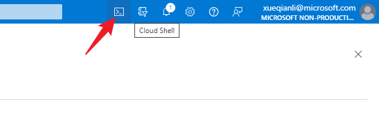  

    显示下图表示您已经成功开启Azure Cloud Shell  

    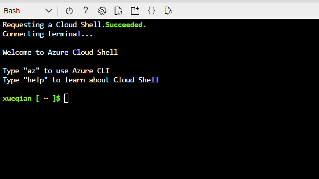  

3. 实验整体架构
   

   **注意**：本动手实验文档默认按Azure Global环境运行，探索对象主要是Azure Database for PostgreSQL的flexible server版本，该版本支持AzureGlobal和AzureChina（世纪互联）等所有Azure公有云
   
## 动手实验
### 部署
1. 使用Bicep部署数据库  

    - 安装bicep
         ```bash
        az bicep install
        ```
        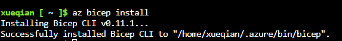
    - 下载bicep模板
        ```bash
        wget https://storageaccounthol.z6.web.core.windows.net/scripts/bicep.zip
        ```
        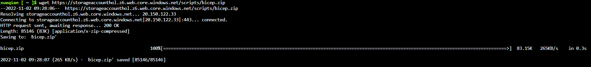
    - 压缩下载文件
        ```bash
        unzip bicep
        ```
        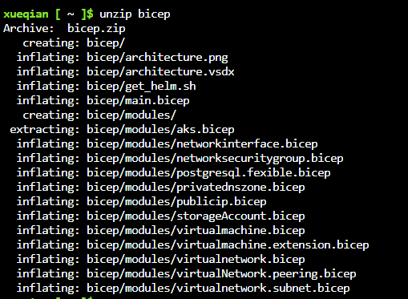
    - 创建一个名为PG-Workshop的资源组来部署实验资源
        ```bash
        az group create -l Eastus -n PG-Workshop
        ```
        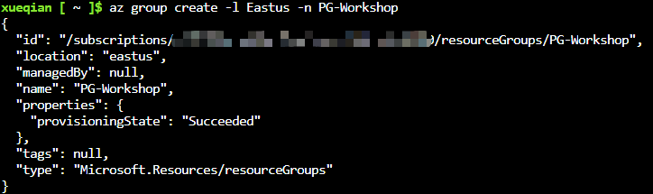
    - 使用bicep模板部署
        ```bash
        az deployment group create --resource-group PG-Workshop --template-file bicep/main.bicep
        ```
        需要为跳板机和数据库分别设置管理用户名和密码，部署需要十几分钟时间，如果部署失败可以多执行几次，直到部署成功以后将会出现以下输出： 

        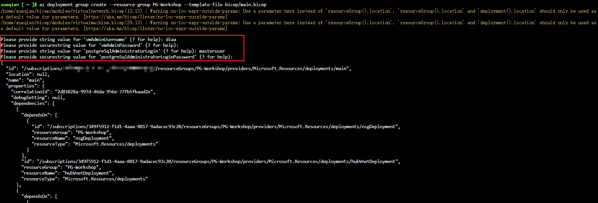
        
        之后您可以在名为PG-Workshop的资源组看到部署后的资源：  

        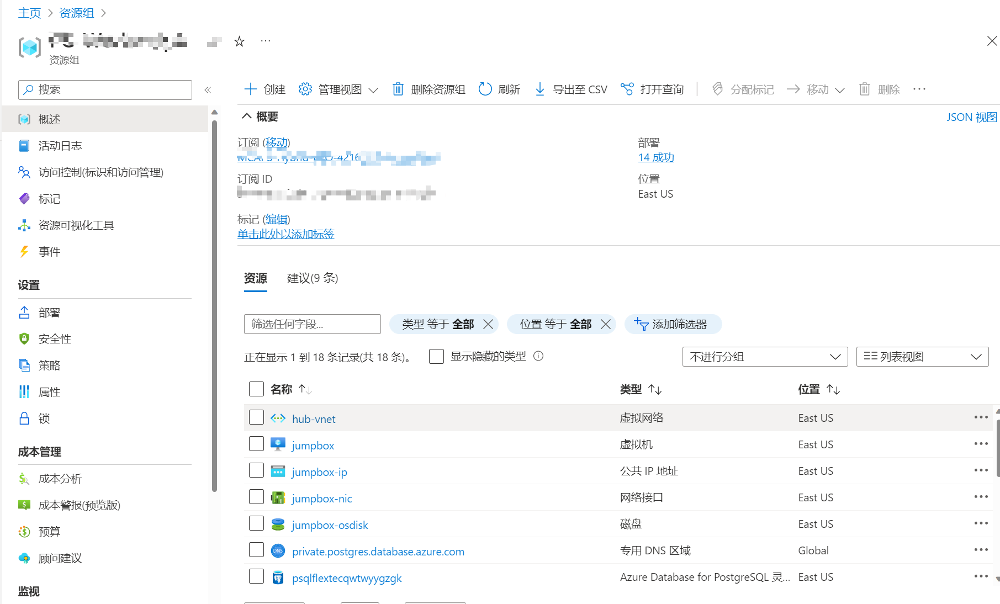

2. 连接数据库  
   
   使用Azure Cloud Shell连接跳板机DNS VM，然后通过DNS VM连接数据库。  
  
    - 
    - 在Azure Cloud Shell中通过ssh连接跳板机
        ```bash
        ssh username@<jumpbox-ip> # 您设置的登录DNS VM的IP地址和用户名
        ```
    - 登录后安装psql（如未安装）
        ```bash
        sudo dnf module enable -y postgresql:13
        sudo dnf install -y postgresql
        ```
        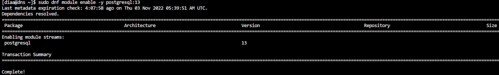
        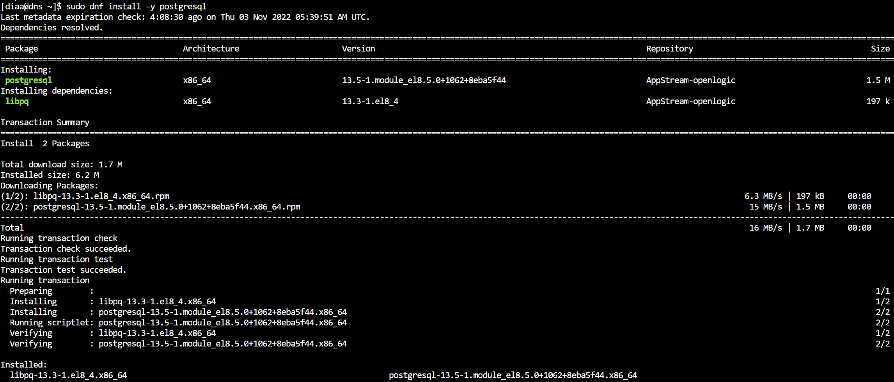

    - 通过预先配置连接参数快速连接数据库
      - 在Azure portal左栏位“Connection Strings”处找到psql字段
      - 在跳板机上创建配置文件
        ```bash
        vi .pg_azure
        ```  
        文件中配置以下内容:  
        ```bash
        export PGDATABASE=postgres
        export PGHOST=[YOURHOST]
        export PGUSER=[YOURUSER]
        export PGPASSWORD=[YOURPASSWD]
        export PGSSLMODE=require
        ```
      - 读取配置文件
        ```bash
        source .pg_azure
        ```
      - psql连接数据
        ```bash
        psql
        ```
        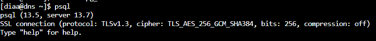

3. 数据引入
    ```bash
    CREATE DATABASE quiz;
    \connect quiz

    CREATE TABLE public.answers (
        question_id serial NOT NULL,
        answer text NOT NULL,
        is_correct boolean NOT NULL DEFAULT FALSE
    );

    CREATE TABLE public.questions (
        question_id integer NOT NULL,
        question text NOT NULL
    );

    ALTER TABLE ONLY public.answers
        ADD CONSTRAINT answers_pkey PRIMARY KEY (question_id, answer);

    ALTER TABLE ONLY public.questions
        ADD CONSTRAINT questions_pkey PRIMARY KEY (question_id);

    ALTER TABLE ONLY public.answers
        ADD CONSTRAINT question_id_answers_fk FOREIGN KEY (question_id) REFERENCES public.questions(question_id);

    CREATE SCHEMA calc;
    CREATE OR REPLACE FUNCTION calc.increment(i integer) RETURNS integer AS $$
            BEGIN
                    RETURN i + 1;
            END;
    $$ LANGUAGE plpgsql;

    CREATE VIEW calc.vista AS SELECT $$I'm in calc$$;

    CREATE VIEW public.vista AS SELECT $$I'm in public$$;

    INSERT INTO public.questions (question_id, question) VALUES (1, 'Jaki symbol chemiczny ma tlen?');

    INSERT INTO public.answers (question_id, answer, is_correct) VALUES (1, 'Au', false);
    INSERT INTO public.answers (question_id, answer, is_correct) VALUES (1, 'O', true);
    INSERT INTO public.answers (question_id, answer, is_correct) VALUES (1, 'Oxy', false);
    INSERT INTO public.answers (question_id, answer, is_correct) VALUES (1, 'Tl', false);
    ```
    查看刚刚创建的表和视图：

    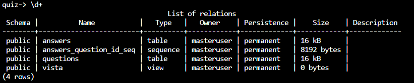

    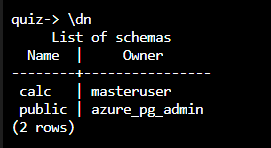

4. 管理PostgreSQL数据库
   - 管理存储和计算

    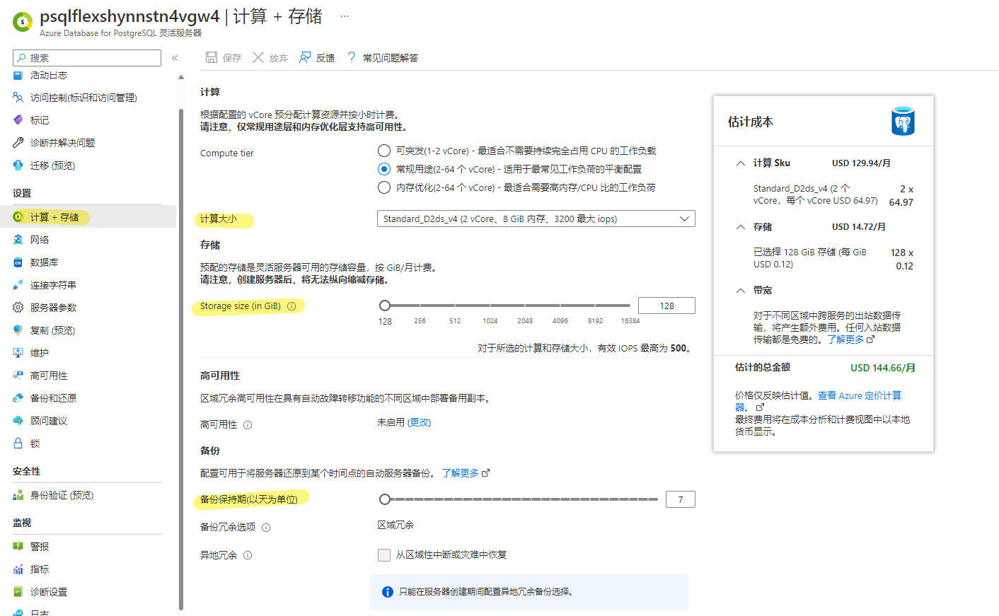

   - 开启pgbouncer服务器参数
    > 内置连接池是一项可选服务，可以再每个数据库服务器启用，并支持公有和私有访问。启用后，PgBouncer 将在数据库服务器上的端口 6432 上运行。PgBouncer 目前不支持可突发服务器计算层。
    
    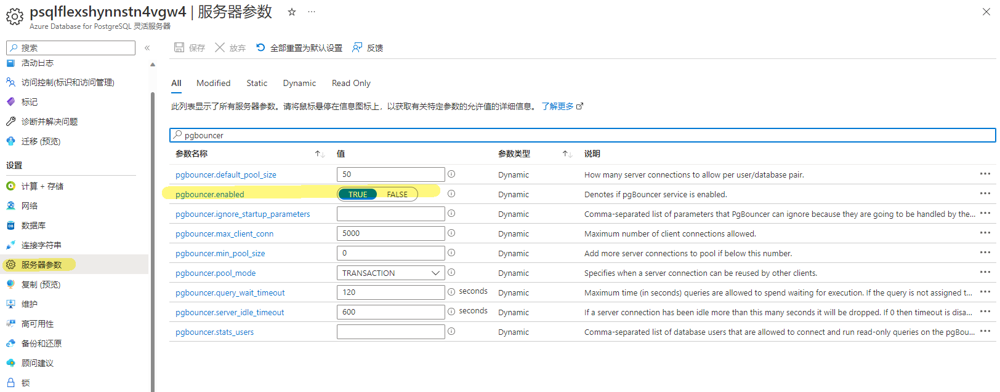

   - 使用服务锁
    > 如果你删除了某个服务器，则也会删除属于该服务器的所有备份，且不可恢复。 为了帮助防止服务器资源在部署后遭意外删除或更改，管理员可以使用管理锁。

    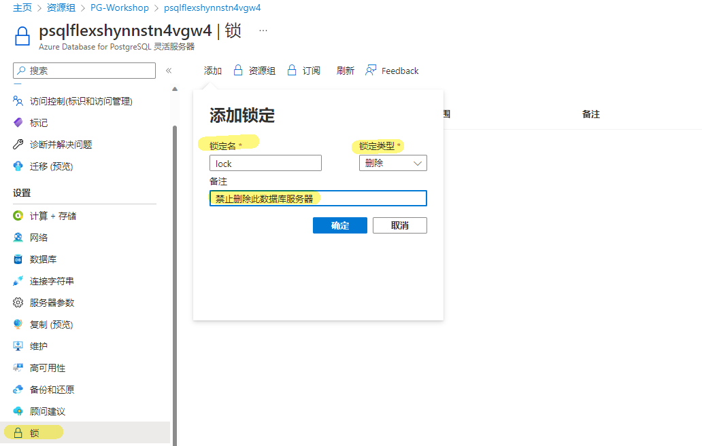

5. 设置角色和权限
    本部分实验探索用户组的权限继承，如果用户没有继承用户组的权限，就不能享受用户组已有的权限，但可以单独给该用户设置权限
    - 创建新的用户组monty_python
    - 创建该用户组的两个新用户Graham和Eric，Graham不继承用户组权限，Eric继承用户组权限，每个用户最大允许两个连接
    - 显示集群中的所有角色
    - 连接到数据引入时创建的quiz数据库
    - 把quiz数据库中所有表的权限赋予用户组monty_python，切换用户，Graham应该无法读取quiz数据库中的表，而Eric可以读取
    - 切换为超级管理员账户给Graham设置查询权限

### 可用性和业务连续性
1. 备份和恢复
    - 逻辑备份pg_dump和pg_restore

    - 物理备份和PITR还原  
        > 默认情况下，Azure Database for PostgreSQL 支持自动备份整个服务器（包括创建的所有数据库），自动备份包括数据库的每日增量快照，日志 (WAL) 文件持续存档至 Azure Blob 存储

        > 备份保持期：备份保留期默认为 7 天。目前，灵活服务器支持自动备份最多保留 35 天。 可以使用手动备份来满足长期保留要求。

        > 备份频率：灵活服务器上的备份基于快照。 第一次完整快照备份在创建服务器后立即进行。 增量快照备份每日创建一次。事务日志备份的发生频率不同，具体取决于工作负载和 WAL 文件已填充并准备好存档的时间。 一般情况下，延迟（恢复点目标，简称 RPO）最大可为 15 分钟。

        > 备份是使用快照执行的联机操作。 快照操作只需几秒钟，不会干扰生产工作负载，可帮助确保服务器的高可用性。

        > 备份加密：在查询执行过程中创建的所有 Azure Database for PostgreSQL 数据、备份和临时文件都通过 AES 256 位加密进行加密。 存储加密始终处于启用状态，无法禁用。

2. 复制
   
3. 高可用和灾备
    > 配置高可用性后，灵活服务器会自动预配和管理备用副本。 备用副本将部署在与主服务器完全相同的 VM 配置（包括 vCore、存储空间、 网络设置 (VNET、防火墙)等）中。

    > 使用 PostgreSQL 流式复制以同步模式将预写日志 (WAL) 流式传输到副本。应用程序读取操作直接从主服务器进行，而只有在主服务器和备用副本上保存了日志数据后，才会向应用程序确认提交和写入操作。 由于这种额外的往返，预计会增加应用程序写入和提交操作的延迟。 

    > 在典型情况下，从应用程序的角度而言，故障转移时间或故障时间介于 60 秒至 120 秒之间。 如果在长期事务、索引创建或大量写入活动的过程中发生中断，这个时间可能会更长，因为备用服务器需要更长时间才能完成恢复过程。由于复制是在同步模式下发生，因此不会有数据丢失。

    > 可突发的计算层不支持高可用性。  

    > **注意**：备用副本不同于只读副本，不支持读取查询
4. 维护
5. 审计