> [实验环境准备](#实验环境准备)
> 
> [实验一：使用Azure DMS将本地postgreSQL联机迁移到Azure Database for postgreSQL flexible server](#实验一迁移)
> 
> [实验二：连接并管理云上的数据库](#实验二连接并管理云上的数据库)
> 
> [实验三：管理数据库的角色和权限](#实验三管理数据库的角色和权限)
> 
> [实验四：手动备份还原pg_dump和pg_restore](#实验四手动备份还原pg_dump和pg_restore)
> 
> [实验五：自动备份和时间点还原](#实验五自动备份和时间点还原)
> 
> [实验六：复制](#实验六复制)
> 
> [实验七：高可用和灾备](#实验七高可用和灾备)
> 
> [高级特性（可选实验）](#高级特性可选)
> 
&nbsp;
&nbsp;


## 实验环境准备
1. 登录Azure portal  
    使用用户名和密码登录[Azure Portal](https://portal.azure.com)  
    
2. 打开Azure Cloud Shell  
   点击此处使用Azure Cloud Shell  
      

    显示下图表示您已经成功开启Azure Cloud Shell  

      

3. 实验资源部署
   
> 使用Bicep部署数据库  

 - 1）安装bicep
      ```bash
     az bicep install
     ```
     
 - 2）下载bicep模板
     ```bash
     wget https://storageaccounthol.z6.web.core.windows.net/scripts/bicep.zip
     ```
     
 - 3）压缩下载文件
     ```bash
     unzip bicep
     ```
     
 - 4）创建一个名为PG-Workshop的资源组来部署实验资源
     ```bash
     az group create -l Eastus -n PG-Workshop
     ```
     
 - 5）使用bicep模板部署
     ```bash
     az deployment group create --resource-group PG-Workshop --template-file bicep/main.bicep
     ```
     需要为跳板机和数据库分别设置管理用户名和密码，部署需要十几分钟时间，如果部署失败可以多执行几次，直到部署成功以后将会出现以下输出： 

     
     
     之后您可以在名为PG-Workshop的资源组看到部署后的资源：  

     
     
4. 实验整体架构
   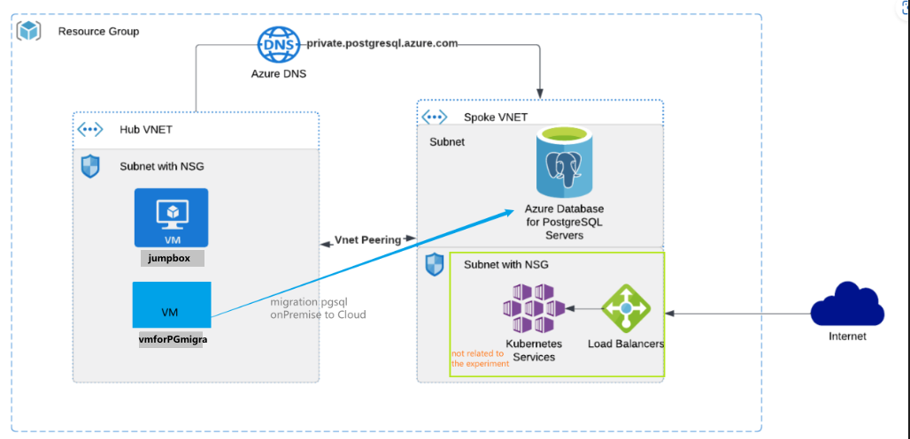

   **注意**：本动手实验文档默认按Azure Global环境运行，探索对象主要是Azure Database for PostgreSQL的flexible server版本，该版本支持AzureGlobal和AzureChina（世纪互联）等所有Azure公有云

## 实验一：迁移

> 本实验使用PostgreSQL官方名为dvdrental的样本数据库，在Azure虚拟机中创建PostgreSql模拟本地环境，借助Azure DMS服务完成本地
> 
> PostgreSql到云上Azure Database for PostgreSql flexible server的数据库迁移

> 实验整体架构在基础实验环境基础上增加了一个模拟本地的虚拟机以及云上的迁移目标数据库
> 
> 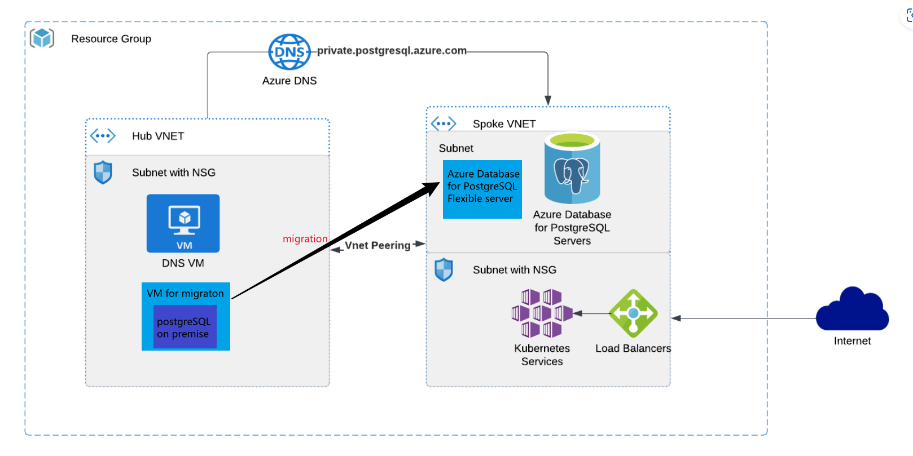


1. **创建一个预配的VM**
   
    参考[快速入门：在 Azure 门户中创建 Windows 虚拟机](https://learn.microsoft.com/zh-cn/azure/virtual-machines/windows/quick-create-portal)
   
- 1）在Azure portal中搜索“虚拟机”，选择创建，注意要选择创建具有预先配置的虚拟机

 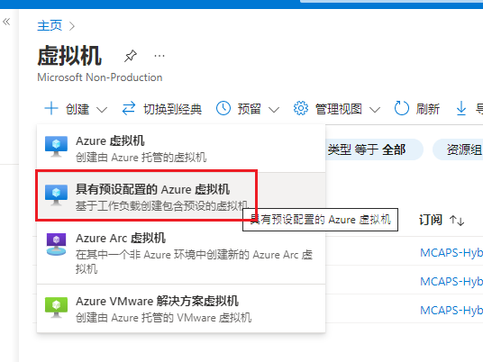

- 2）选择指定镜像，把这个VM放在PG-Workshop资源组里
 
 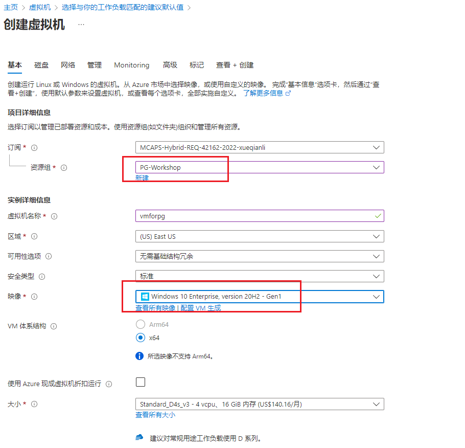

- 3）继续配置以下指定选项，设置登录VM的用户名密码，开启SSH和RDP端口
 
 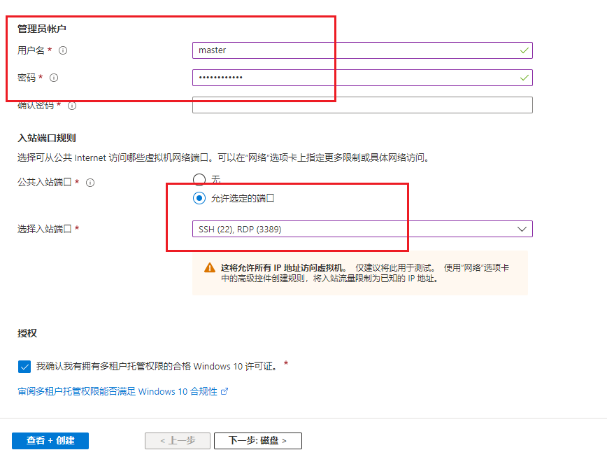

- 4）配置网络，将虚拟机放在hub-vnet子网中
 
 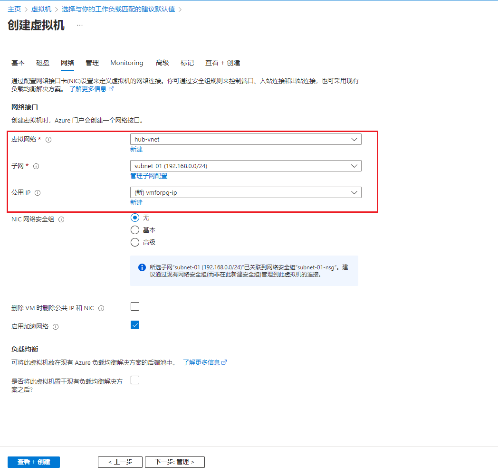

- 5）其他配置使用默认配置即可，点击查看+创建，创建VM

- 6）部署成功后可以在PG-Workshop资源组中查看创建的资源
  
  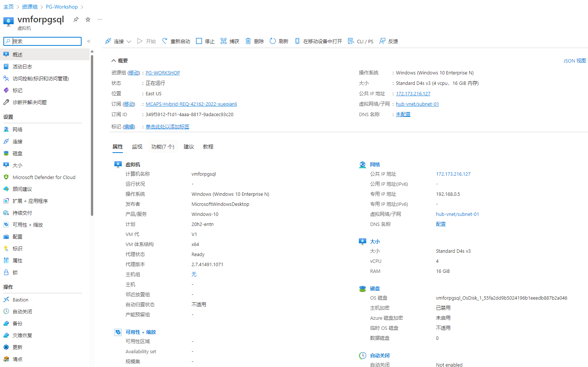
   

2. **在VM中部署数据库并且加载Sample数据库**  
 
- 1）使用本机电脑的远程桌面连接第一步中创建的VM，填写连接ip,vm登录用户名和密码（创建时设置）
  
  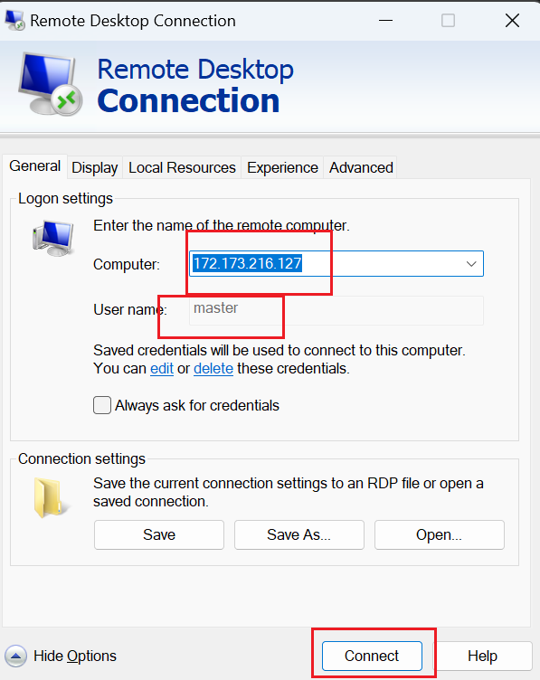

  其中连接ip可以在创建的vm的概述-公共ip处获取
  
  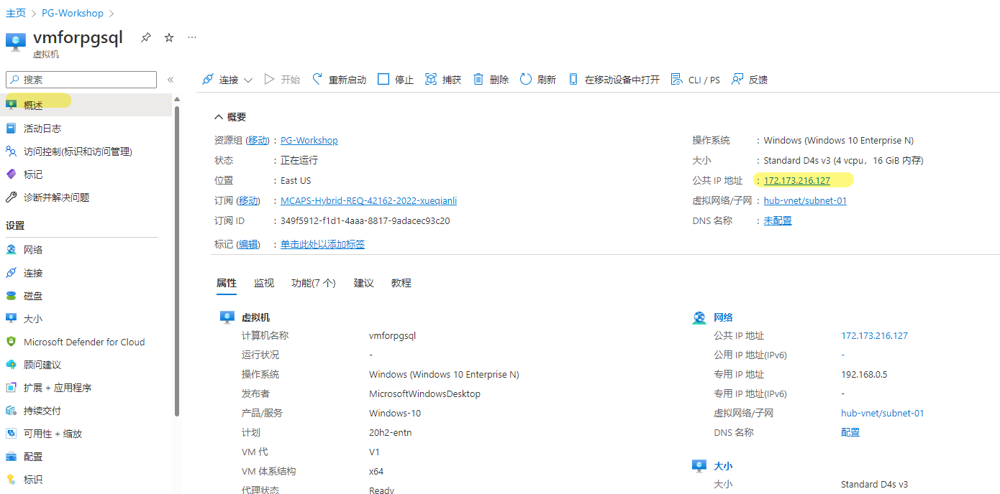

  **注意**：如果连接不上，检查虚拟机-网络的入站端口规则，如果没有开放3389端口，需要在网络选项卡内配置以下入站规则
  
  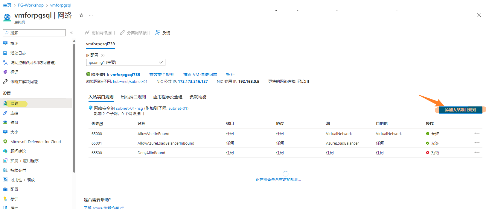
  

- 2）在VM中参考以下[链接](https://www.postgresqltutorial.com/postgresql-getting-started/install-postgresql/)，下载11.8或者12.3版本的PostgreSQL server并安装

- 3）在VM中连接本地的数据库,可以使用[psql工具或者pgAdmin工具](https://www.postgresqltutorial.com/postgresql-getting-started/connect-to-postgresql-database/)
  
- 4）在VM内的数据库中加载dvdrental样本数据库
  
  先下载[DVD Rental Sample Database](https://www.postgresqltutorial.com/postgresql-getting-started/postgresql-sample-database/)

  然后使用[pg_restore或者pgAdmin恢复样本数据库](https://www.postgresqltutorial.com/postgresql-getting-started/load-postgresql-sample-database/)

  **注意**：

  1）恢复数据库前要手动创建dvdrental数据库

  2）使用pg_restore方法恢复数据库时， PostgreSQL安装目录的bin目录需要客户化为自己的，pg_restore命令需要替换为.\pg_restore（这是因为参考链接中的命令适用于linux系统，不适用于windows）


3. **在Azure portal创建Azure Database for PostgreSql**  
   
   参考[此处详细教程](https://docs.azure.cn/zh-cn/postgresql/single-server/quickstart-create-server-database-portal)创建Azure Database for PostgreSql flexible server

    **要点**：

- 1）在[Azure portal](https://portal.azure.com)搜索"postfresql"，选择Azure Database for PostgreSql服务器

- 2）创建时需要选择flexsible server灵活服务器版本
    
    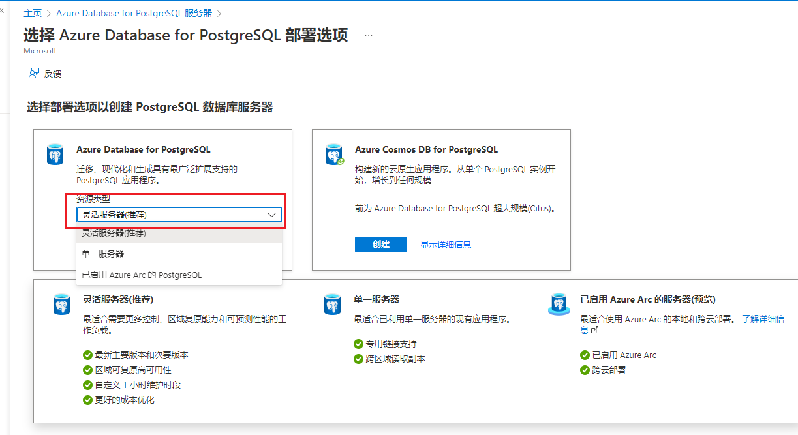

- 3）配置以下选项，配置数据库管理员用户名密码，放置在PG-Workshop资源组里，网络放在spoken-vnet中，其余默认即可，点击创建
- 
    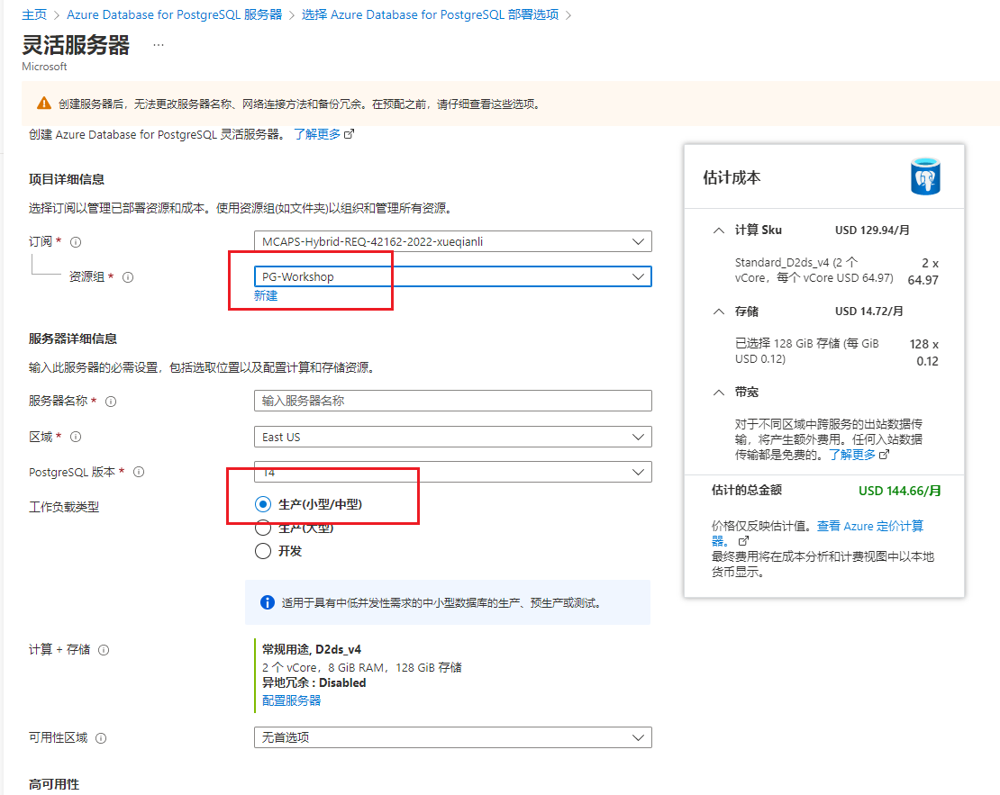
    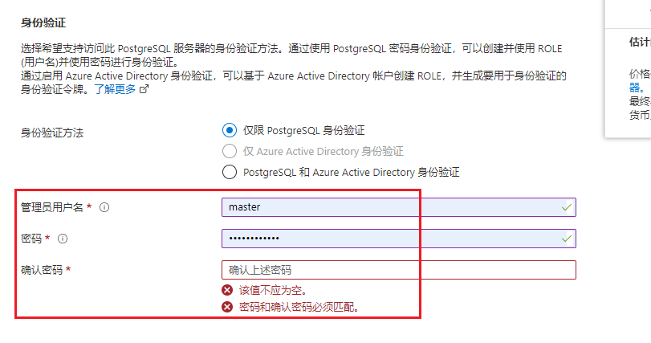
    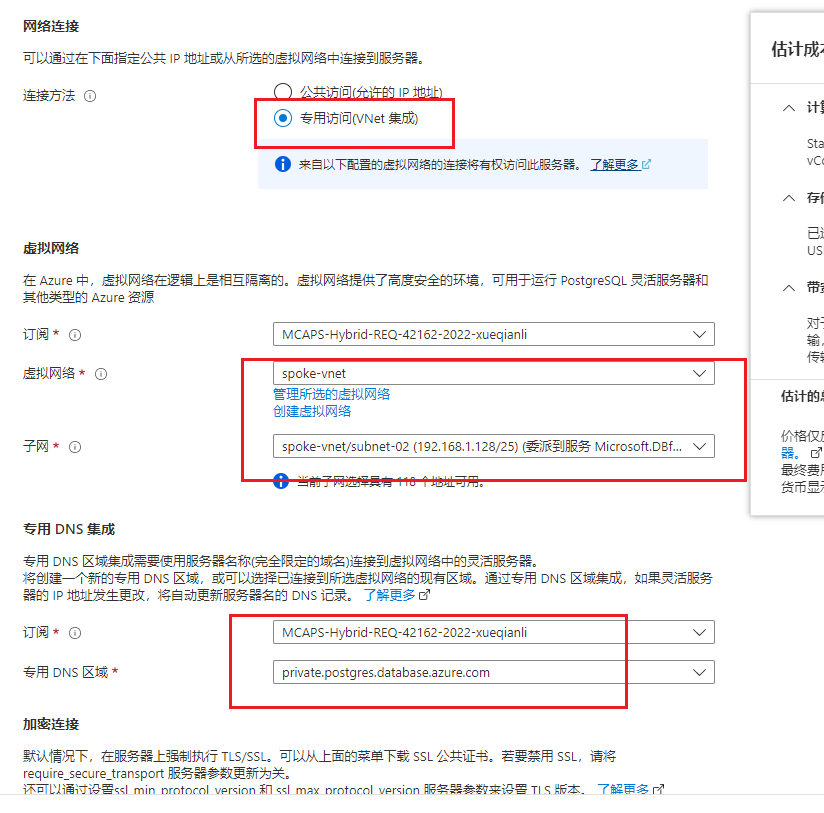

- 4）部署成功后可以在PG-Workshop资源组中查看创建的资源
  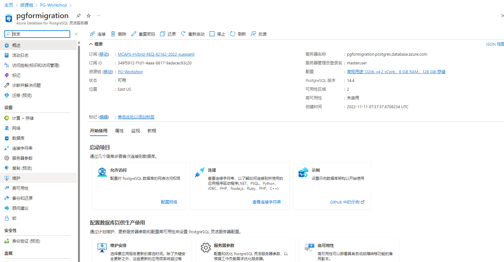

4. **迁移环境准备**
   
- 1）在VM中的 postgresql.config 文件中（在本机PostgreSQL安装路径的data目录下）启用逻辑复制，并设置以下参数：  

    wal_level = logical

    max_replication_slots = [槽数]，建议设置为“5 个槽”

    max_wal_senders =[并发任务数] - max_wal_senders 参数设置可以运行的并发任务数，建议设置为“10 个任务”

- 2）在VM中的 pg_hba.conf 文件中（在本机PostgreSQL安装路径的data目录下）加入云上的PostgreSQL所在DNS的ip
  
  
  
- 3）打开 Windows 防火墙，使 Azure 数据库迁移服务能够访问源 PostgreSQL 服务器（默认情况下为 TCP 端口 5432）

  [开放Windows防火墙5432端口](https://jingyan.baidu.com/article/fd8044fa7fc3245030137a49.html#:~:text=%E5%9C%A8%E9%98%B2%E7%81%AB%E5%A2%99%E9%9D%A2%E6%9D%BF%E4%B8%AD%E5%8D%95%E6%9C%BA%EF%BC%9A%E9%AB%98%E7%BA%A7%E8%AE%BE%E7%BD%AE%202%2F7%20%E5%8F%B3%E9%94%AE%E2%80%9C%E2%80%9D%E5%85%A5%E7%AB%99%E8%A7%84%E5%88%99%E2%80%9C%E2%80%9D%EF%BC%8C%E9%80%89%E6%8B%A9%EF%BC%9A%E6%96%B0%E5%BB%BA%E8%A7%84%E5%88%99,3%2F7%20%E9%80%89%E6%8B%A9%EF%BC%9A%E7%AB%AF%E5%8F%A3---%E4%B8%8B%E4%B8%80%E6%AD%A5%204%2F7%20%E9%94%AE%E5%85%A5%E8%A6%81%E5%BC%80%E6%94%BE%E7%9A%84%E6%8C%87%E5%AE%9A%E7%AB%AF%E5%8F%A3%EF%BC%8C%E4%B8%8B%E4%B8%80%E6%AD%A5)

    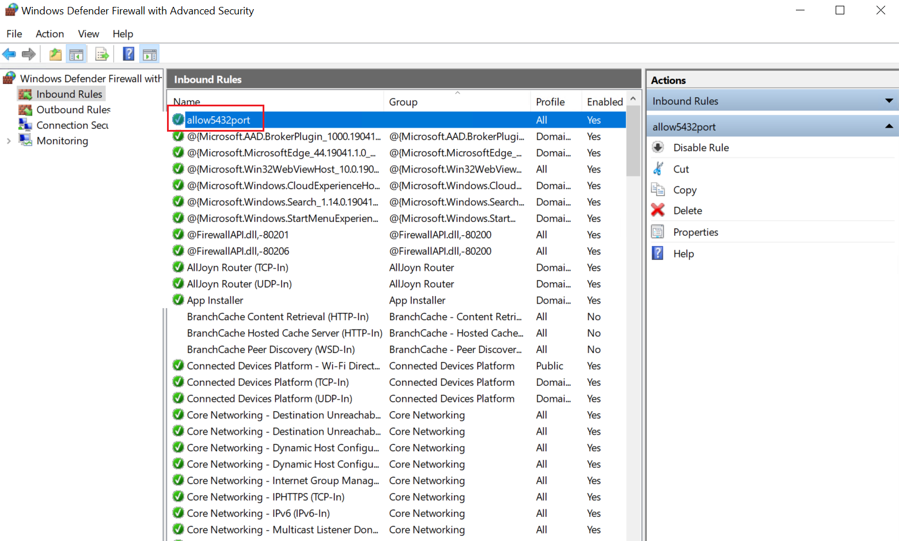

  **注意**：其他场景下可能需要check其他环境是否通畅，可参考[迁移先决条件部分](https://docs.azure.cn/zh-cn/dms/tutorial-postgresql-azure-postgresql-online-portal#prerequisites)

5. **迁移schema**

    参考[迁移架构](https://docs.azure.cn/zh-cn/dms/tutorial-postgresql-azure-postgresql-online-portal#migrate-the-sample-schema)

    **要点**：

- 1）使用本地VM的pgAdmin工具连接云上的postgreSQL数据库，参考[pgAdmin连接数据库](https://www.postgresqltutorial.com/postgresql-getting-started/connect-to-postgresql-database/)

  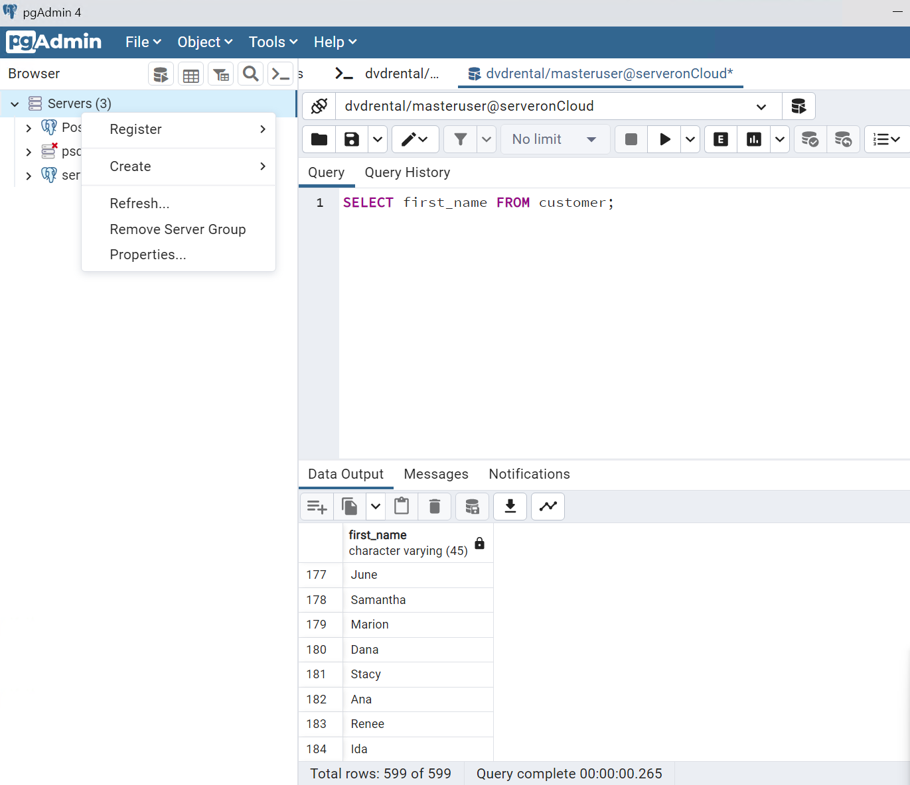

  连接后可以直接在本地的pgadmin中操作云上的postgreSQL数据库

- 2）在VM的postgreSQL安装目录data目录下，使用powershell
  ```bash
    .\pg_dump -o -h localhost -U postgres -d dvdrental -s -O -x > dvdrentalSchema.sql
  ```
- 3）在云上的postgreSQL数据库创建一个空的数据库，也叫dvdrental，可以直接在pgAdmin中操作
  
  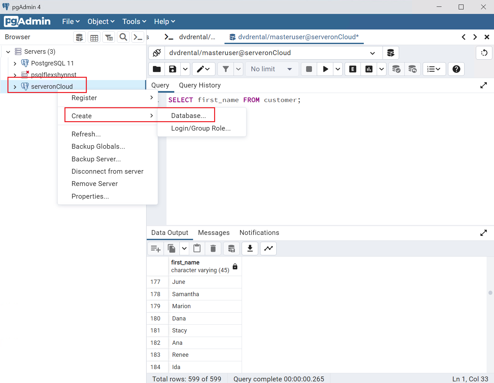

- 4）通过还原架构转储文件，将架构导入已创建的目标数据库
  
  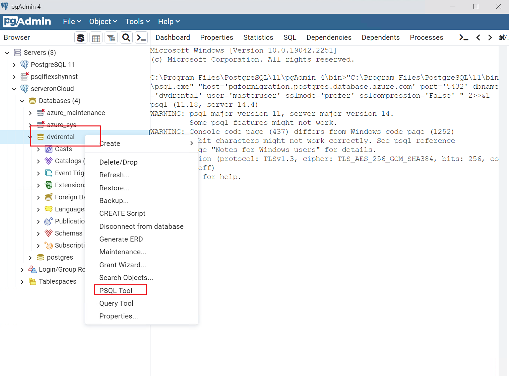

  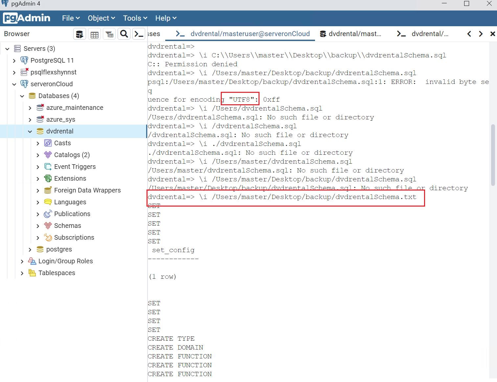

    **注意**：转储schma时，需要注意文件必须是utf-8编码，且路径写法正确，才能成功导入

6. **创建部署Azure Data Migration Service完成迁移**
   
    参考[此处](https://docs.azure.cn/zh-cn/dms/tutorial-postgresql-azure-postgresql-online-portal#register-the-resource-provider)在Azure portal中创建Azure Data Migration Service服务

    **注意**：
    1) 创建Azure Data Migration Service时必须要选择4-core的premium的sku的DMS,否则无法新建postgreSQL的迁移project

    2) 创建活动时，加密连接暂时不要勾选，源服务器名称填写VM的私有ip即可
    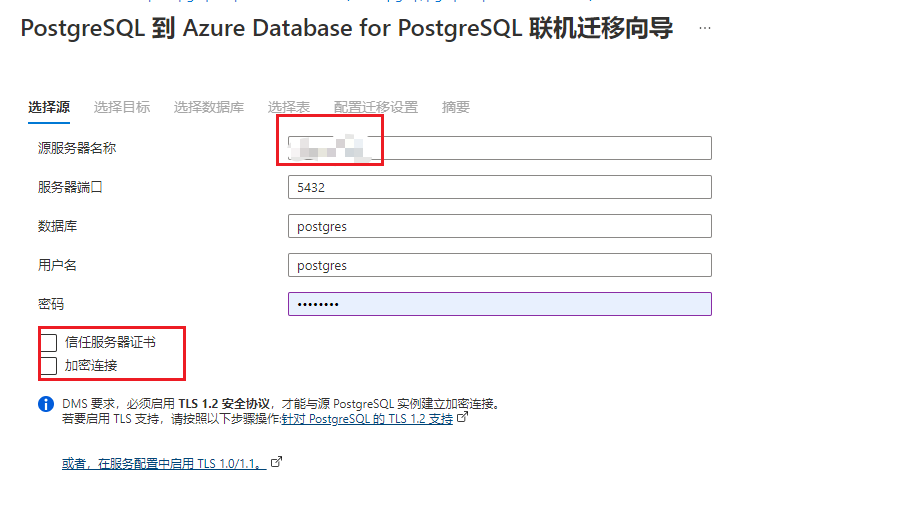


## 连接和管理
### 实验二：连接并管理云上的数据库
1. 连接数据库  
   
   使用Azure Cloud Shell连接跳板机DNS VM，然后通过DNS VM连接数据库。  
  
    - 在Azure Cloud Shell中通过ssh连接跳板机
        ```bash
        ssh username@<jumpbox-ip> # 您设置的登录DNS VM的IP地址和用户名
        ```
        **注意**：如果连接不上跳板机，可以查看跳板机的网络设置，入站流量规则是否打开了22端口

    - 登录后安装psql（如未安装）
        ```bash
        sudo dnf module enable -y postgresql:13
        sudo dnf install -y postgresql
        ```
        
        

    - 通过预先配置连接参数快速连接数据库
      - 在Azure portal左栏位“Connection Strings”处找到psql字段

        

      - 在跳板机上创建配置文件
        ```bash
        vi .pg_azure
        ```  
        文件中配置以下内容:  
        ```bash
        export PGDATABASE=postgres
        export PGHOST=[YOURHOST]
        export PGUSER=[YOURUSER]
        export PGPASSWORD=[YOURPASSWD]
        export PGSSLMODE=require
        ```
      - 读取配置文件
        ```bash
        source .pg_azure
        ```
      - psql连接数据
        ```bash
        psql
        ```
        

2. 数据引入
    ```bash
    CREATE DATABASE quiz;
    \connect quiz

    CREATE TABLE public.answers (
        question_id serial NOT NULL,
        answer text NOT NULL,
        is_correct boolean NOT NULL DEFAULT FALSE
    );

    CREATE TABLE public.questions (
        question_id integer NOT NULL,
        question text NOT NULL
    );

    ALTER TABLE ONLY public.answers
        ADD CONSTRAINT answers_pkey PRIMARY KEY (question_id, answer);

    ALTER TABLE ONLY public.questions
        ADD CONSTRAINT questions_pkey PRIMARY KEY (question_id);

    ALTER TABLE ONLY public.answers
        ADD CONSTRAINT question_id_answers_fk FOREIGN KEY (question_id) REFERENCES public.questions(question_id);

    CREATE SCHEMA calc;
    CREATE OR REPLACE FUNCTION calc.increment(i integer) RETURNS integer AS $$
            BEGIN
                    RETURN i + 1;
            END;
    $$ LANGUAGE plpgsql;

    CREATE VIEW calc.vista AS SELECT $$I'm in calc$$;

    CREATE VIEW public.vista AS SELECT $$I'm in public$$;

    INSERT INTO public.questions (question_id, question) VALUES (1, 'Jaki symbol chemiczny ma tlen?');

    INSERT INTO public.answers (question_id, answer, is_correct) VALUES (1, 'Au', false);
    INSERT INTO public.answers (question_id, answer, is_correct) VALUES (1, 'O', true);
    INSERT INTO public.answers (question_id, answer, is_correct) VALUES (1, 'Oxy', false);
    INSERT INTO public.answers (question_id, answer, is_correct) VALUES (1, 'Tl', false);
    ```
    查看刚刚创建的表和视图：

    

    

3. 管理PostgreSQL数据库
   - 管理存储和计算

    

   - 开启pgbouncer服务器参数  

    > 内置连接池是一项可选服务，可以再每个数据库服务器启用，并支持公有和私有访问。启用后，PgBouncer 将在数据库服务器上的端口 6432 上运行。PgBouncer 目前不支持可突发服务器计算层。

    

   - 使用服务锁  

    > 如果你删除了某个服务器，则也会删除属于该服务器的所有备份，且不可恢复。 为了帮助防止服务器资源在部署后遭意外删除或更改，管理员可以使用管理锁。

    

### 实验三：管理数据库的角色和权限
> 本部分实验探索用户组的权限继承，如果用户没有继承用户组的权限，就不能享受用户组已有的权限，但可以单独给该用户设置权限  

   - 按之前章节介绍的方法连接数据库
   - 创建新的用户组monty_python
      ```bash
        postgres=> CREATE GROUP monty_python;
        ```  
   - 创建该用户组的两个新用户Graham和Eric，Graham不继承用户组权限，Eric继承用户组权限，每个用户最大允许两个连接
      ```bash
        postgres=> CREATE USER Graham CONNECTION LIMIT 2 IN ROLE monty_python NOINHERIT;
        postgres=> CREATE USER Eric CONNECTION LIMIT 2 IN ROLE monty_python INHERIT;
        ``` 
   - 显示集群中的所有角色
      ```bash
        postgres=> \dg
        ```         
        

   - 连接到数据引入时创建的quiz数据库
      ```bash
        postgres=> \c quiz
        ```           
   - 把quiz数据库中所有表的权限赋予用户组monty_python，切换用户，Graham应该无法读取quiz数据库中的表，而Eric可以读取
      ```bash
        quiz=> GRANT ALL ON ALL TABLES IN SCHEMA public TO monty_python;
        
        quiz=> GRANT graham to masteruser;
        quiz=> GRANT eric to masteruser;

        quiz=> SET ROLE TO graham;
        SET
        quiz=> TABLE answers;
        ERROR:  permission denied for table answers

        quiz=> SET ROLE TO eric;
        SET
        quiz=> table answers;
        question_id | answer | is_correct
        -------------+--------+------------
                1 | Au     | f
                1 | O      | t
                1 | Oxy    | f
                1 | Tl     | f
        (4 rows)

        ``` 
   - 切换为超级管理员账户给Graham设置查询权限,可以查看answer表
      ```bash        
        quiz=> SET ROLE TO adminuser;
        SET
        quiz=> GRANT SELECT ON TABLE answers TO Graham;
        GRANT

        quiz=> SET ROLE TO graham;
        SET
        quiz=> TABLE answers;
        question_id | answer | is_correct
        -------------+--------+------------
                1 | Au     | f
                1 | O      | t
                1 | Oxy    | f
                1 | Tl     | f
        (4 rows)
        ```

## 可用性和业务连续性
### 实验四：手动备份还原pg_dump和pg_restore
> 这类方法可以用来手动备份整个数据库或者某个单独的数据库。

> pg_dump只备份数据库集群中某个数据库的信息，不会导出角色和表空间相关的信息。

> pg_dumpall可以对数据库集群以及全局对象进行备份。
    
1. 情景1：对普通单个数据库进行备份还原
   - 按实验一中的方法连接DNS VM虚拟机，运行以下命令为quiz数据库备份并且删除数据库
   ```bash
       source .pg_azure
       pg_dump quiz > /tmp/quiz.plain.dump
       less /tmp/quiz.plain.dump
       dropdb quiz
   ```
   再次进入quiz数据库显示不存在：
   

   - 使用psql还原数据库
   需要先自己创建对应的数据库
   ```bash
       createdb quiz
   ```
   quiz数据库被成功创建，但是内部没有任何关系和数据：

   

   ```bash
       psql -f /tmp/quiz.plain.dump quiz
       or
       psql quiz < /tmp/quiz.plain.dump
   ```
   再次进入quiz数据库，发现关系和数据已经被还原：
   

2. 情景2：对大型数据库使用压缩备份还原  

    > 对于大型数据库，可以使用pg_dump自带压缩功能，只需要压缩时使用-Fc参数，还原时只能使用pg_restore不能使用psql，感兴趣同学可以自行尝试
    ```bash
    pg_dump -Fc quiz > /tmp/quizCompressed.plain.dump
    pg_restore -d quiz /tmp/quizCompressed.plain.dump
    ```

3. 情景3：多线程备份还原
    > -Fd参数支持多线程备份还原数据，请按照情景1的步骤自行实验，最后进入quiz数据库查看数据是否被还原
    ```bash
    pg_dump quiz -Fd -f /tmp/directorydump
    zless /tmp/directorydump/*dat.gz
    dropdb quiz
    createdb quiz
    pg_restore -d quiz /tmp/directorydump
    ```
**注意**：如果未配置数据库连接参数文件，需要在备份和恢复语句中增加Host，username等参数，如

```bash
pg_dump -Fc -v --host=<host> --username=<name> --dbname=<database name> -f <database>.dump
pg_restore -v --no-owner --host=<server name> --port=<port> --username=<user-name> --dbname=<target database name> <database>.dump
```

### 实验五：自动备份和时间点还原
1. 自动备份 

    > 默认情况下，Azure Database for PostgreSQL 支持自动备份整个服务器（包括创建的所有数据库），自动备份包括数据库的每日快照备份，日志 (WAL) 文件持续存至 Azure Blob 存储

    > 备份保持期：备份保留期默认为 7 天。目前，灵活服务器支持自动备份最多保留 35 天。 可以使用手动备份来满足长期保留要求。

    > 备份频率：灵活服务器上的备份基于快照。第一次完整快照备份在创建服务器后立即进行。 之后每日创建一次。事务日志备份的发生频率不同，具体取决于工作负载和 WAL 文件已填充并准备好存档的时间。一般情况下，延迟最大可为15分钟。

    > 备份是使用快照执行的联机操作。快照操作只需几秒钟，不会干扰生产工作负载，可帮助确保服务器的高可用性。

    > 备份加密：在查询执行过程中创建的所有Azure Database for PostgreSQL 数据、备份和临时文件都通过AES 256位加密进行加密。存储加密始终处于启用状态，无法禁用。

    在这里可以更改备份保持期，修改后点击保存即可：

    

2. PITR还原

    > 在灵活服务器中，执行时间点恢复（PITR）会在源服务器所在的同一区域中创建新服务器，可以选择可用性区域。 

    > 该服务器是使用源服务器的定价层、计算代系、虚拟核心数、存储大小、备份保留期和备份冗余选项的配置创建的。 

    > 这种恢复方式只能恢复到一个新的服务器，而且HA配置不会还原

    > 恢复过程如下，先将物理数据库文件从快照备份还原到服务器的数据位置。 这会自动选择并还原所需时间点之前进行的相应备份。 然后，使用WAL文件启动恢复过程，使数据库处于一致状态。

    首先点击此处的“还原”：

    

    选择还原的时间点，把数据还原到一个新的数据库：

    

    等待部署完成，本次还原耗时约10min：

    


### 实验六：复制
> 使用 PostgreSQL 本机逻辑复制复制数据对象。 逻辑复制允许对数据复制（包括表级数据复制）进行精细控制。

> 发布服务器是从中发送数据的 PostgreSQL 数据库。订阅服务器是向其发送数据的 PostgreSQL 数据库。

1. **创建一个新的数据库服务器**
   ```bash
    az postgres flexible-server create --vnet spoke-vnet --subnet subnet-02 --resource-group PG-Workshop \
    --private-dns-zone private.postgres.database.azure.com --name replication-flex-1 --admin-user replica   --admin-password 'PkG3zk&SKt' \
    --sku-name Standard_B1ms --tier Burstable --storage-size 128 \
    --tags "key=replica" --version 13 --high-availability Disabled

    az postgres flexible-server create --vnet spoke-vnet --subnet subnet-02 --resource-group PG-Workshop \
    --name replication-flex-1 --admin-user replica   --admin-password 'PkG3zk&SKt' \
    --sku-name Standard_B1ms --tier Burstable --storage-size 128 \
    --tags "key=replica" --version 13 --high-availability Disabled
   ```
   输出如下图表示部署成功：
   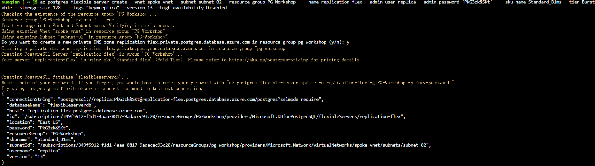

2. **修改源数据库服务器参数**
   wal_level设置为logical
   max_worker_processes设置为16

   保存并且重启服务：
    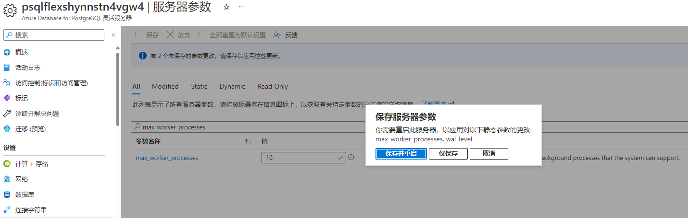
   
3. **通过跳板机连接源PostgreSQL 数据库，授予管理员用户复制权限**
   ```bash
    ssh diaa@yourvmip
   	psql -U <username> -h <hostname> postgres
   ```
   ```sql
    ALTER ROLE <adminname> WITH REPLICATION;
   ```
    **注意**：如果无法连接跳板机请检查VM的网络规则，22端口需要开启

4. **为表创建发布**
   ```sql
    \c quiz
    CREATE PUBLICATION answers_pub FOR TABLE  answers;
   ```

5. **连接到订阅服务器，创建相同schema的表**
   ```bash
   ssh diaa@yourvmip
   export PGPASSWORD='PkG3zk&SKt'; psql -d postgres  -U replica  -h replication-flex.postgres.database.azure.com
   ```
   ```sql
    CREATE DATABASE quiz;
    \connect quiz

    CREATE TABLE public.answers (
    question_id serial NOT NULL,
    answer text NOT NULL,
    is_correct boolean NOT NULL DEFAULT FALSE
    );
   ```

6. **为表创建发布的订阅**
   ```sql
   CREATE SUBSCRIPTION sub CONNECTION 'host=[PUBLICATION_HOSTNAME] user=[YOURUSER] dbname=quiz password=[YOURPASSWORD]' PUBLICATION answers_pub;
   ```
   
7. **在订阅服务器上查询表，将会看到它从发布服务器接收数据**
   ```sql
    table answers;
   ```

8. **在源服务器上插入数据，目标服务器中answers表数据将会同步增加**
   ```sql
    INSERT INTO public.answers (question_id, answer, is_correct) VALUES (1, 'today', false);
   ```


### 实验七：高可用和灾备
> 配置高可用性后，灵活服务器会自动预配和管理备用副本。 备用副本将部署在与主服务器完全相同的 VM 配置（包括 vCore、存储空间、网络设置 (VNET、防火墙)等）中。

> 使用 PostgreSQL 流式复制以同步模式将预写日志 (WAL) 流式传输到副本。应用程序读取操作直接从主服务器进行，而只有在主服务器和备用副本上保存了日志数据后，才会向应用程序确认提交和写入操作。由于这种额外的往返，预计会增加应用程序写入和提交操作的延迟。 

> 在典型情况下，从应用程序的角度而言，故障转移时间或故障时间介于60秒至120秒之间。 如果在长期事务、索引创建或大量写入活动的过程中发生中断，这个时间可能会更长，因为备用服务器需要更长时间才能完成恢复过程。由于复制是在同步模式下发生，因此不会有数据丢失。

> 可突发的计算层不支持高可用性。  

> **注意**：备用副本不同于只读副本，不支持读取查询

可以在此处选择启用高可用：


执行强制的故障切换：


故障自动切换后，主服务器和从服务器交换，用时约2min：

    


## 高级特性（可选）
> 本部分实验链接如下[](https://storageaccounthol.z6.web.core.windows.net/)
1. 审计和维护
- 维护
   > 用户可以自定义维护时段
   > 参考[Patching and maintenance windows章节](https://storageaccounthol.z6.web.core.windows.net/)
   
   此处可以自定义服务维护时间：
    

- 审计
   > 使用pgAudit扩展审计数据库的活动日志
   > 参考[Security Management PostgreSQL章节](https://storageaccounthol.z6.web.core.windows.net/)

2. 监控数据库
   > 参考[Monitoring and Troubleshooting章节](https://storageaccounthol.z6.web.core.windows.net/)

3. 配置PgBadger
   > 参考[Configure PgBadger章节](https://storageaccounthol.z6.web.core.windows.net/)

4. 探索MVCC
   > 参考[Multiversion Concurrency Control, MVCC章节](https://storageaccounthol.z6.web.core.windows.net/)

5. SQL特性
   > 参考[SQL Characteristic章节](https://storageaccounthol.z6.web.core.windows.net/)

6. 查询优化
   > 参考[Statistics and Query Planning章节](https://storageaccounthol.z6.web.core.windows.net/)
