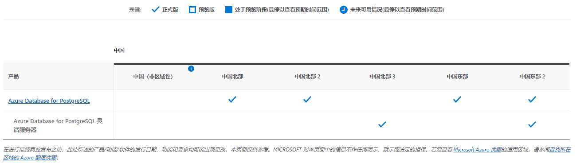

# PostgresqlWorkshop
Azure Database for PostgreSQL迁移部署实操

> [实验背景](#实验背景)
>
> [基础知识](#所需基础知识介绍)
>

&nbsp;
&nbsp;

## 实验背景
Azure Database for PostgreSQL 是基于开源 Postgres 数据库引擎的关系型数据库服务。它是完全托管的数据库即服务，具有可预测的性能、安全性、高可用性和动态可伸缩性。

本实验目的意在帮助您掌握Azure Database for PostgreSQL的迁移和部署相关操作，包括：
- 部署
  -  前提条件
  -  使用Bicep部署数据库
  -  数据引入和环境准备
  -  管理PostgreSQL数据库
  -  设置角色和权限
- 可用性和业务连续性
  - 备份和恢复
    - 逻辑备份
    - 物理备份和PITR还原
  - 复制
  - 高可用和灾备
  - 维护
  - 审计
- 高级特性（可选）
  - 监控数据库
  - 性能优化
    - PgBadger
    - MVCC
    - SQL特性
    - 查询优化

    
## 基础知识
1. Azure Database for PostgreSQL flexible server  
   [Azure Database for PostgreSQL](https://learn.microsoft.com/zh-cn/azure/postgresql/single-server/overview) 是 Microsoft Azure中基于 PostgreSQL 开源关系数据库的一种关系数据库服务。用于 PostgreSQL 的 Azure 数据库提供以下功能：

  >    内置的高可用性。

  >    使用自动备份和时间点还原对数据进行长达 35 天的保护。

  > 自动维护基础硬件、操作系统和数据库引擎，使服务保持安全和最新状态。

  > 使用非独占即用即付定价，实现可预测性能。

> 在几秒钟内实现弹性缩放。

> 具有企业级安全性和行业领先的符合性，可保护静态和动态敏感数据。

> 具有监视和自动化功能，可简化大规模部署的管理和监视。

> 行业领先的支持体验。
  
    这些功能几乎都不需要进行任何管理，并且都是在不另外收费的情况下提供的。 借助这些功能，用户可将注意力集中在如何快速进行应用程序开发、加快推向市场，而不需要投入宝贵的时间和资源来管理虚拟机与基础结构。  

  由 PostgreSQL 社区版提供支持的 Azure Database for PostgreSQL 提供三种部署模式：

> Single Server  
> Flexible Server  
> Hyperscale   

   [Azure Database for PostgreSQL flexible server](https://learn.microsoft.com/zh-cn/azure/postgresql/flexible-server/overview)是一种完全托管的数据库服务，旨在针对数据库管理功能和配置设置提供更精细的控制和更大的灵活性。相比single server版本,提供了更好的成本优化控制，具有停止/启动服务器和可突增计算层的功能，非常适合无需持续全计算容量的工作负载。 该服务当前支持 PostgreSQL 11、12、13 和 14 的社区版本。此服务目前在各种[Azure区域](https://azure.microsoft.com/zh-cn/explore/global-infrastructure/products-by-region/?products=cosmos-db,postgresql)中提供，下图是中国区域该服务可用性情况：

   