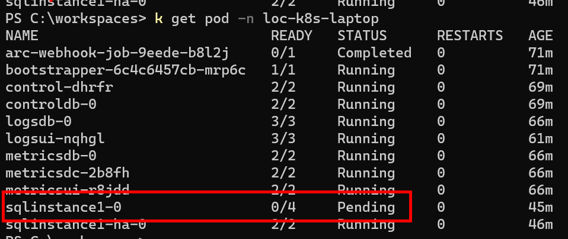

# Lab3 - Azure Arc for SQL MI
## 实验目标
已启用 Azure Arc 的 SQL 托管实例(MI)是一种 Azure SQL 数据服务，可在所选的基础架构上创建, 相当于把SQL MI的PaaS服务部署在任意地方，包括其他云或本地。这个实验是让大家可以动手体验一下从零开始搭建的全过程，增加实战经验和提前知道一些注意事项，以便更好的给客户推荐方案。


## 环境准备
1．	Azure帐号，能够启用Azure Arc服务。
2.	安装Docker Desktop， 模拟本地的Kubernetes集群，需要的资源比较多，最少需要8G内存和4个CPU core可用，如果本地电脑配置不够，也可以略过此步使用AKS.
  - 下载地址：https://www.docker.com/products/docker-desktop
  - k8s Arc 的配置要求 https://learn.microsoft.com/zh-cn/azure/azure-arc/kubernetes/system-requirements#compute-and-memory-requirements
  - Arc for Data 的配置要求 https://learn.microsoft.com/zh-cn/azure/azure-arc/data/sizing-guidance#minimum-deployment-requirements
3.  安装kubectl，kubectl是Kubernetes的命令行工具，用于管理Kubernetes集群，可以在Docker Desktop里安装，也可以在本地安装，这里选择在本地安装，下载地址：https://kubernetes.io/docs/tasks/tools/install-kubectl/，下载完成后，解压，然后把kubectl.exe放到C:\Windows\System32目录下，然后在命令行里输入kubectl version，如果能看到版本信息，说明安装成功。
4.	安装Azure CLI，Azure CLI是Azure的命令行工具，用于管理Azure资源，下载地址：https://docs.microsoft.com/zh-cn/cli/azure/install-azure-cli-windows?view=azure-cli-latest&tabs=azure-cli，安装完成后，在命令行里输入az version，如果能看到版本信息，说明安装成功。
5. Azure Data Studio , 以及Azure Arc扩展(ADS) 是一个免费的跨平台的数据工作台，用于管理 SQL Server、Azure SQL DB 和 SQL DW。参考：https://learn.microsoft.com/zh-cn/azure/azure-arc/data/install-client-tools

## 实验步骤
### 1.	准备本机的Kubernetes环境
1.	启动Docker Desktop，点击右上角的齿轮图标，选择Settings，然后选择Kubernetes，勾选Enable Kubernetes，然后点击Apply & Restart，等待重启完成。
如图所示：

  **注意：**如果本地电脑配置不够，也可以略过此步使用AKS.参考：https://docs.microsoft.com/zh-cn/azure/aks/kubernetes-walkthrough-portal 。 做到能连接集群即可。

2.	在命令行里输入kubectl get nodes，如果能看到节点信息，说明Kubernetes集群启动成功。
```cmd
C:\workspaces\mssql>kubectl get nodes
NAME             STATUS   ROLES           AGE     VERSION
docker-desktop   Ready    control-plane   2m34s   v1.25.4
```

### 2.	连接 K8s 到Azure Arc
这一步主要在K8s里部署Azure Arc Agents. <br/>
主要参考 :
https://learn.microsoft.com/zh-cn/azure/azure-arc/kubernetes/quickstart-connect-cluster?tabs=azure-cli

也可以在Azure Portal操作。
附脚本参考:
``` bash
#添加扩展
az extension add --name connectedk8s

#注册提供程序
az provider register --namespace Microsoft.Kubernetes
az provider register --namespace Microsoft.KubernetesConfiguration
az provider register --namespace Microsoft.ExtendedLocation

#检查提供程序注册状态，需都为Registered
az provider show -n Microsoft.Kubernetes -o table
az provider show -n Microsoft.KubernetesConfiguration -o table
az provider show -n Microsoft.ExtendedLocation -o table

#确认是否已登录测试订阅
az account show

# 如果没有，Log into Azure
az login

# Set Azure subscription
az account set --subscription xxxx


# Create resource group
az group create --name AzureArcTest-Rade --location japaneast --output table

# Create connected cluster
az connectedk8s connect --name k8s-laptop --resource-group AzureArcTest-Rade --location japaneast 

```
需要等几分钟。然后可以在Azure portal或下面命令确认连接成功。
``` bash
az connectedk8s list --resource-group AzureArcTest-Rade --output table

Name        Location    ResourceGroup
----------  ----------  -----------------
k8s-laptop  japaneast   AzureArcTest-Rade

```
``` bash
> kubectl get ns

NAME              STATUS   AGE
azure-arc         Active   41m
default           Active   132m
kube-node-lease   Active   132m
kube-public       Active   132m
kube-system       Active   132m
loc-k8s-laptop    Active   39s

> kubectl get pod -n azure-arc

NAME                                         READY   STATUS    RESTARTS      AGE
cluster-metadata-operator-76dc854cbb-96glv   2/2     Running   2 (22m ago)   42m
clusterconnect-agent-5f9d45fc94-rtzr7        3/3     Running   3 (22m ago)   42m
clusteridentityoperator-74f49457c5-2p2f4     2/2     Running   3 (22m ago)   42m
config-agent-7d7bb6c84d-bjq9g                2/2     Running   2 (22m ago)   42m
controller-manager-77b8d94954-2c4mh          2/2     Running   2 (22m ago)   42m
extension-manager-5fdd956447-9kj9s           2/2     Running   3 (22m ago)   42m
flux-logs-agent-96b5564c6-rsgq6              1/1     Running   1 (22m ago)   42m
kube-aad-proxy-99d68d76d-2jg8h               2/2     Running   3 (22m ago)   42m
metrics-agent-56ccbb6d49-twv7d               2/2     Running   2 (22m ago)   42m
resource-sync-agent-6c4dc44fc-gcc8h          2/2     Running   3 (22m ago)   42m
```

### 3. 创建Azure Arc 的数据控制器服务
这一步主要在已连接的k8s集群里部署 Azure Arc Data Controller. <br/>
主要参考 : https://learn.microsoft.com/zh-cn/azure/azure-arc/data/create-data-controller-direct-azure-portal

在Azure Portal的步骤截图如下：


确认数据服务创建成功。
``` bash
> kubectl get pod -n loc-k8s-laptop

NAME                            READY   STATUS      RESTARTS   AGE
arc-webhook-job-9eede-b8l2j     0/1     Completed   0          3m54s
bootstrapper-6c4c6457cb-mrp6c   1/1     Running     0          3m54s
control-dhrfr                   2/2     Running     0          2m13s
controldb-0                     2/2     Running     0          2m13s

```

### 4. 创建Azure Arc 的SQL Managed Instance
可以直接在Azure Portal创建，也可以在Azure Data Studio里创建。 <br/>
Azure Portal如下:


Azure Data Studio的创建过程主要参考：
https://learn.microsoft.com/zh-cn/azure/azure-arc/data/create-sql-managed-instance-azure-data-studio


建议点"Script to Notebook", 然后改脚本里的参数配置，尤其是内存cpu等。 然后点脚本最上面的"Run All" <br/>

创建完成之后可以在Azure Portal里看到。或者Azure Data Studio里看到。


***如果部署过程中出现问题，可以用下面方法Trouble shooting***
``` bash
kubectl get pod  -n loc-k8s-laptop
```

``` bash
kubectl describe pod sqlinstance1-0 -n loc-k8s-laptop
```


如内存不足，可以看看docker-desktop的内存配置。
``` bash
kubectl describe nodes docker-desktop
```

## 5. 连接本地的 SQL MI 
可以用Azure Data Studio连接，也可以用SQL Server Management Studio连接。 <br/>
端口参考Overview里的Endpoint, IP 建议用localhost


## 参考链接
https://learn.microsoft.com/zh-cn/azure/azure-arc/kubernetes/conceptual-agent-overview

https://azurearcjumpstart.io/overview/
