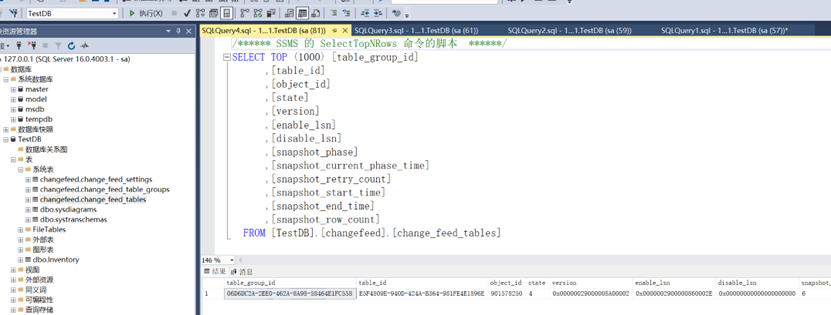

# Lab2 - Synapse Link for SQL 2022
## 实验目标
利用自带的功能实现SQL Server(本地SQL 2022或Azure SQL)的数据变更近实时同步到Synapse SQL数仓里，省去了ETL工具的搭建配置和维护，高效的实现了即时报表。
这次实验搭建了SQL Server本地的测试环境，配置好Synapse Link并模拟数据的初始同步及变化同步，可以在Synapse里查看结果以及监控过程。

## 实验环境准备
1．	参考文档的先决条件，https://learn.microsoft.com/zh-cn/azure/synapse-analytics/synapse-link/connect-synapse-link-sql-server-2022#prerequisites ， 创建以下资源：
 - Synapse 工作区。为了节省实验资源，[请使用这个工作区](https://web.azuresynapse.net/en/home?workspace=%2Fsubscriptions%2Feb5e3289-61e0-4522-be1c-25f0b0153a54%2FresourceGroups%2Fcommon%2Fproviders%2FMicrosoft.Synapse%2Fworkspaces%2Fsyapselinkhack) ，就不要自己创建了。 如果是自己的订阅，创建时为了方便，建议创建 Azure Synapse 工作区时选择“**禁用托管虚拟网络**”和“**允许来自所有 IP 地址的连接**”。 
 - Azure Data Lake Storage Gen2 帐户。 https://learn.microsoft.com/zh-cn/azure/storage/blobs/create-data-lake-storage-account

2．	可以继续使用Lab1 里创建的SQL Server 2022, 也可以本地安装SQL Server 2022，本机建议使用Docker的安装方式，也可以下载本地安装 https://www.microsoft.com/en-us/sql-server/sql-server-downloads ，以下是Docker方式步骤:
 - 在本机安装Docker Desktop，如Windows: https://docs.docker.com/desktop/install/windows-install/
 - 确保启动成功，命令运行正常：docker ps
``` shell
docker pull mcr.microsoft.com/mssql/server:2022-latest

#设定密码，如Sqlp@ssw0rd
docker run -e "ACCEPT_EULA=Y" -e "MSSQL_SA_PASSWORD=xxx" -p 1433:1433 --name sql1 --hostname sql1 -d mcr.microsoft.com/mssql/server:2022-latest

```

 - 下载并安装 Azure Data Studio https://learn.microsoft.com/zh-cn/sql/azure-data-studio/download-azure-data-studio?view=sql-server-ver16&tabs=redhat-install%2Credhat-uninstall , 或者熟悉的可以用SSMS, 或sqlcmd都可以。本实验以Azure Data Studio为例。

3．	在Azure Data Studio里连接SQL Server 2022，创建数据库和表，如下图所示：

密码为上面docker run 命令行指定, 如 Sqlp@ssw0rd , 点击Connect, 然后
信任证书：


连接成功后，点击 NewQuery,开始执行SQL


```sql
---Begin---
--准备初始库数据
drop database TestDBuser<01-15>;


CREATE DATABASE TestDBuser<01-15>;
go
USE TestDBuser<01-15>;
CREATE MASTER KEY ENCRYPTION BY PASSWORD = 'Sqlp@ssw0rd'

CREATE TABLE Inventory (id INT, name NVARCHAR(50), quantity INT, CONSTRAINT PK_ID PRIMARY KEY NONCLUSTERED(id));
INSERT INTO Inventory VALUES (1, 'banana', 150); INSERT INTO Inventory VALUES (2, 'orange', 154);
go

--insert 1000 records into inventory table
declare @i int
set @i=1000
while @i<=2000
begin
insert into Inventory values (@i,'name'+cast(@i as varchar(255)),@i);
set @i=@i+1
end

---End---
```
实际客户的环境需要注意已知限制和问题: https://learn.microsoft.com/zh-cn/azure/synapse-analytics/synapse-link/synapse-link-for-sql-known-issues


## 配置Synapse Link
参考在线文档 https://learn.microsoft.com/zh-cn/azure/synapse-analytics/synapse-link/connect-synapse-link-sql-server-2022#create-your-target-azure-synapse-sql-dedicated-pool


注意事项如下：

1．	创建Synapse Linked的时候需要创建自承集成运行时，名称建议带上自己的名字，使用“选项1：快速安装程序”。如果已安装过别的集成运行时，需先卸载。取决于网速，需要下载1G左右，如果慢，建议自行下载安装。https://www.microsoft.com/zh-CN/download/details.aspx?id=39717

 <br/>
确认数据完成初始同步，在本地和Synapse里都执行SQL

```sql
SELECT count(*) from dbo.Inventory

select * from dbo.Inventory  where id < 1000

select * from dbo.Inventory 
```

## 测试数据同步

在Azure Data Studio里对本地SQL Server的数据进行增删改，并查看Synapse里的变化。如

```sql
--配置完Synapse Link再执行下面的语句

INSERT INTO Inventory VALUES (3, 'apple', 156); 
update Inventory set quantity = quantity + 1 where id = 1;

INSERT INTO Inventory VALUES (4, 'grape', 100); 

select * from dbo.Inventory  where id < 1000
```

同时在Synapse里查询sql pool里也执行下面的语句作对比
```sql
select * from dbo.Inventory  where id < 1000
```
 <br/>


## 监视Synapse Link

参考在线文档: 
https://learn.microsoft.com/zh-cn/azure/synapse-analytics/synapse-link/how-to-monitor-synapse-link-sql-server-2022

```sql
-- 在SQL Server上监控Synapse Link的状态
SELECT table_group_id, workspace_id, synapse_workgroup_name
FROM [changefeed].[change_feed_table_groups]

--WHERE synapse_workgroup_name = <synapse workspace name>
```

 <br/>


```sql
-- 停用Synapse Link
EXEC sys.sp_change_feed_drop_table_group @table_group_id = "16729A8D-EE83-4793-B8E0-675C20F417CE"
EXEC sys.sp_change_feed_disable_db
```


