# Microsoft Sentinel日志长期存储解决方案

Microsoft Sentinel是SIEM(安全信息和事件管理)和SOAR(安全编排、自动化和响应)的云原生解决方案，可用于用于攻击检测、威胁可见性、主动搜寻和威胁响应等场景。Sentinel通过数据连接器收集云上或者云下关于用户、设备、应用和基础设施相关的日志并存储于Log Analytics Workspace中，利用智能分析和威胁情报检测潜在攻击或者搜寻可以活动。

安全日志对于识别威胁和追踪对数据的未授权访问是非常重要的，安全攻击可能在被发现之前已经开始了，因此长期存储安全日志是非常重要的，查询长期存储的日志对于确定威胁的影响和调查非法尝试访问的范围至关重要。但是安全日志的长期存储也带来了额外的成本，为了降低安全日志的存储成本同时能有效利用Microsoft Sentinel的能力，用户可以在不同的场景下使用本文所述的三种不同的长期日志存储解决方案。

# 理解Microsoft Sentinel成本构成

如下图所示，Sentinel的成本构成主要由数据注入费用和存档费用构成，为了降低Sentinel的成本，需要根据实际的场景选择所需的安全日志，避免发送无安全价值的日志到Sentinel中，同时需要在90天后考虑数据归档，避免低价值的安全数据产生较大的存储成本。

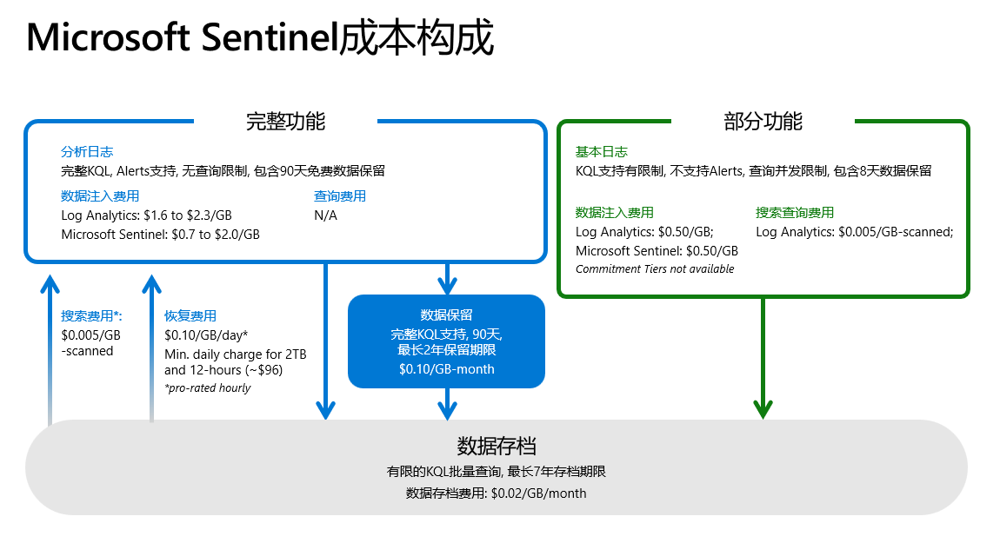

# 前提条件

已经在使用Microsoft Sentinel服务，本文档主要关注Microsoft Sentinel日志长期存储的解决方案，关于Basic Logs的使用场景请参考[Microsoft Sentinel Basic Logs Use Case](https://learn.microsoft.com/en-us/azure/sentinel/basic-logs-use-cases)

# 安全日志存储基本配置

Microsoft Sentinel对所有注入到工作区的数据提供90天的免费保存，但是Log Analytics的工作区默认保存期限为31天，因此为了简化后续的配置，可在工作区级别配置默认的日志保存配置，具体步骤如下:

1. 选择Sentinel所使用的Log Analytics workspace
2. 在Log Analytics workspace左侧导航栏中选择 `Usage and estimated costs`并在新的界面上点击 `Data Retention`
   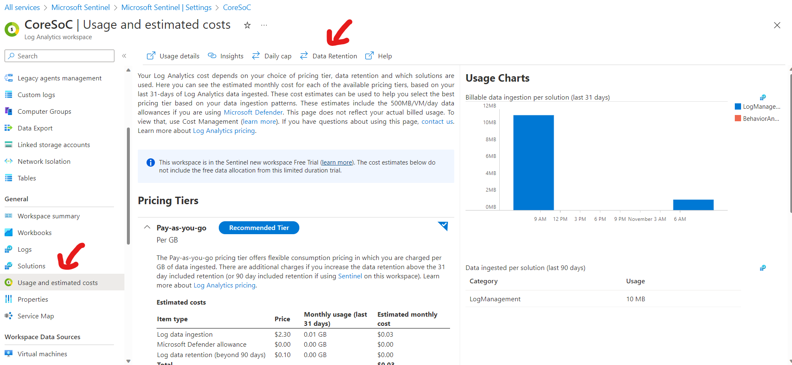
3. 将保留期限由31天修改为90天并确认
   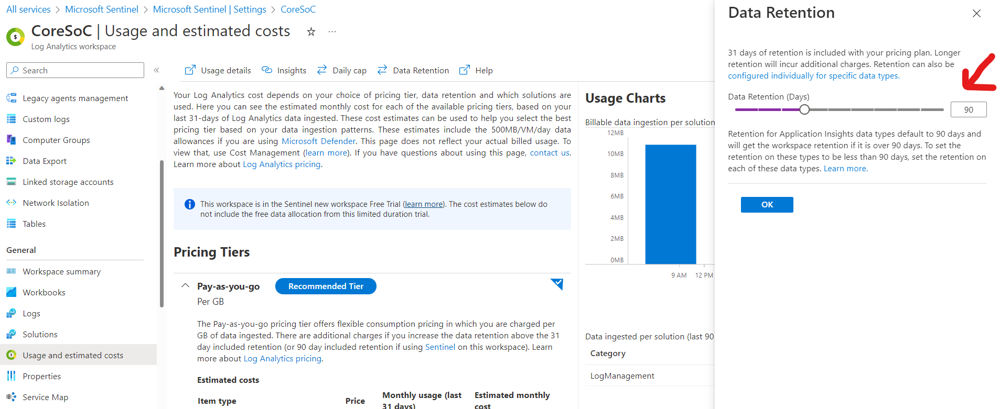

完成修改后该工作区内所有的表均默认使用90天的保留期限，包括自定义表。

# Log Analytics归档存储

Log Analytics的归档存储允许针对单个表进行配置日志归档存储时间，最长可存储7年。该功能涉及如下几个参数:

* 交互保留时间(Interactive retention): 默认为Log Analytics工作区得数据保留配置
* 总保留时间(Total retention period): 数据保留在Sentinel和Archive存储中的时间总和

## 适用场景

该功能是由Log Analytics原生支持,支持自定义表，在多数情况下建议使用该种方式，该种方式无需引入额外的组件，不会增加额外的管理成本。

## 配置归档策略

1. 选择Sentinel所使用的Log Analytics workspace
2. 在Log Analytics workspace左侧导航栏中选择 `Tables`并在新的界面上选择需要配置的表，点击表右侧的 `...`, 选择 `Manage table`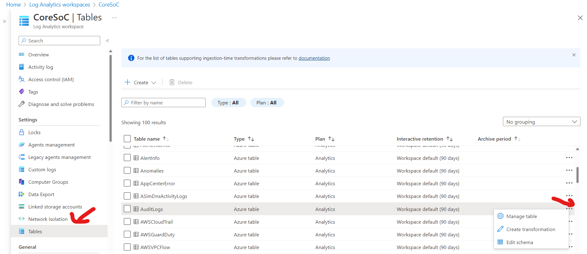
3. 将 `Total retention period`修改为日志需要存档的期限并保存
   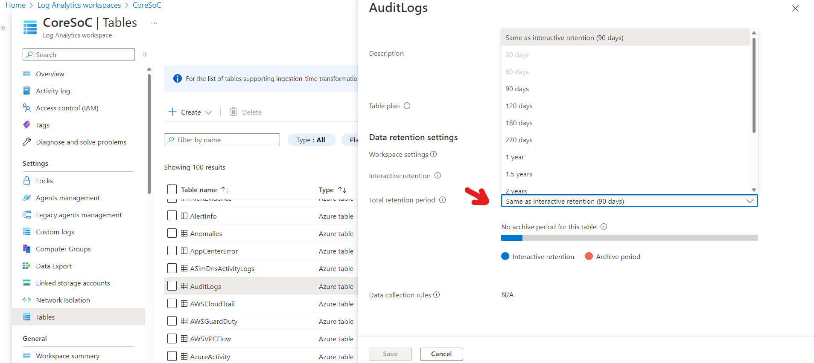
   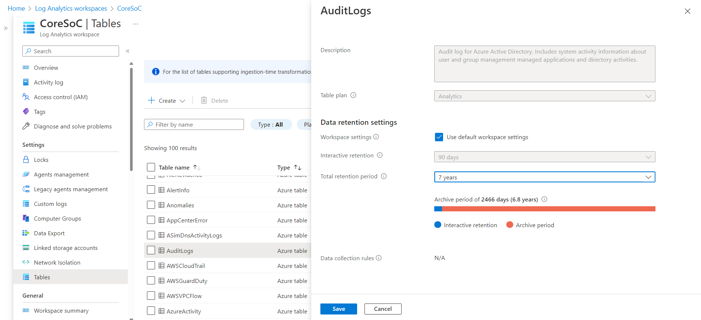

## 搜索归档日志

用户可以指定要搜索的数据表、时间段和关键字在数据中进行搜索，但是目前只支持简单的KQL语句。相对于标准查询最多返回30,000条结果和10分钟超时时间，搜索可以解决该问题，搜索作业独立于常规查询，允许其返回最多1,000,000条结果同时超时时间长达24小时。搜索作业完成后其结果会被存储在临时表中，用户可以在后续引用该结果和对结果进行处理。

搜索作业可以同时查询不同存储级别的日志，包括分析日志、基本日志和归档日志，在必要时可按需查询海量历史数据，一个简单的例子就是一个可以追溯至3个月前的大范围的攻击行为，通过搜索，用户能够查询是否由有关的IoC以确定是否遭受攻击。

存储搜索结果的临时表名字(例如SecurityEvents_SRCH)中包含如下元素:

* 自定义的表名
* SRCH后缀

### 启动一个搜索作业

1. 在Azure Portal上，进入 `Microsoft Sentinel`服务并选择一个工作区
2. 在左侧导航栏的 `General`菜单下，选择 `Search`
   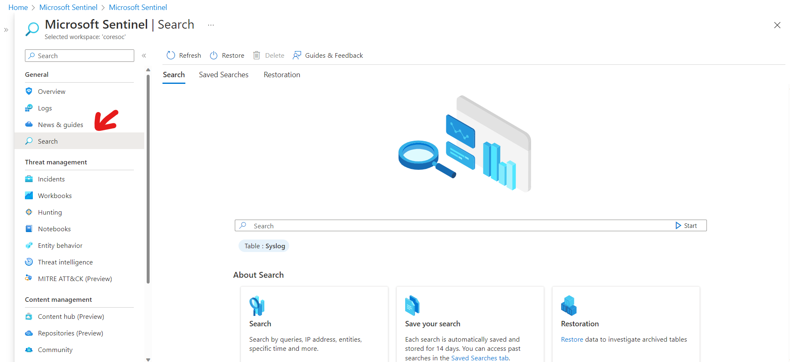
3. 在工作区中部的搜索框中输入要搜索的关键字，并选择需要搜索的表，点击 `Start`
   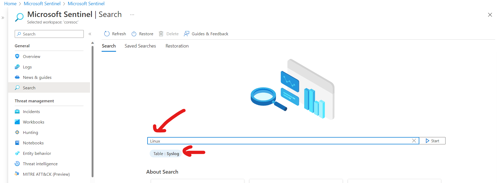
4. 点击 `Start`后会打开高级的KQL编辑器并返回7天内的搜索结果
   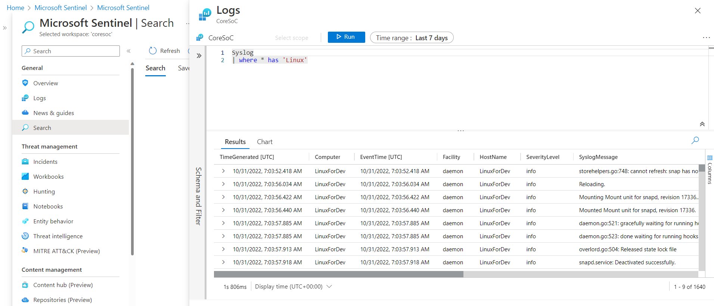
5. 可以在编辑器内编辑KQL语句并点击 `Run`进行搜索检查结果是否满足需求
   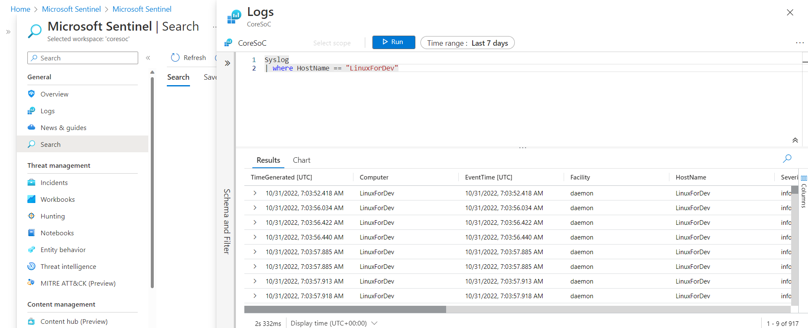
6. 在确认搜索语句满足搜索要求后点击编辑器右上角的3个点，滑动 `Search job mode`选择启动搜索模式
   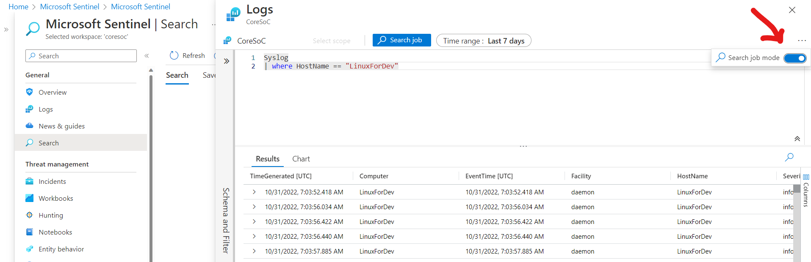
7. 选择需要搜索的时间范围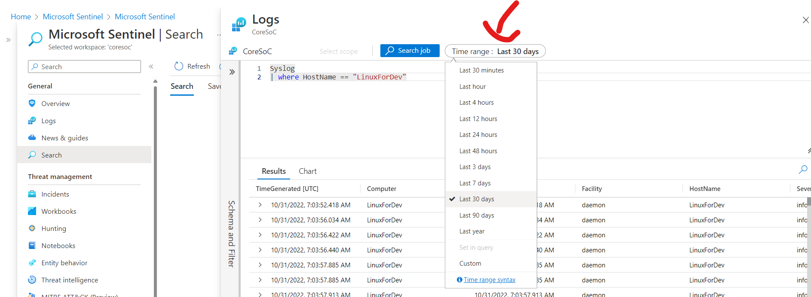
8. 点击 `Search job`并输入搜索结果存储的表名后点击 `Run a search job`开始搜索
   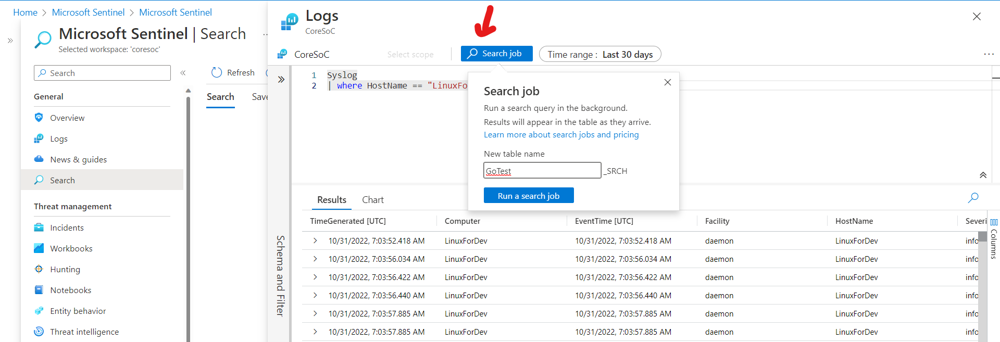
9. 在 `Saved Searches`查看搜索作业的状态和最终的结果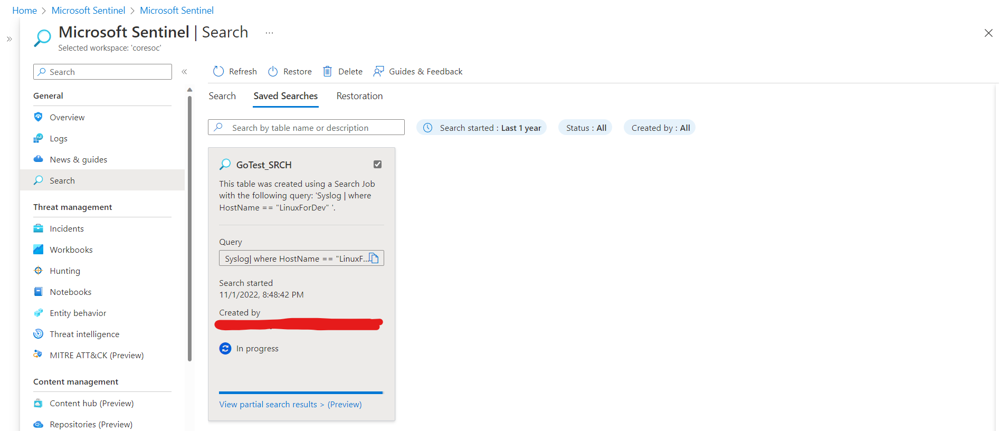

### 搜索作业使用场景

## 恢复归档日志

与搜索归档日志相似，恢复归档日志允许用户恢复一张指定的表在一定时间内的归档日志到分析日志中，相对于搜索日志的单一搜索结果，用户可以恢复大量的数据。该功能在调查数月前发生的包含多个实体和用户的安全事件非常有帮助，可以获取事件发生时的相关日志。

恢复归档结果的临时表名字(例如SecurityEvents_RST)中包含如下元素:

* 自定义的表名
* RST后缀

### 启动一个恢复作业

1. 在Azure Portal上，进入 `Microsoft Sentinel`服务并选择一个工作区
2. 在左侧导航栏的 `General`菜单下，选择 `Search`
   
3. 在工作区中选择 `Restore`
   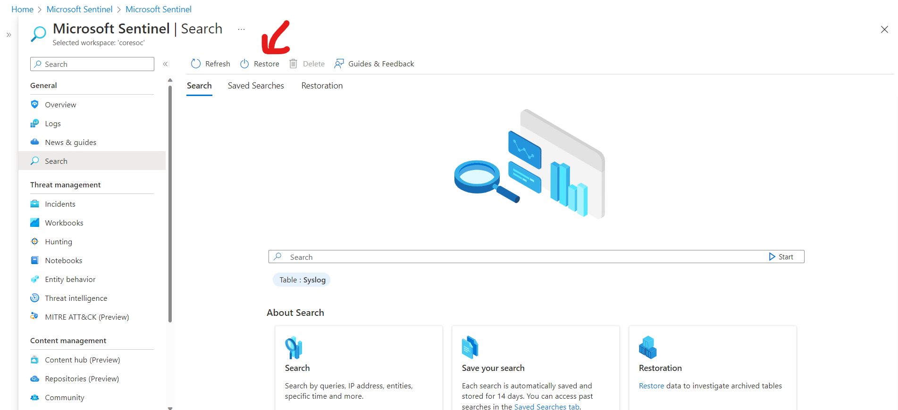
4. 在恢复窗口中选择需要恢复的表和恢复的事件范围并确定
   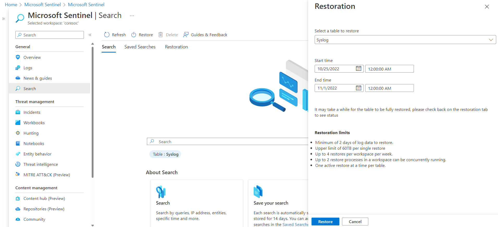
5. 在Sentinel中查询恢复进展及恢复后的数据
   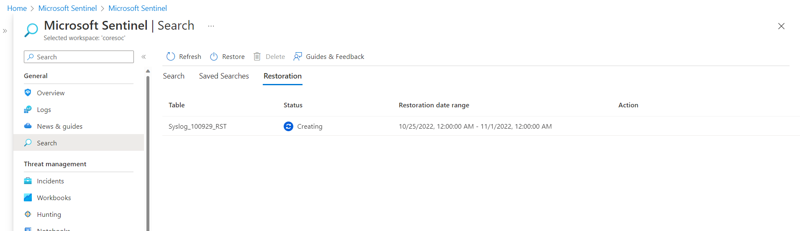

### 归档日志恢复使用场景

# 导出日志到存储账户中

## 适用场景

企业为了满足监管合规需求，需要长期保留一些安全日志、审计相关日志或者业务日志，但是基本上不会查询相关日志，为了降低存储成本同时避免日志被篡改，需要将该类日志存储WORM(Write Once, Read Many)类型的存储中，同时为了能够挖掘该种类型的数据，需要能够支持查询，在Azure上可以通过Blob存储和Azure Data Explorer实现。在下列情况下可以适用该种方式：

* 已经使用Blob Storage存储日志
* 由于Sentinel Hunting功能不支持通过ADX Proxy直接查询ADX外部表，因此在进行调查时需要通过ADX进行

## 前提条件
* 已有ADX集群
* 已有存储账户
* 已有Sentinel
## 受支持的表导出

Log Analytics workspace支持在数据进入Azure Monitor后将数据持续导出到存储账户中，但是目前并无法支持所有的表且每个workspace只允许同时存在10条启用的导出规则。

1. 在Azure Portal上，进入 `Log Analytics workspaces`服务并选择一个Sentinel所使用的工作区
2. 在左侧导航栏选择 `Data Export`并点击 `New export rule`创建新的导出规则
   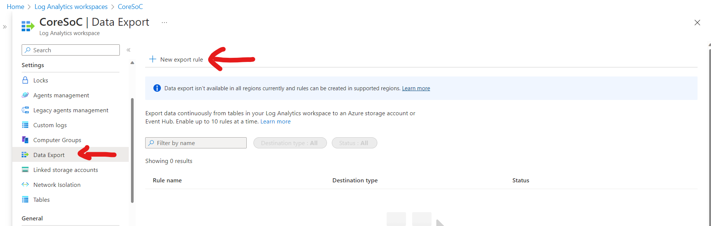
3. 在规则创建向导中填写 `Rule name`并勾选 `Enable upon creation`
   
4. 按需勾选需要导出日志到表
   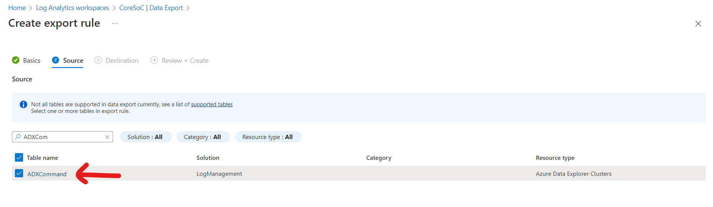
5. 在 `Destination`部分选择 `Destination type`为 `Storage account`并选择相对应的订阅和存储账户,注意存储账户必须和工作区处于同一区域
   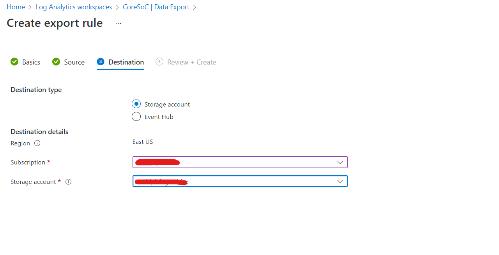
6. 点击 `Next`，确认配置正确后创建即可
7. 在创建完成后该功能会在存储账户中为每张表创建一个container，然后将每个表中数据导出到对应的container中
   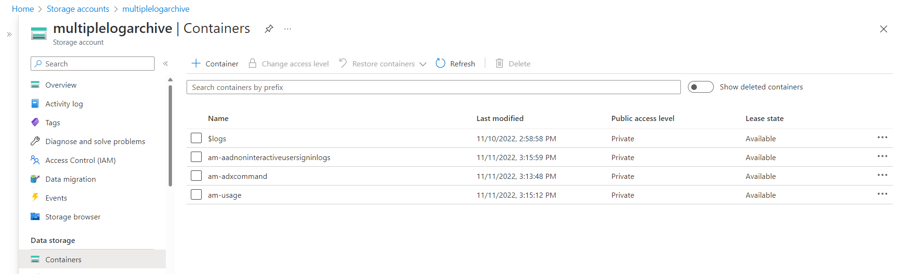

## 未受支持的表导出

目前Log Analytics workspace暂不支持自定义表的导出，可以通过Logic Apps进行数据导出
具体的导出步骤参考[Export with Logic Apps](https://learn.microsoft.com/en-us/azure/azure-monitor/logs/logs-export-logic-app)

## 创建外部表

在数据导出到存储账户后可以通过ADX外部表的方式查询而无需重新导入数据

1. 在Azure Portal上，进入 `Azure Data Explorer Clusters`服务并选择对应的ADX集群并复制其 `URI`
   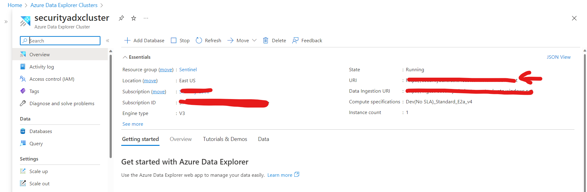
2. 打开新的浏览器窗口并访问ADX集群
3. 在ADX管理界面左侧导航栏点击 `Data`并选择 `Create external table`
   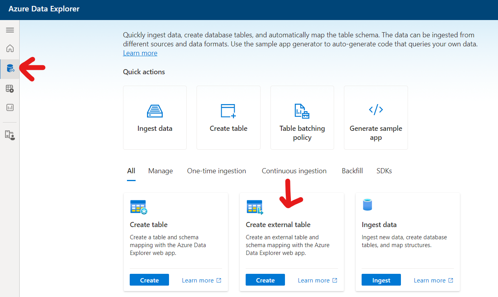
4. 在表创建向导界面选择对应参数,包括所使用的ADX集群，数据库名称和要新建的表名
   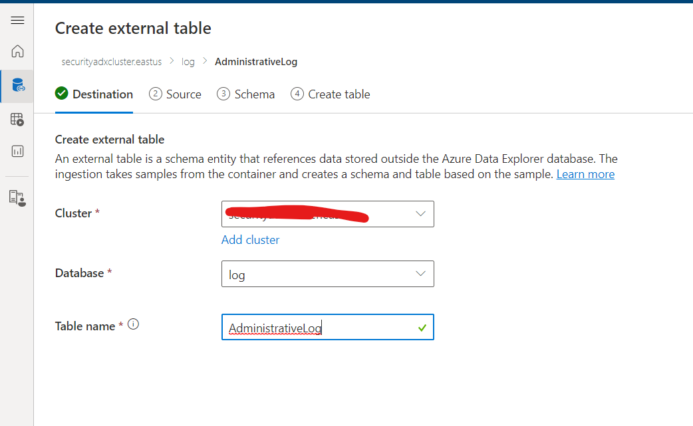
5. 在数据源(Source)配置界面，选择日志存储所用的储存账户和container,并选择任意文件作为schema定义文件
   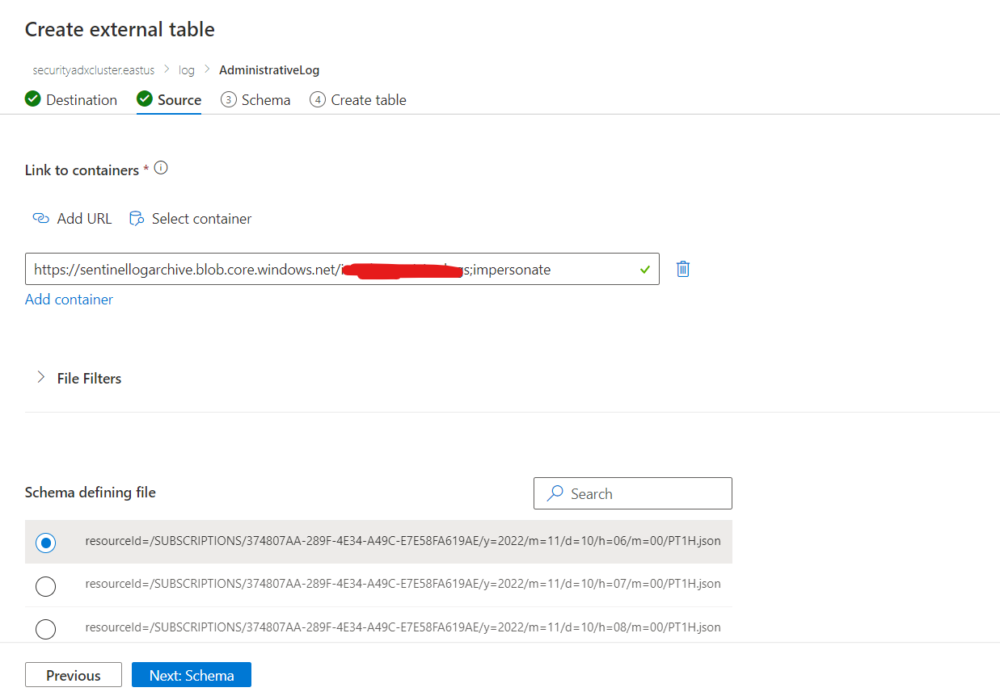
6. 在Schema配置界面确认Schema是否正确, 染红点击 `Create Table`
   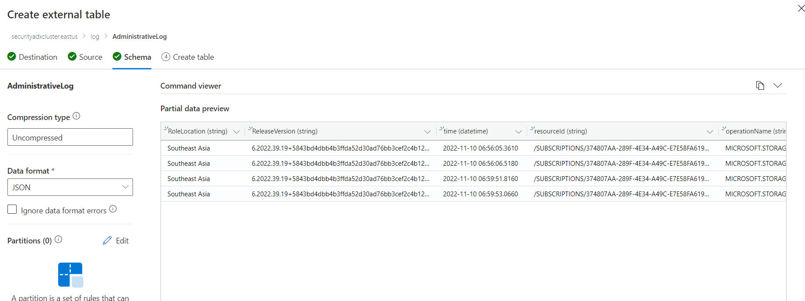
7. 在表创建完成后可以选择查看创建表的命令
   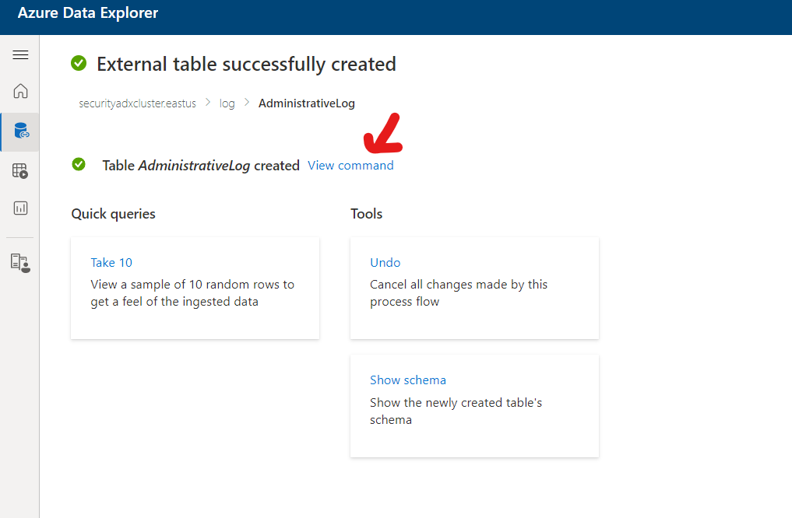

表的创建语句如下：

```
.create external table ['AdministrativeLog'] (['RoleLocation']:string,['ReleaseVersion']:string,['time']:datetime,['resourceId']:string,['operationName']:string,['category']:string,['resultType']:string,['resultSignature']:string,['durationMs']:timespan,['callerIpAddress']:string,['correlationId']:guid,['identity']:dynamic,['level']:string,['properties']:dynamic,['tenantId']:guid)
    kind = blob
    dataformat = multijson
    (
        h@'https://sentinellogarchive.blob.core.windows.net/insights-activity-logs;impersonate'
    )
    with (FileExtension=json)
```
8. 表创建完成后，可以通过如下语句验证其内容
```
external_table('AdministrativeLog')
| take 10
```
可以看到如下结果
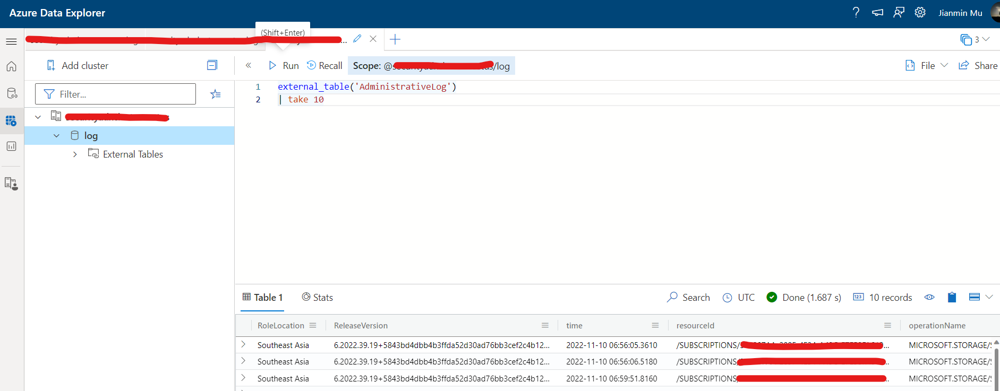

## 查询数据
数据导出到存储账户后可以通过外部表的方式查询相关的数据，但是无法直接在`Microsoft Sentinel`中查询，需要通过ADX进行查询，如果需要`Sentinel`中的相关数据，则需要在ADX中连接对应的`Log Analytics`工作区
1. 在Azure Portal上，进入 `Azure Data Explorer Clusters`服务并选择对应的ADX集群并复制其 `URI`
   
2. 打开新的浏览器窗口并访问ADX集群
3. 在ADX管理界面左侧导航栏点击 `Query`
4. 在新界面中选择`Add cluster`
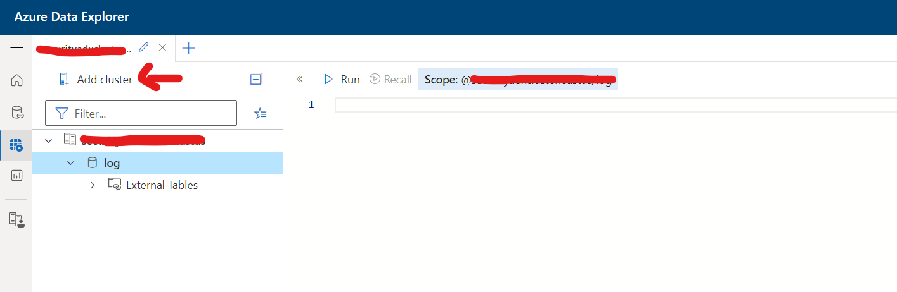
5. 在添加向导中按照如下格式填入Sentinel所对应对应的Log Analytics工作区
```
https://ade.loganalytics.io/subscriptions/<subscription-id>/resourcegroups/<resource-group-name>/providers/microsoft.operationalinsights/workspaces/<workspace-name>
``` 
6. 添加完成后即可在ADX中查询Log Analytics工作区的数据,可以通过如下语句进行验证
```
cluster('https://ade.loganalytics.io/subscriptions/<subscription-id>/resourcegroups/<resource-group-name>/providers/microsoft.operationalinsights/workspaces/<workspace-name>').database('database-name>').SigninLogs
| take 10
```
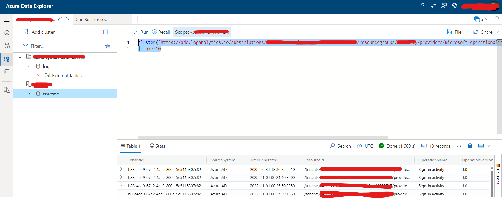

# 导出日志到Azure Data Explorer
企业为了满足监管合规需求，需要长期保留一些安全日志、审计相关日志或者业务日志，但是基本上不会查询相关日志，为了降低存储成本同时避免日志被篡改，需要将该类日志存储WORM(Write Once, Read Many)类型的存储中，同其需要与它方案或者工具进行集成，因此可以使用`Event Hub`, `Azure Data Explorer`及`Azure Blob Storage`实现

## 适用场景
* 已经在使用Event Hub进行第三方工具集成
* 已经有专用的ADX集群

## 前提条件
* 已有ADX集群
* 已有存储账户
* 已有Sentinel
* 已有Event Hub

## 受支持的表导出
1. 在Azure Portal上，进入 `Log Analytics workspaces`服务并选择一个Sentinel所使用的工作区
2. 在左侧导航栏选择 `Data Export`并点击 `New export rule`创建新的导出规则
   
3. 在规则创建向导中填写 `Rule name`并勾选 `Enable upon creation`
   
4. 按需勾选需要导出日志到表,下图以`ADXCommand`表为例
   
5. 在`Destination`部分，选择对应的Event Hub,然后进入下一步点击`Create`
   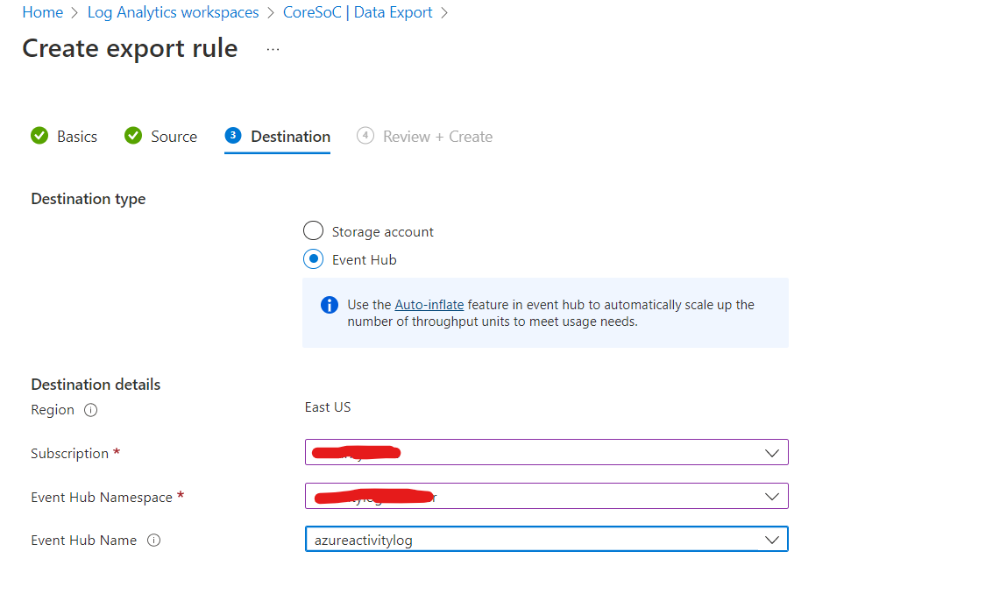
6. 打开Azure Data Explorer UI并选择`Query`后在对应数据库内按照如下语句创建表
```
.create table ADXCommandLog (TenantId: string, TimeGenerated: datetime, OperationName: string, Category: string, CorrelationId: string, RootActivityId: string, StartedOn: datetime, LastUpdatedOn: datetime, DatabaseName: string, State: string, FailureReason: string, TotalCPU: string, CommandType: string, ApplicationName: string, ResourceUtilization: dynamic, Duration: string, User: string, Principal: string, WorkloadGroup: string, Text: string, SourceSystem: string, Type: string)
```
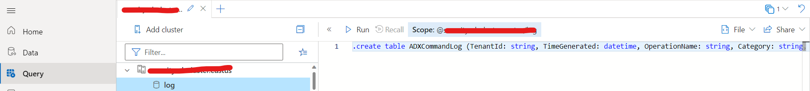
7. 在ADX集群中创建名为 ***ADXCommandLogRawRecords***的临时表
```
.create table ADXCommandLogRawRecords (Records:dynamic)
```
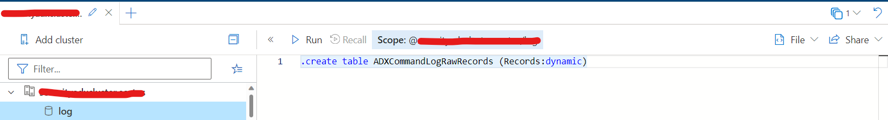
8. 将临时表的保存策略设置为0
```
.alter-merge table ADXCommandLogRawRecords policy retention softdelete = 0d
```
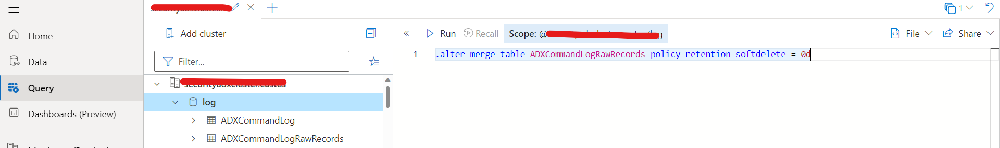
9. 创建数据映射策略，将数据映射为json
```
.create table ADXCommandLogRawRecords ingestion json mapping 'ADXCommandLogRawRecordsMapping' '[{"column":"Records","Properties":{"path":"$.records"}}]'
```
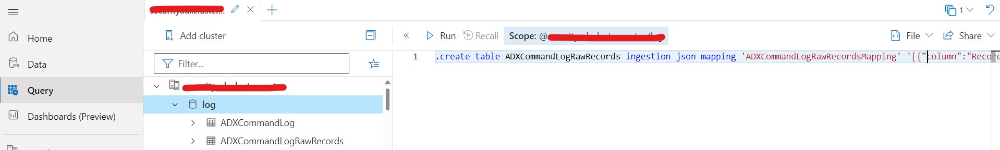
10. 为数据创建更新策略，通过创建一个function实现
```
.create function ADXCommandLogRecordsExpand() {
    ADXCommandLogRawRecords
    | mv-expand events = Records
    | project
        TenantId = tostring(events['TenantId']),
        TimeGenerated = todatetime(events['TimeGenerated']),
        OperationName = tostring(events['OperationName']),
        Category = tostring(events['Category']),
        CorrelationId = tostring(events['CorrelationId']),
        RootActivityId= tostring(events['RootActivityId']),
        StartedOn = todatetime(events['StartedOn']),
        LastUpdatedOn = todatetime(events['LastUpdatedOn']),
        DatabaseName = tostring(events['DatabaseName']),
        State = tostring(events['State']),
        FailureReason = tostring(events['FailureReason']),
        TotalCPU = tostring(events['TotalCPU']),
        CommandType = tostring(events['CommandType']),
        ApplicationName = tostring(events['ApplicationName']),
        ResourceUtilization = todynamic(events['ResourceUtilization']),
        Duration = tostring(events['Duration']),
        User = tostring(events['User']),
        Principal = tostring(events['Principal']),
        WorkloadGroup = tostring(events['WorkloadGroup']),
        Text = tostring(events['Text']),
        SourceSystem = tostring(events['SourceSystem']),
        Type = tostring(events['Type'])
}
```
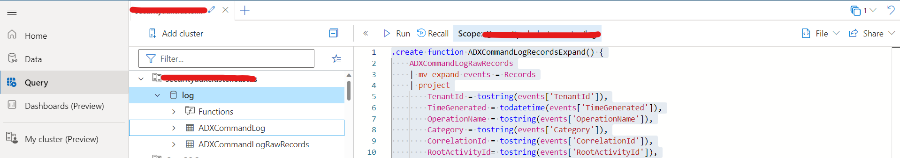
11. 通过下列语句将更新策略添加到目标表上
```
.alter table ADXCommandLog policy update @'[{"Source": "ADXCommandLogRawRecords", "Query": "ADXCommandLogRecordsExpand()", "IsEnabled": "True", "IsTransactional": true}]'
```

12. 在Azure Portal上搜索并选择对应的`Azure Data Explorer Clusters`
13. 在`Azure Data Explorer Clusters`左侧导航栏选择`Databases`并选择存储日志的数据库
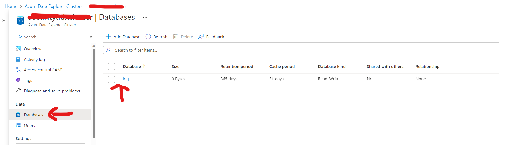
14. 在数据库页面左侧导航栏选择`Data connections`,然后点击`Add data connection`并选择`Event Hub`
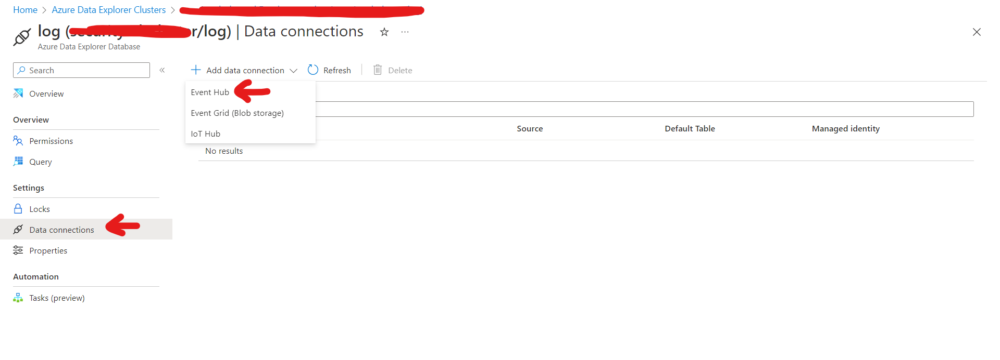
9. 在添加Event Hub连接的时候填入前面步骤所创建的相关资源
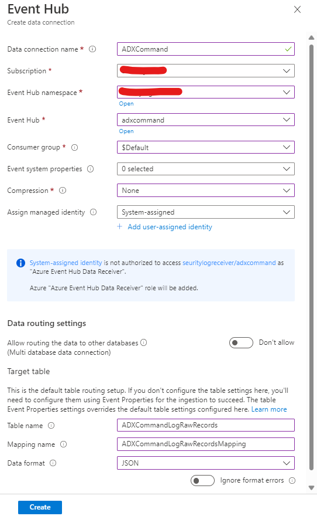
10. 过一段时间后，即可在ADX集群的ADXCommandLog表中查询到相关数据，打开Azure Data Explorer Web UI执行如下语句，确认日志已经收集到ADX
```
ADXCommandLog
| limit 10
```
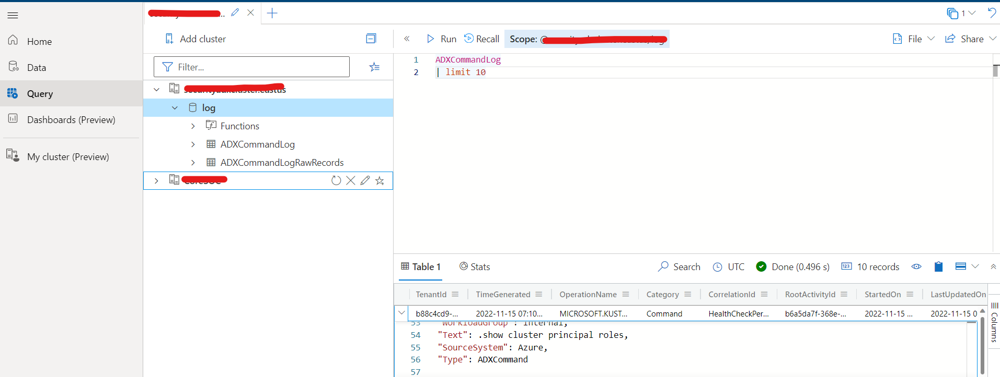
11. 在将数据导出到存储账户前，需要使用下列查询语句创建外部表
```
.create external table  EXADXCommandLog (TenantId: string, TimeGenerated: datetime, OperationName: string, Category: string, CorrelationId: string, RootActivityId: string, StartedOn: datetime, LastUpdatedOn: datetime, DatabaseName: string, State: string, FailureReason: string, TotalCPU: string, CommandType: string, ApplicationName: string, ResourceUtilization: dynamic, Duration: string, User: string, Principal: string, WorkloadGroup: string, Text: string, SourceSystem: string, Type: string)
    kind = blob
    dataformat = json
    (
        h@'https://sentinellogarchive.blob.core.windows.net/adxcommand;accesskey(填入实际key)'
    )
    with (FileExtension=json)
```
12. 创建秩序导出任务
```
.create-or-alter continuous-export ADXCommandExport
over (ADXCommandLog)
to table EXADXCommandLog
with
(intervalBetweenRuns=1h, 
 forcedLatency=10m, 
 sizeLimit=104857600)
<| ADXCommandLog
```
13. 查看导出任务状态并确定数据导出的起始点
```
.show continuous-export ADXCommandExport | project StartCursor
```
14. 一次性导出在导出任务启动前的数据
```
.export async to table EXADXCommandLog
<| ADXCommandLog | where cursor_before_or_at("638041604650779565")
```

## 未受支持的表导出
目前`Azure Data Explorer`只支持[部分表](https://learn.microsoft.com/en-us/azure/azure-monitor/logs/logs-data-export?tabs=portal#supported-tables)的导出，对于未受支持的表导出，需要通Log Analytics相关的API进行导出，最简单的方式则是使用Logic Apps进行数据导出,以下以`AzureActivity`表为例

1. 打开Azure Data Explorer UI并选择`Query`后在对应数据库内按照如下语句创建表
```
.create table AzureActivityLog  (TenantId:guid, SourceSystem:string, CallerIpAddress:string, CategoryValue:string, CorrelationId:guid, Authorization:string, Authorization_d:string, Claims:string, Claims_d:string, Level:string, OperationNameValue:string, Properties:string, Properties_d:string, Caller:string, EventDataId:guid, EventSubmissionTimestamp:datetime, HTTPRequest:string, OperationId:string, ResourceGroup:string, ResourceProviderValue:string, ActivityStatusValue:string, ActivitySubstatusValue:string, Hierarchy:string, TimeGenerated:datetime, SubscriptionId:guid, OperationName:string, ActivityStatus:string, ActivitySubstatus:string, Category:string, ResourceId:string, ResourceProvider:string, Resource:string, ['Type']:string, ['_ResourceId']:string)
```
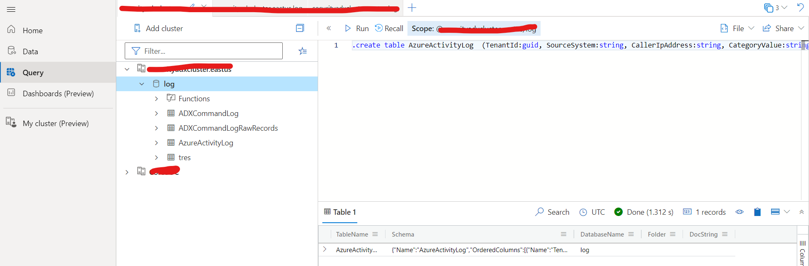

2. 创建数据映射策略，将数据映射为json
```
.create table AzureActivityLog ingestion json mapping 'AzureActivityLogMapping' '[{"column":"TenantId", "Properties":{"Path":"$[\'TenantId\']"}},{"column":"SourceSystem", "Properties":{"Path":"$[\'SourceSystem\']"}},{"column":"CallerIpAddress", "Properties":{"Path":"$[\'CallerIpAddress\']"}},{"column":"CategoryValue", "Properties":{"Path":"$[\'CategoryValue\']"}},{"column":"CorrelationId", "Properties":{"Path":"$[\'CorrelationId\']"}},{"column":"Authorization", "Properties":{"Path":"$[\'Authorization\']"}},{"column":"Authorization_d", "Properties":{"Path":"$[\'Authorization_d\']"}},{"column":"Claims", "Properties":{"Path":"$[\'Claims\']"}},{"column":"Claims_d", "Properties":{"Path":"$[\'Claims_d\']"}},{"column":"Level", "Properties":{"Path":"$[\'Level\']"}},{"column":"OperationNameValue", "Properties":{"Path":"$[\'OperationNameValue\']"}},{"column":"Properties", "Properties":{"Path":"$[\'Properties\']"}},{"column":"Properties_d", "Properties":{"Path":"$[\'Properties_d\']"}},{"column":"Caller", "Properties":{"Path":"$[\'Caller\']"}},{"column":"EventDataId", "Properties":{"Path":"$[\'EventDataId\']"}},{"column":"EventSubmissionTimestamp", "Properties":{"Path":"$[\'EventSubmissionTimestamp\']"}},{"column":"HTTPRequest", "Properties":{"Path":"$[\'HTTPRequest\']"}},{"column":"OperationId", "Properties":{"Path":"$[\'OperationId\']"}},{"column":"ResourceGroup", "Properties":{"Path":"$[\'ResourceGroup\']"}},{"column":"ResourceProviderValue", "Properties":{"Path":"$[\'ResourceProviderValue\']"}},{"column":"ActivityStatusValue", "Properties":{"Path":"$[\'ActivityStatusValue\']"}},{"column":"ActivitySubstatusValue", "Properties":{"Path":"$[\'ActivitySubstatusValue\']"}},{"column":"Hierarchy", "Properties":{"Path":"$[\'Hierarchy\']"}},{"column":"TimeGenerated", "Properties":{"Path":"$[\'TimeGenerated\']"}},{"column":"SubscriptionId", "Properties":{"Path":"$[\'SubscriptionId\']"}},{"column":"OperationName", "Properties":{"Path":"$[\'OperationName\']"}},{"column":"ActivityStatus", "Properties":{"Path":"$[\'ActivityStatus\']"}},{"column":"ActivitySubstatus", "Properties":{"Path":"$[\'ActivitySubstatus\']"}},{"column":"Category", "Properties":{"Path":"$[\'Category\']"}},{"column":"ResourceId", "Properties":{"Path":"$[\'ResourceId\']"}},{"column":"ResourceProvider", "Properties":{"Path":"$[\'ResourceProvider\']"}},{"column":"Resource", "Properties":{"Path":"$[\'Resource\']"}},{"column":"Type", "Properties":{"Path":"$[\'Type\']"}},{"column":"_ResourceId", "Properties":{"Path":"$[\'_ResourceId\']"}}]'
```
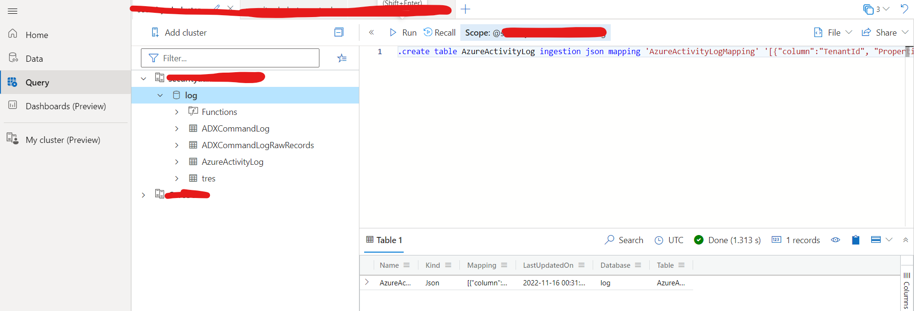

3. 在Azure Portal上搜索并选择对应的`Azure Data Explorer Clusters`
8. 在`Azure Data Explorer Clusters`左侧导航栏选择`Databases`并选择存储日志的数据库

9. 在数据库页面左侧导航栏选择`Data connections`,然后点击`Add data connection`并选择`Event Hub`

10. 在添加Event Hub连接的时候填入前面步骤所创建的相关资源
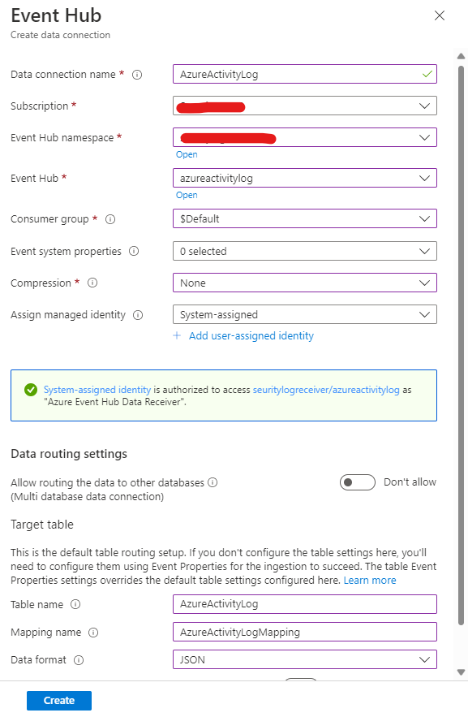
11. 在Azure Portal上搜索并选择`Logic Apps`服务，点击`Add`并选择`Subscription`,`Resource group`和`Region`以存储新建的Logic Apps,讲Logic Apps命名为 **azureactivitycolloctor**, 选择`Consumption Plan`后点击`Review + create`
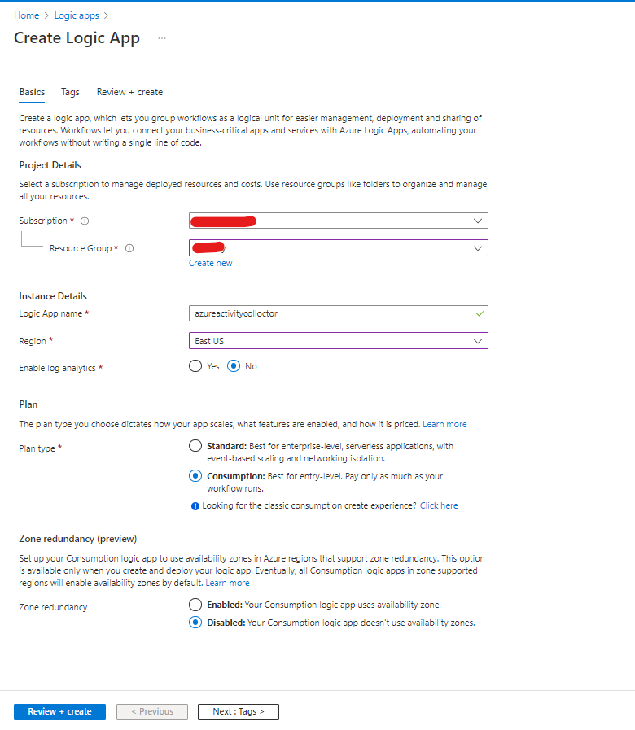
12. 资源创建完成后点击`Go to resource`以打开`Logic Apps Designer`并选择`Recurrence`作为触发器
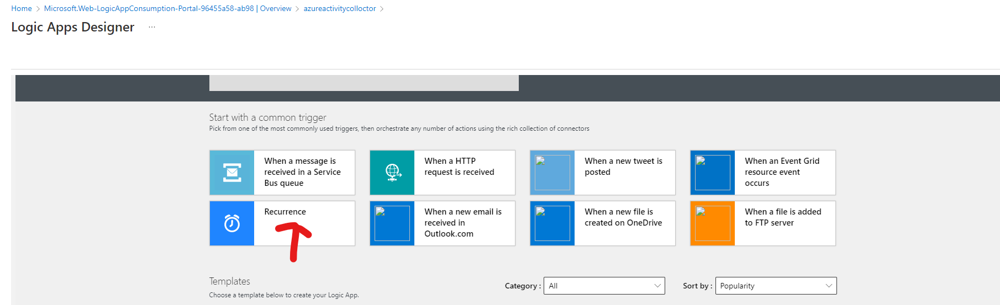
13. 在触发器配置页面，选择`Frequency`为`minutes`, `Interval`为10设置每10分钟运行一次
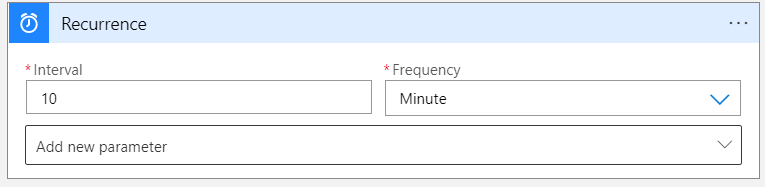
14. 点击`New step`并搜索和选择`Azure Monitor Logs`作为下一步，然后选择`Run query and list results`
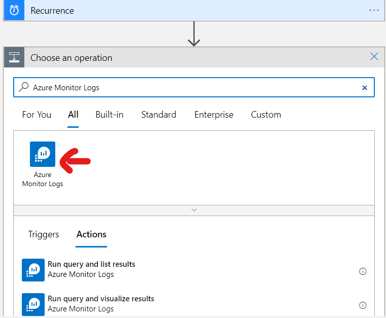
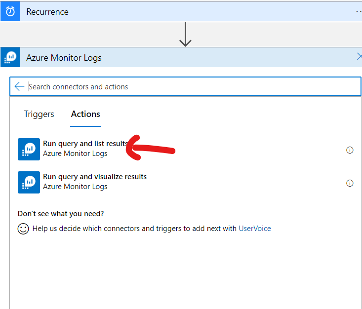
15. 点击`Sign in`或者`Connect with service principal`创建连接
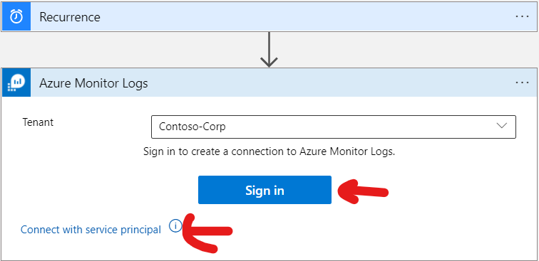
16. 创建完链接后选择Log Analytics工作区所在的`Subscription`,`Resource group`并选择`Resource Type`为 **Log Analytics Workspace**，然后选择存储Azure Activity Log的工作区
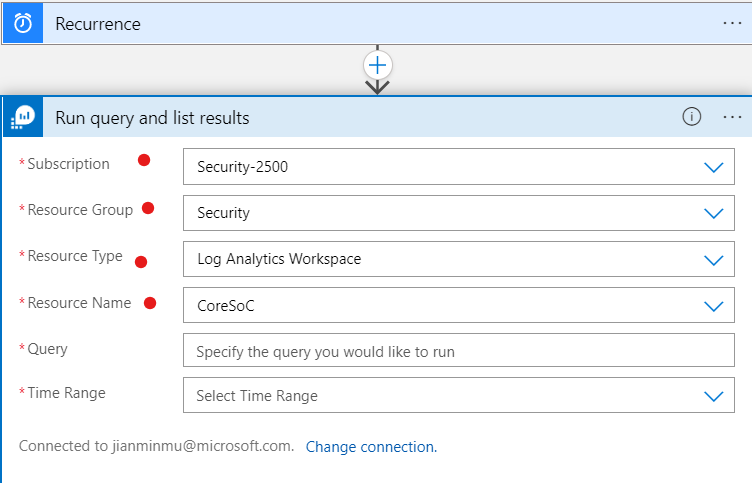
17. 将下列查询语句添加到`Query`窗口中
```
let endTime = now();
let startTime = endTime-10m;
AzureActivity
| where ingestion_time() between(startTime .. endTime)
```
18. 将`Time Range`指定为`Last 4 hours`以根据`TimeGenerated`字段返回过去四小时内的数据并筛选注入时间在过去10分钟内的数据
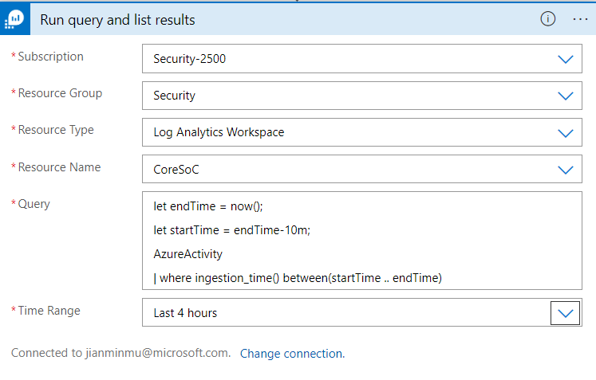
19. 点击`New step`并搜索和选择`Event Hubs`作为下一步，
然后选择`Sent event`
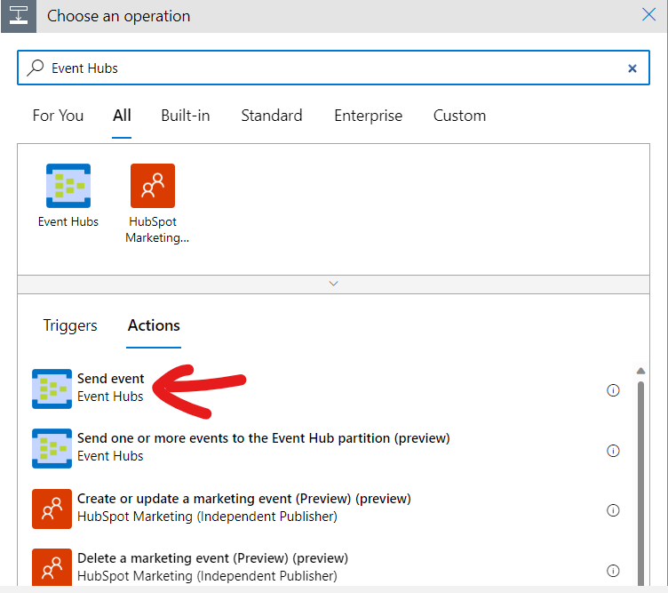
20. 填入对应event hub的链接字符串并点击`Create`
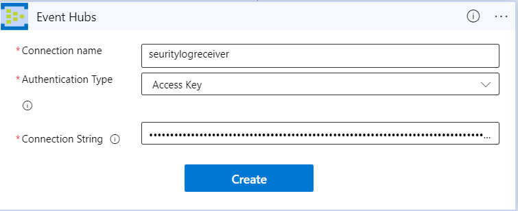
21. 然后选择`Content`为`Value-item`后点击`Save`
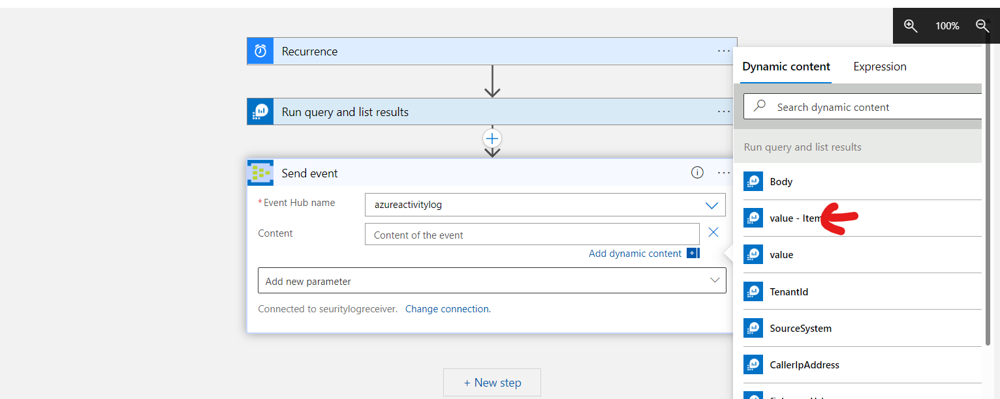
22. 过一段时间查询`Logic Apps`执行历史，确认其执行正常
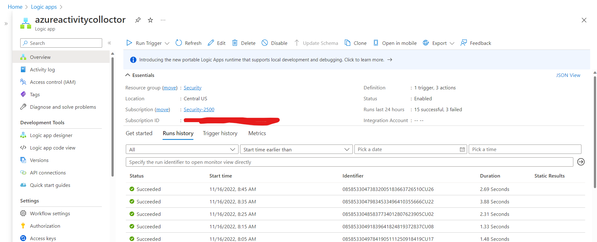
23. 在ADX UI上执行如下查询确认数据已经导出至ADX
```
AzureActivityLog
| take 10
```
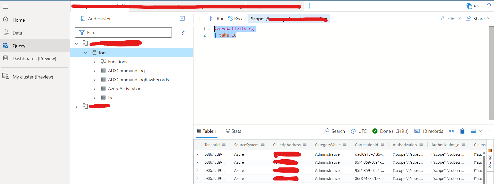
24. 创建外部表以便将ADX中的数据持续导出到存储账户中
```
.create external  table EXAzureActivityLog  (TenantId:guid, SourceSystem:string, CallerIpAddress:string, CategoryValue:string, CorrelationId:guid, Authorization:string, Authorization_d:string, Claims:string, Claims_d:string, Level:string, OperationNameValue:string, Properties:string, Properties_d:string, Caller:string, EventDataId:guid, EventSubmissionTimestamp:datetime, HTTPRequest:string, OperationId:string, ResourceGroup:string, ResourceProviderValue:string, ActivityStatusValue:string, ActivitySubstatusValue:string, Hierarchy:string, TimeGenerated:datetime, SubscriptionId:guid, OperationName:string, ActivityStatus:string, ActivitySubstatus:string, Category:string, ResourceId:string, ResourceProvider:string, Resource:string, ['Type']:string, ['_ResourceId']:string)
    kind = blob
    dataformat = json
    (
        h@'https://sentinellogarchive.blob.core.windows.net/azureactivitylog;accesky(替换)'
    )
    with (FileExtension=json)
```
25. 创建秩序导出任务
```
.create-or-alter continuous-export AzureActivyCommandExport
over (AzureActivityLog)
to table EXAzureActivityLog
with
(intervalBetweenRuns=1h, 
 forcedLatency=10m, 
 sizeLimit=104857600)
<| AzureActivityLog
```
13. 查看导出任务状态并确定数据导出的起始点
```
.show continuous-export AzureActivyCommandExport | project StartCursor
```
14. 一次性导出在导出任务启动前的数据
```
.export async to table EXAzureActivityLog
<| AzureActivityLog | where cursor_before_or_at("638041614840940465")
```